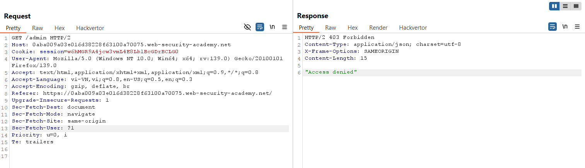
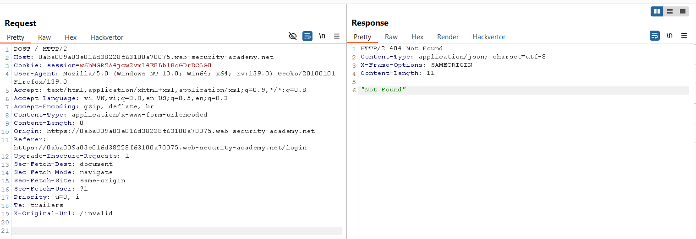
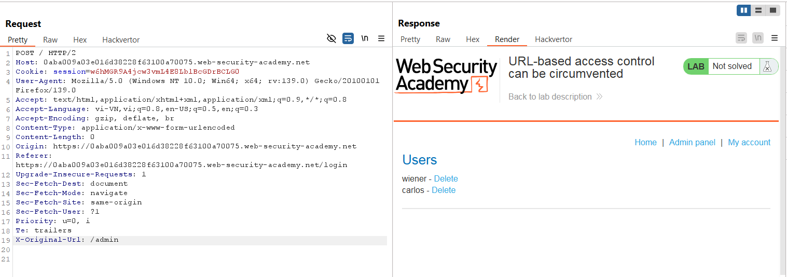
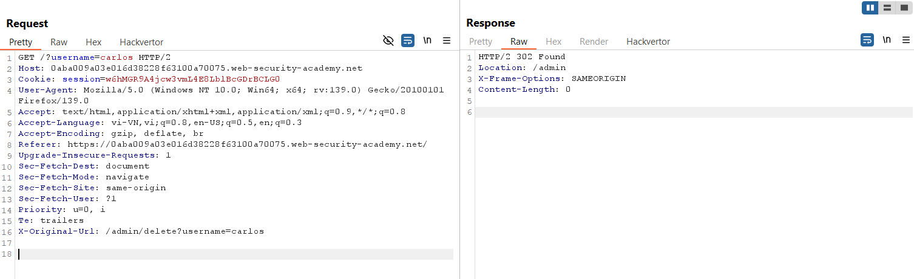

# Write-up: URL-based access control can be circumvented

### Tổng quan
Khai thác lỗ hổng kiểm soát truy cập dựa trên URL, sử dụng header `X-Original-UR`L để bypass hệ thống front-end, truy cập admin panel tại `/admin` và xóa tài khoản `carlos`.

### Mục tiêu
- Truy cập admin panel và xóa tài khoản `carlos`.

### Công cụ sử dụng
- Burp Suite Community
- Firefox Browser

### Quy trình khai thác
1. **Thu thập thông tin (Reconnaissance)**
- Thử truy cập admin panel tại `/admin`:
    - Nhận phản hồi từ chối truy cập (403 Forbidden):
        
    - Quan sát: Hệ thống front-end chặn truy cập `/admin` từ bên ngoài.

- Trong Burp Repeater, thêm header` X-Original-URL: /invalid` để kiểm tra hỗ trợ của ứng dụng:
    - Phản hồi trả về lỗi 404 Not Found, xác nhận ứng dụng hỗ trợ header `X-Original-URL`: 
        

2. **Khai thác (Exploitation)**
- Trong Burp Repeater, sửa header thành `X-Original-URL: /admin`:
    - Kết quả: Truy cập thành công admin panel, bypass kiểm soát truy cập:
        
    - **Giải thích**: Ứng dụng back-end dựa vào `X-Original-URL` để xác định đường dẫn xử lý, nhưng không xác thực quyền, dẫn đến lỗ hổng leo thang đặc quyền dọc.

- Xóa tài khoản carlos bằng cách thêm header `X-Original-URL: /admin/delete?username=carlos`:
    - **Kết quả**: Tài khoản carlos bị xóa, hoàn thành lab:
        
        

### Bài học rút ra
- Hiểu cách khai thác lỗ hổng kiểm soát truy cập dựa trên header `X-Original-URL`.
- Nhận thức tầm quan trọng của việc xác thực quyền truy cập phía server và vô hiệu hóa các header tùy chỉnh không cần thiết.

### Tài liệu tham khảo
- PortSwigger: Access control vulnerabilities

### Kết luận
Lab này cung cấp kinh nghiệm thực tiễn trong việc khai thác lỗ hổng kiểm soát truy cập URL, sử dụng Burp Repeater để giả mạo header X-Original-URL, truy cập admin panel và xóa tài khoản mục tiêu. Xem portfolio đầy đủ tại https://github.com/Furu2805/Lab_PortSwigger.

*Viết bởi Toàn Lương, Tháng 6/2025.*