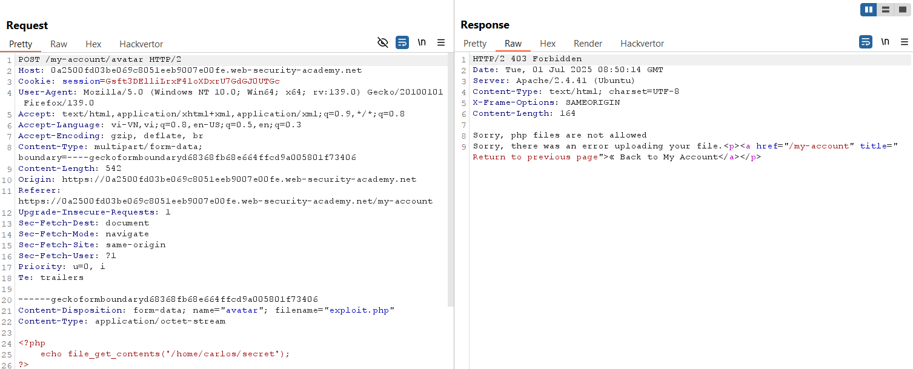
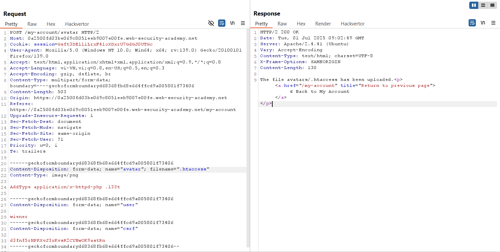
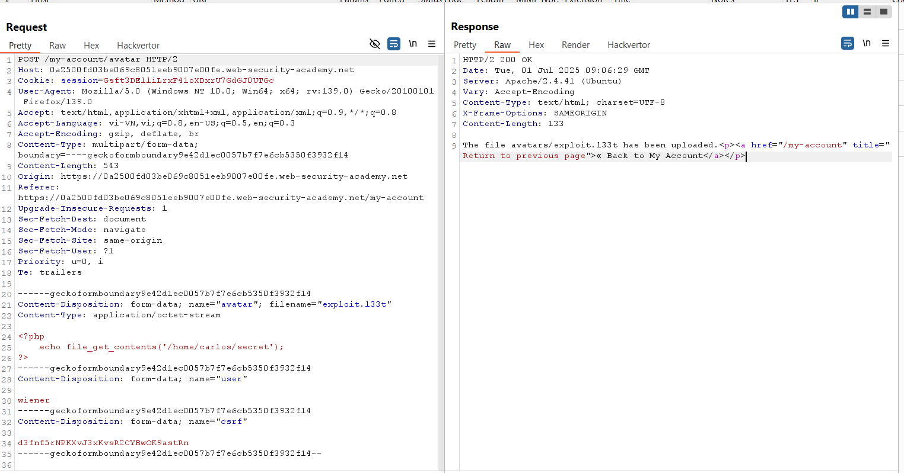
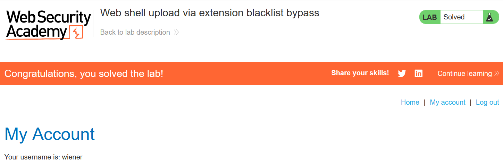

# Write-up: Web shell upload via extension blacklist bypass

### Tổng quan
Khai thác lỗ hổng trong chức năng upload file avatar, bypass danh sách đen đuôi file bằng cách upload file `.htaccess` để sửa cấu hình server Apache, cho phép thực thi file `.l33t` như PHP, sau đó upload web shell `exploit.l33t` để đọc nội dung file `/home/carlos/secret` và submit secret.

### Mục tiêu
- Upload web shell qua bypass danh sách đen đuôi file, đọc nội dung file `/home/carlos/secret`, và submit secret.

### Công cụ sử dụng
- Burp Suite Community
- Firefox Browser

### Quy trình khai thác 
1. **Thu thập thông tin (Reconnaissance)**
- Đăng nhập với tài khoản `wiener`:`peter`
- Truy cập chức năng upload avatar, thử upload file web shell `exploit.php` với nội dung:
    
    -**Phản hồi**: Server từ chối upload do đuôi `.php` nằm trong danh sách đen:
        

2. **Khai thác (Exploitation)**
- Trong Burp Repeater, upload file `.htacces`s để sửa cấu hình server Apache, `filename=".htaccess"` và nội dung `AddType application/x-httpd-php .l33t`
    - **Phản hồi**: File `.htaccess` được upload thành công:
        

- Upload file web shell `exploit.l33t` với nội dung:
    
    - Phản hồi: File exploit.l33t được upload thành công:
        

    - Phản hồi: trả về nội dung file `/home/carlos/secret`:
        `GqgC2O6sxAWYT7l0ccXCScQ1Utv1BoR6`

- Submit secret và hoàn thành lab
    

### Bài học rút ra
- Hiểu cách khai thác lỗ hổng danh sách đen đuôi file bằng cách sử dụng file `.htaccess` để sửa cấu hình server.
- Nhận thức tầm quan trọng của việc kiểm tra nội dung file upload và vô hiệu hóa cấu hình `.htaccess` để ngăn chặn RCE.

### Tài liệu tham khảo
- PortSwigger: File upload vulnerabilities

### Kết luận
Lab này cung cấp kinh nghiệm thực tiễn trong việc khai thác lỗ hổng upload file, sử dụng Burp Repeater để upload file `.htaccess` và web shell `exploit.l33t`, thực thi mã và đọc file bí mật. Xem portfolio đầy đủ tại https://github.com/Furu2805/Lab_PortSwigger.

*Viết bởi Toàn Lương, Tháng 7/2025.*