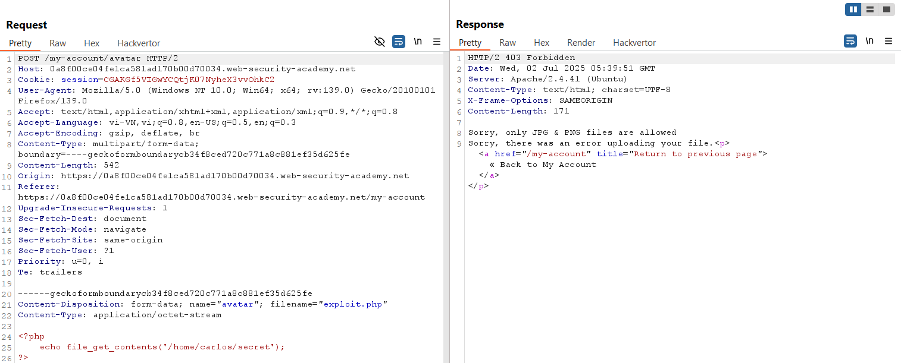
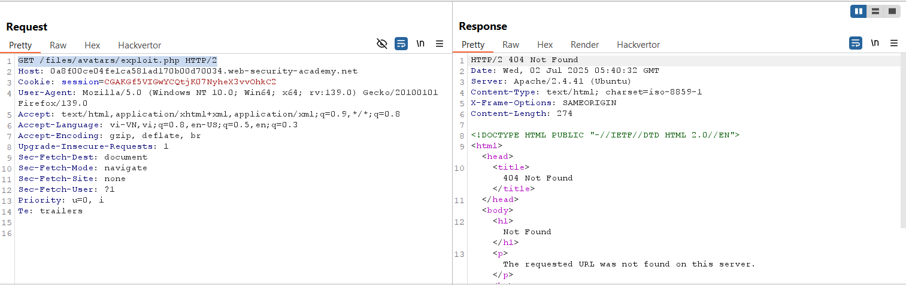
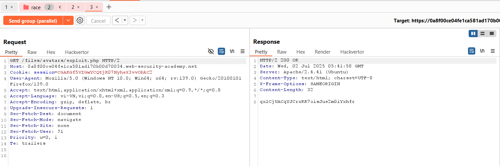
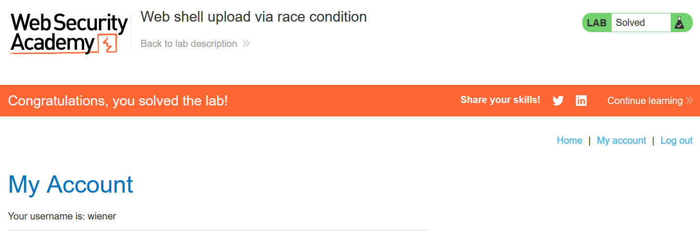

# Write-up: Web shell upload via race condition

### Tổng quan
Khai thác lỗ hổng race condition trong chức năng upload file avatar, bypass kiểm tra nội dung hình ảnh bằng cách gửi đồng thời yêu cầu upload file PHP và truy cập file, thực thi mã để đọc nội dung file `/home/carlos/secret`, và submit secret để hoàn thành lab.

### Mục tiêu
- Upload web shell PHP qua khai thác race condition, đọc nội dung file `/home/carlos/secret`, và submit secret.

### Công cụ sử dụng
- Burp Suite Community
- Firefox Browser
- Exiftool

### Quy trình khai thác 
1. **Thu thập thông tin (Reconnaissance)**
- Đăng nhập với tài khoản `wiener`:`peter`
- Truy cập chức năng upload avatar, upload file ảnh hợp lệ (ví dụ: `avatar.png`):
    - Xem ảnh tại `/files/avatars/avatar.png`:

- Thử upload file web shell exploit.php với nội dung:
    
    - **Phản hồi**: Server từ chối với thông báo file không phải nội dung hình ảnh:
        

2. **Khai thác (Exploitation)**
- Trong Burp Repeater, chuẩn bị hai yêu cầu:
    - Yêu cầu 1: Upload file `exploit.php`:
        
    - Yêu cầu 2: Truy cập file `exploit.php`:
        

- Nhóm hai yêu cầu trong Burp Repeater, chọn `Send group in parallel (single-packet attack)` để gửi đồng thời:
    - **Phản hồi**: Yêu cầu GET trả về nội dung file` /home/carlos/secret`:
        `qx1CjUACqYJCrxKR7oisJue2m0iYxhfr`
        
    - **Giải thích**: Race condition xảy ra khi yêu cầu GET truy cập file `exploit.php` trước khi server hoàn tất kiểm tra nội dung và xóa file, dẫn đến việc thực thi mã PHP, gây lỗ hổng thực thi mã từ xa (RCE).

- Submit secret và hoàn thành lab
    

### Bài học rút ra
- Hiểu cách khai thác lỗ hổng race condition trong chức năng upload file bằng cách gửi yêu cầu song song.
- Nhận thức tầm quan trọng của việc đồng bộ hóa kiểm tra và xử lý file upload để ngăn chặn RCE.

### Tài liệu tham khảo
- PortSwigger: File upload vulnerabilities
- PortSwigger: Race conditions

### Kết luận
Lab này cung cấp kinh nghiệm thực tiễn trong việc khai thác lỗ hổng race condition, sử dụng Burp Repeater để gửi yêu cầu song song, bypass kiểm tra nội dung, thực thi web shell PHP và đọc file bí mật. Xem portfolio đầy đủ tại https://github.com/Furu2805/Lab_PortSwigger.

*Viết bởi Toàn Lương, Tháng 7/2025.*