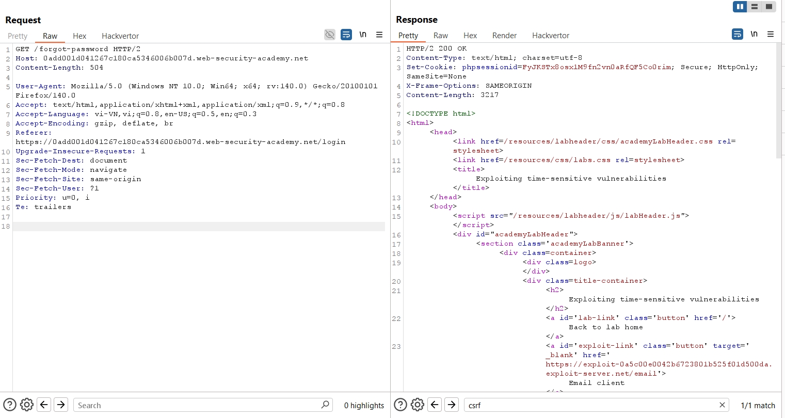
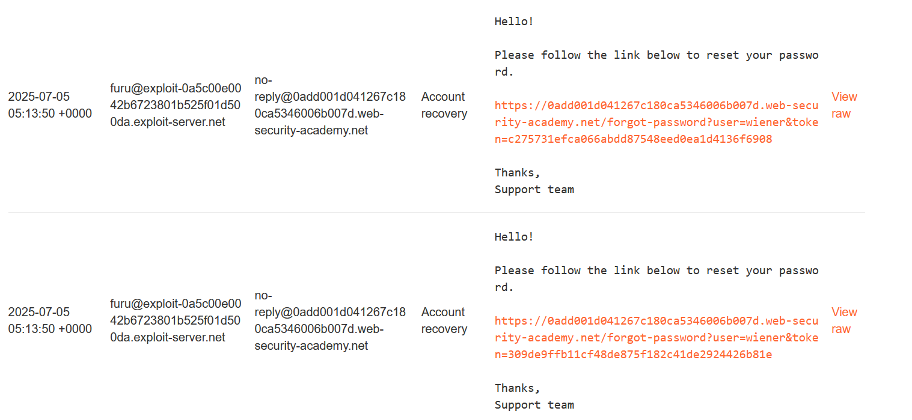
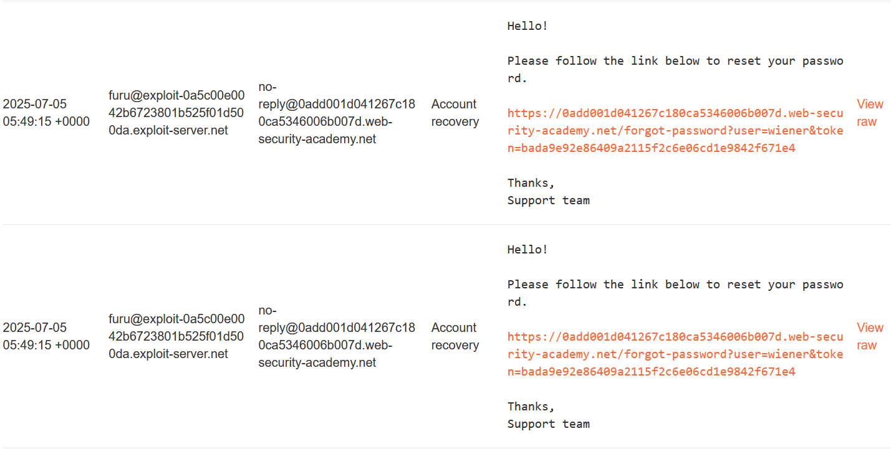
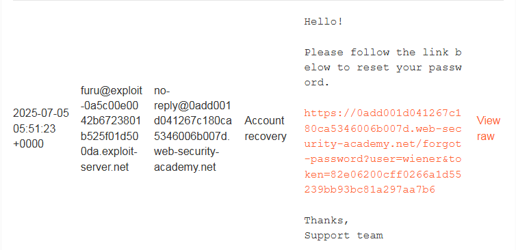
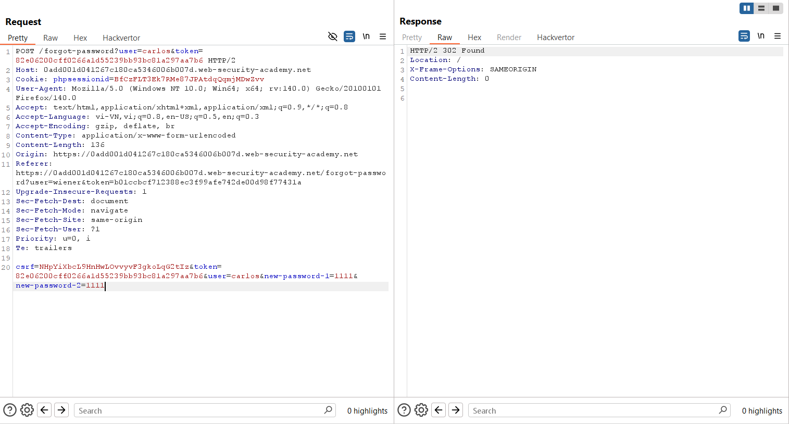
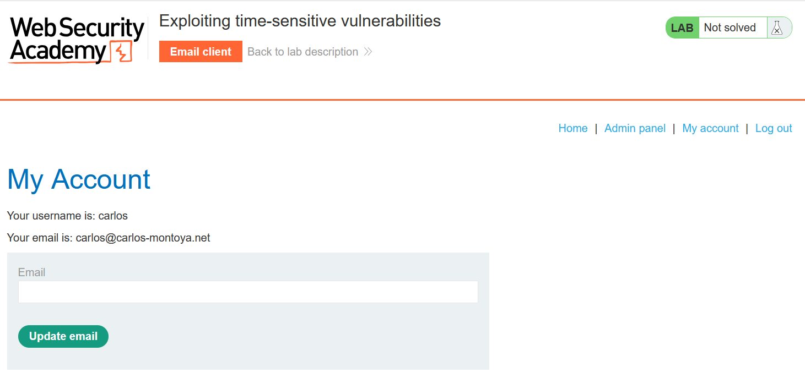

# Write-up: Exploiting time-sensitive vulnerabilities

### Tổng quan
Khai thác lỗ hổng trong cơ chế tạo token đặt lại mật khẩu, lợi dụng thời gian xử lý yêu cầu để tạo hai token giống nhau bằng cách gửi đồng thời các yêu cầu reset với `PHPSESSID` và `csrf` khác nhau, lấy token reset cho `carlos`, thay đổi mật khẩu, đăng nhập, truy cập admin panel, và xóa tài khoản `carlos` để hoàn thành lab.

### Mục tiêu
- Khai thác lỗ hổng tạo token đặt lại mật khẩu để lấy token hợp lệ cho `carlos`, thay đổi mật khẩu, đăng nhập, và xóa tài khoản `carlos`.

### Công cụ sử dụng
- Burp Suite Community
- Firefox Browser

### Quy trình khai thác
1. **Thu thập thông tin (Reconnaissance)**
- Đăng nhập với tài khoản `wiener`:`peter`:
- Phân tích chức năng forgot password:
    - Gửi yêu cầu `GET /forgot-password` để truy cập trang đặt lại mật khẩu:
        - **Phản hồi**: Nhận `PHPSESSID` và `csrf token`
            
    - Gửi yêu cầu `POST /forgot-password` để yêu cầu reset mật khẩu:
        - Phản hồi: Nhận email chứa token reset tại email client.
    - Gửi yêu cầu `POST /forgot-password?user=wiener&token=...` để xác nhận reset:
        - **Phản hồi**: Mật khẩu được thay đổi thành công

2. **Kiểm chứng (Predict)**
- Kiểm tra khả năng tạo hai token giống nhau:
    - Chuẩn bị hai yêu cầu `POST /forgot-password` trong Burp Repeater với cùng `username=wiener`:
    - Nhóm hai yêu cầu, chọn `Send group in parallel (single-packet attack)`:
        
    - **Phản hồi**: Email client nhận hai email cùng thời điểm nhưng token khác nhau.
        
    - **Quan sát**: Server tạo token khác nhau khi `PHPSESSID` và `csrf` giống nhau.

- Thử lại với `PHPSESSID` và `csrf` khác nhau:
    - Gửi GET /forgot-password để lấy `PHPSESSID` và `csrf`
    - Cập nhật một yêu cầu reset:
        
        - Giữ yêu cầu còn lại với `PHPSESSID` và `csrf` cũ
    
    - Gửi song song hai yêu cầu:
    - **Phản hồi**: Email client nhận hai email cùng thời điểm với cùng token:
        

    - **Giải thích**: Server sử dụng thời gian làm yếu tố tạo token, khi gửi đồng thời với `PHPSESSID` và `csrf` khác nhau, server tạo cùng `token` do xử lý đồng thời.

3. **Khai thác (Prove)**
- Lấy token reset cho `carlos`:
    - Gửi `GET /forgot-password` để lấy `PHPSESSID` và `csrf`.
    - Chuẩn bị hai yêu cầu reset:
        - Yêu cầu 1: Dùng `PHPSESSID` và `csrf` cũ, `username=wiener`:
        - Yêu cầu 2: Dùng `PHPSESSID` và `csrf` mới, `username=carlos`:
    - Gửi song song hai yêu cầu:
        - **Phản hồi**: Email client nhận một email với token cho wiener
            

- Thay đổi mật khẩu `carlos`:
    - Dùng token từ email, cập nhật yêu cầu confirm:
    - **Phản hồi**: Mật khẩu carlos được thay đổi thành công:
        

- Đăng nhập với `carlos`:`1111`:
    

- Truy cập trang admin panel, xóa tài khoản carlos và hoàn thành lab
    

### Bài học rút ra
- Hiểu cách khai thác lỗ hổng time-sensitive trong cơ chế tạo token đặt lại mật khẩu để tạo token giống nhau cho các tài khoản khác nhau.
- Nhận thức tầm quan trọng của việc sử dụng thuật toán tạo token an toàn và đồng bộ hóa xử lý yêu cầu để ngăn chặn khai thác thời gian.

### Tài liệu tham khảo
- PortSwigger: Race conditions
- PortSwigger: Authentication vulnerabilities

### Kết luận
Lab này cung cấp kinh nghiệm thực tiễn trong việc khai thác lỗ hổng time-sensitive trong cơ chế tạo token, sử dụng Burp Repeater để gửi yêu cầu song song, lấy token reset, thay đổi mật khẩu, và xóa tài khoản mục tiêu. Xem portfolio đầy đủ tại https://github.com/Furu2805/Lab_PortSwigger.

*Viết bởi Toàn Lương, Tháng 7/2025.*