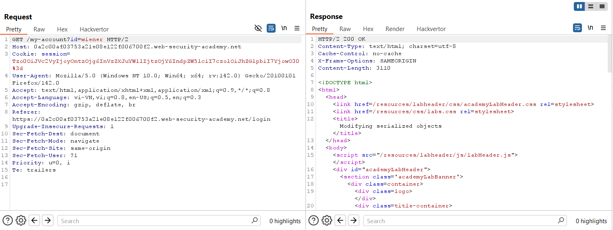
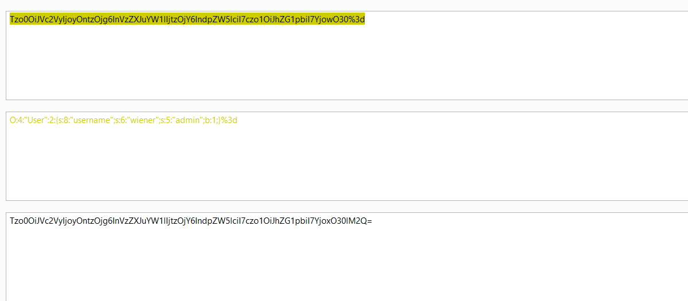
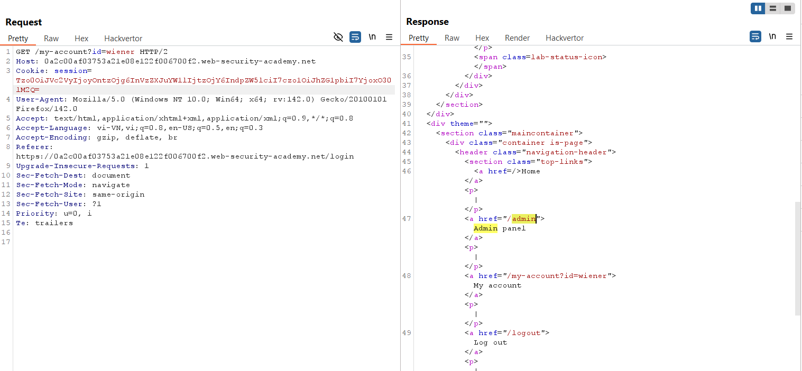
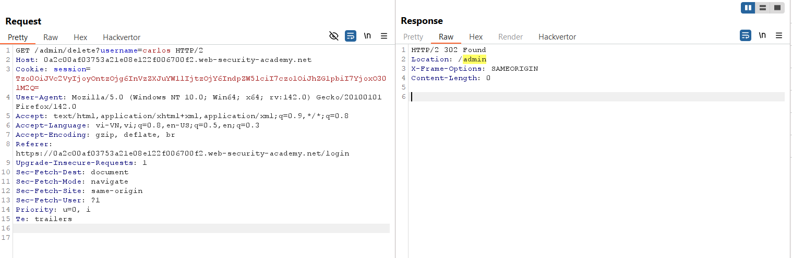
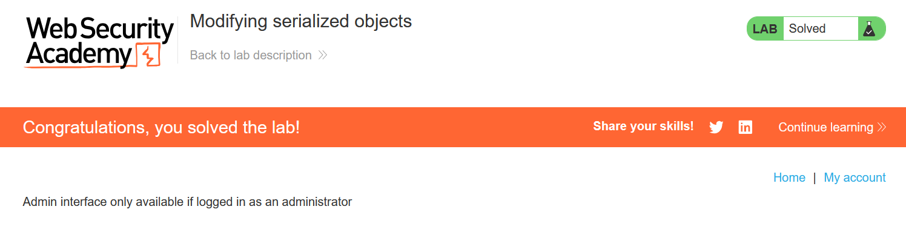

# Write-up: Modifying serialized objects

### Tổng quan
Lab này sử dụng cơ chế session dựa trên serialization và dễ bị tấn công leo thang đặc quyền. Để hoàn thành lab, chỉnh sửa object serialized trong cookie session để khai thác lỗ hổng và giành quyền quản trị, sau đó xóa tài khoản carlos. Đăng nhập bằng tài khoản: `wiener`:`peter`.

### Mục tiêu
- Leo thang đặc quyền để trở thành admin.
- Xóa tài khoản carlos để giải lab.

### Công cụ sử dụng
- Burp Suite Pro
- Firefox Browser

### Quy trình khai thác
1. **Thu thập thông tin (Reconnaise)**
- Đăng nhập vào tài khoản `wiener`:`peter`.
    
- Theo dõi Burp Proxy, quan sát cookie gửi đi dạng PHP được mã hóa Base64, giải mã và thấy mã:
    ```
    O:4:"User":2:{s:8:"username";s:6:"wiener";s:5:"admin";b:0;}
    ```
    
2. **Khai thác (Exploit)**
- Sửa mã thành:
    ```
    O:4:"User":2:{s:8:"username";s:6:"wiener";s:5:"admin";b:1;}
    ```
    và encode sau đó gửi đi bằng burp repeater -> leo thang vào trang admin thành công
    

- Xóa tài khoản carlos và hoàn thành lab
    
    

### Bài học rút ra
- Không kiểm tra tính toàn vẹn của serialized data trong session cookie dẫn đến dễ bị tấn công leo thang đặc quyền.
- Sử dụng Burp Suite để giải mã và chỉnh sửa Base64 là cách hiệu quả để khai thác serialization vulnerabilities.

### Kết luận
Lab này cung cấp kinh nghiệm thực tiễn trong việc khai thác deserialization để leo thang đặc quyền, nhấn mạnh cần thiết phải bảo vệ dữ liệu session và kiểm tra dữ liệu trước khi xử lý. Xem portfolio đầy đủ tại https://github.com/Furu2805/Lab_PortSwigger.

*Viết bởi Toàn Lương, Tháng 9/2025.*