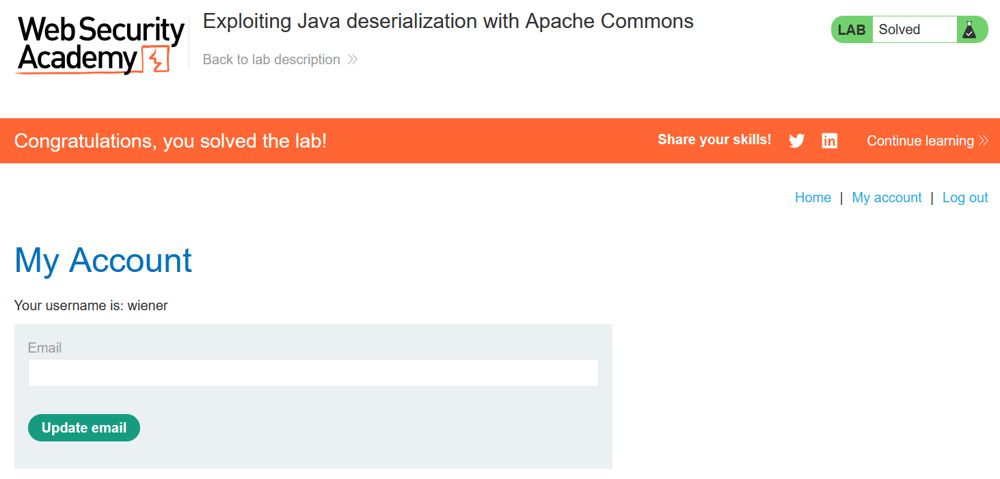

# Write-up: Exploiting Java deserialization with Apache Commons

### Tổng quan
Khai thác lỗ hổng **Insecure Deserialization** trong ứng dụng Java, nơi cookie `session` chứa một Java serialized object được xử lý mà không kiểm tra tính toàn vẹn. Bằng cách sử dụng tool `ysoserial` với gadget chain `CommonsCollections4`, kẻ tấn công tạo payload serialized để thực thi lệnh `rm /home/carlos/morale.txt`, thay thế cookie `session` và gửi request để kích hoạt RCE, hoàn thành lab.

### Mục tiêu
- Khai thác lỗ hổng **Insecure Deserialization** bằng cách sử dụng `ysoserial` để tạo gadget chain `CommonsCollections4`, thực thi lệnh `rm /home/carlos/morale.txt` thông qua cookie `session`, hoàn thành lab.

### Công cụ sử dụng
- Burp Suite Pro
- Firefox Browser
- ysoserial

### Quy trình khai thác
1. **Quan sát cookie**  
- Đăng nhập với tài khoản `wiener:peter` và quan sát cookie `session` trong Burp Proxy:  
  ```
  GET / HTTP/2
  Host: 0a7g005f06gh7890b0cd045600ef00cb.web-security-academy.net
  Cookie: session=rO0ABXQA...
  ```  
- **Phân tích cookie**:  
  - Cookie `session` là chuỗi Base64 của Java serialized object (bắt đầu bằng `rO0...`).  
  - Điều này cho thấy backend đang deserialize cookie để lấy object session.  
  - Nếu attacker chỉnh sửa object, server deserialize có thể trigger thực thi mã (RCE):  
      

2. **Dùng ysoserial để tạo payload**  
- Công cụ `ysoserial` cung cấp gadget chain `CommonsCollections4`, tận dụng các lớp trong Apache Commons Collections (có sẵn trong ứng dụng) để thực thi lệnh khi deserialize.  
- Payload cần thực thi: `rm /home/carlos/morale.txt`.  
- **Trường hợp Java ≤ 15**:  
  ```
  java -jar ysoserial-all.jar CommonsCollections4 'rm /home/carlos/morale.txt' | base64
  ```  
- **Trường hợp Java ≥ 16** (có hạn chế module, cần thêm `--add-opens`):  
  ```
  java -jar ysoserial-all.jar \
     --add-opens=java.xml/com.sun.org.apache.xalan.internal.xsltc.trax=ALL-UNNAMED \
     --add-opens=java.xml/com.sun.org.apache.xalan.internal.xsltc.runtime=ALL-UNNAMED \
     --add-opens=java.base/java.net=ALL-UNNAMED \
     --add-opens=java.base/java.util=ALL-UNNAMED \
     CommonsCollections4 'rm /home/carlos/morale.txt' | base64
  ```  
- **Kết quả**: Sinh ra chuỗi Base64 đại diện cho serialized object chứa gadget chain:  
  ```
  rO0ABXNy... (chuỗi Base64 dài, ví dụ)
  ```  
- **Giải thích payload**:  
  - Gadget chain `CommonsCollections4` sử dụng các lớp trong Apache Commons Collections để gọi `Runtime.getRuntime().exec("rm /home/carlos/morale.txt")` khi deserialize:  
      

3. **Thay session cookie**  
- Copy chuỗi Base64 từ `ysoserial`.  
- Trong Burp Repeater:  
  - Gửi request chứa cookie `session` bình thường:  
    ```
    GET / HTTP/2
    Host: 0a7g005f06gh7890b0cd045600ef00cb.web-security-academy.net
    Cookie: session=rO0ABXQA...
    ```  
  - Thay giá trị cookie bằng chuỗi Base64 từ `ysoserial`.  
  - URL-encode cookie để đảm bảo hợp lệ (thay `+` thành `%2B`, `/` thành `%2F`, `=` thành `%3D`):  
    ```
    Cookie: session=rO0ABXQA...%3D
    ```  
      

4. **Gửi request**  
- Gửi request qua Burp Repeater:  
  - Server nhận cookie, unserialize object, kích hoạt gadget chain `CommonsCollections4`.  
  - Payload `rm /home/carlos/morale.txt` được thực thi, xóa tệp `/home/carlos/morale.txt`.  
- Load lại trang trên trình duyệt để xác nhận:  
  - Lab xác nhận tệp bị xóa, hoàn thành lab:  
      
- **Ý tưởng payload**:  
  - Sử dụng `ysoserial` với `CommonsCollections4` để tạo serialized object, thực thi lệnh `rm /home/carlos/morale.txt` khi server deserialize cookie.  

### Bài học rút ra
- Hiểu cách khai thác **Insecure Deserialization** trong Java bằng cách sử dụng `ysoserial` với gadget chain `CommonsCollections4` để thực thi mã tùy ý (`exec`) thông qua cookie `session`.  
- Nhận thức tầm quan trọng của việc tránh deserialize dữ liệu người dùng, sử dụng digital signature để kiểm tra tính toàn vẹn, kiểm tra nghiêm ngặt kiểu dữ liệu, hoặc thay thế bằng định dạng an toàn như JSON để ngăn chặn các cuộc tấn công RCE.

### Kết luận
Lab này cung cấp kinh nghiệm thực tiễn trong việc khai thác **Insecure Deserialization** trong Java với Apache Commons, nhấn mạnh tầm quan trọng của việc bảo vệ dữ liệu serialized và sử dụng các biện pháp kiểm tra an toàn để ngăn chặn thực thi mã tùy ý. Xem portfolio đầy đủ tại https://github.com/Furu2805/Lab_PortSwigger.

*Viết bởi Toàn Lương, Tháng 9/2025.*