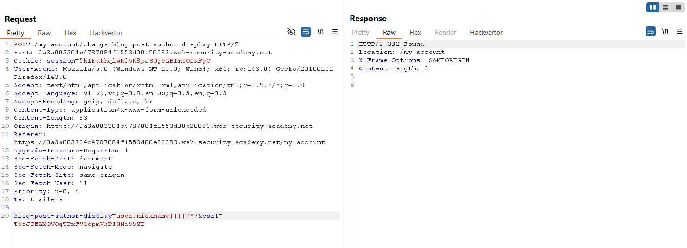

# Write-up: Basic server-side template injection

### Tổng quan
Khai thác lỗ hổng **Server-Side Template Injection (SSTI)** trong ứng dụng web sử dụng template engine Tornado, nơi trường `blog-post-author-display` không được lọc, cho phép thực thi mã Python tùy ý. Bằng cách sử dụng cú pháp Tornado để import module `os` và thực thi lệnh hệ thống qua `os.system`, kẻ tấn công xóa file `/home/carlos/morale.txt` và hoàn thành lab.

### Mục tiêu
- Khai thác lỗ hổng **SSTI** trong Tornado qua trường `blog-post-author-display`, xác nhận khả năng thực thi mã với `{{7*7}}`, và sử dụng `os.system` để xóa file `/home/carlos/morale.txt`, hoàn thành lab.

### Công cụ sử dụng
- Burp Suite Pro
- Firefox Browser

### Quy trình khai thác
1. **Khai thác Tornado**  
- Đăng nhập với tài khoản `wiener:peter`:  
- Truy cập tính năng tùy chỉnh tên người dùng trong blog post (`Preferred name`) tại:  
  ```
  GET /my-account HTTP/2
  Host: 0am9020u21vw2345q0rs190100tu00rq.web-security-academy.net
  Cookie: session=...
  ```  
- Bắt request khi thay đổi tên người dùng trong trường `blog-post-author-display`:  
    ```
    POST /my-account HTTP/2
    Host: 0am9020u21vw2345q0rs190100tu00rq.web-security-academy.net
    Cookie: session=...
    Content-Type: application/x-www-form-urlencoded

    blog-post-author-display=user.nickname
    ```  
     
- Thử payload SSTI cơ bản trong trường `blog-post-author-display`:  
      
- Kết quả: Server trả về giá trị `49`, xác nhận lỗ hổng **SSTI** trong Tornado:  
      

2. **Sử dụng lệnh system để thực thi lệnh shell**  
- Nghiên cứu tài liệu Tornado, phát hiện cú pháp `` cho phép import module `os`, và `os.system` có thể thực thi lệnh hệ thống.  
- Sử dụng payload để thực thi lệnh `rm /home/carlos/morale.txt`:  
    
- Kết quả: File `/home/carlos/morale.txt` bị xóa, lab xác nhận hoàn thành:  
    

- **Ý tưởng payload**:  
  - Sử dụng SSTI trong Tornado với cú pháp `` và `os.system` để thực thi lệnh hệ thống, xóa file `/home/carlos/morale.txt`.  

### Bài học rút ra
- Hiểu cách khai thác lỗ hổng **Server-Side Template Injection** trong Tornado, sử dụng cú pháp `{{ }}` và `` để thực thi mã Python và lệnh hệ thống như `rm`.  
- Nhận thức tầm quan trọng của việc lọc và mã hóa đầu vào người dùng trong template engine, vô hiệu hóa import module nhạy cảm như `os`, và hạn chế quyền thực thi lệnh hệ thống trong môi trường production.

### Kết luận
Lab này cung cấp kinh nghiệm thực tiễn trong việc khai thác **Server-Side Template Injection** trong Tornado, nhấn mạnh tầm quan trọng của việc lọc đầu vào và bảo vệ template engine để ngăn chặn thực thi lệnh hệ thống trái phép. Xem portfolio đầy đủ tại https://github.com/Furu2805/Lab_PortSwigger.

*Viết bởi Toàn Lương, Tháng 9/2025.*