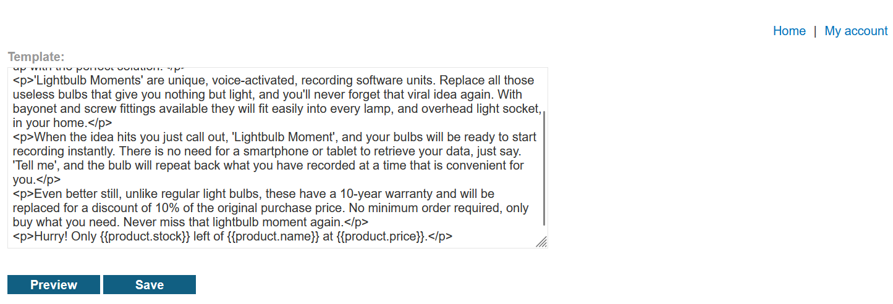
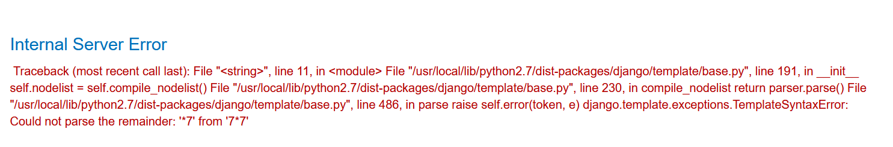
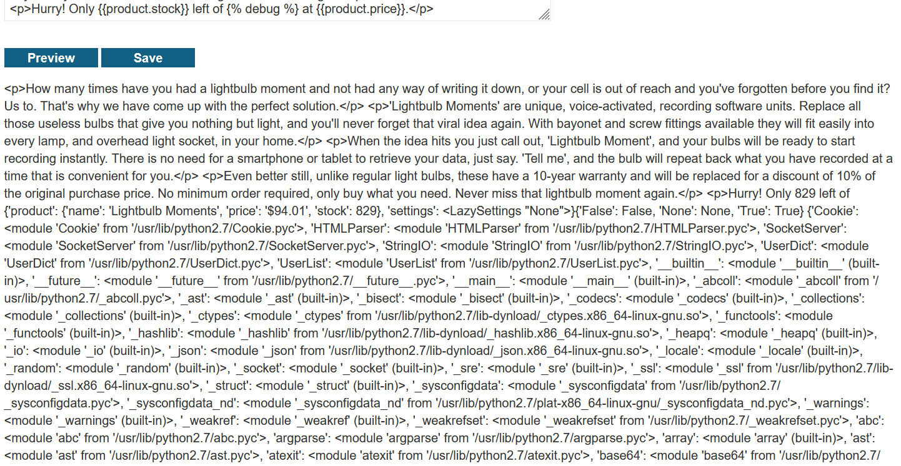
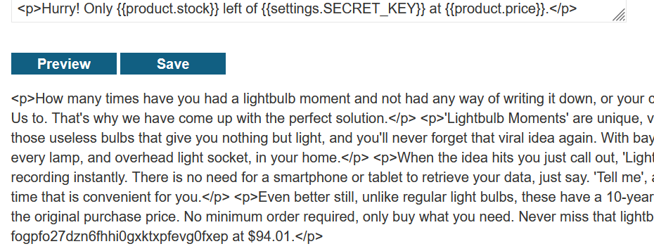
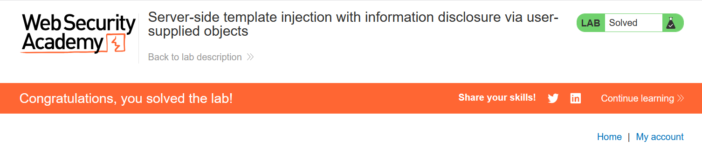

# Write-up: Server-side template injection with information disclosure via user-supplied objects

### Tổng quan
Khai thác lỗ hổng **Server-Side Template Injection (SSTI)** trong ứng dụng web sử dụng template engine Django, nơi đầu vào người dùng trong trường template không được lọc, cho phép truy cập các biến context nhạy cảm. Bằng cách sử dụng tag `` để kiểm tra context và truy cập `settings.SECRET_KEY`, kẻ tấn công lấy được khóa bí mật (`fogpfo27dzn6fhhi0gxktxpfevg0fxep`) và nộp giải pháp để hoàn thành lab.

### Mục tiêu
- Khai thác lỗ hổng **SSTI** trong template Django, sử dụng tag `` để kiểm tra context, lấy giá trị `settings.SECRET_KEY`, và nộp giải pháp để hoàn thành lab.

### Công cụ sử dụng
- Burp Suite Pro
- Firefox Browser

### Quy trình khai thác
1. **Thu thập thông tin (Reconnaissance)**  
- Đăng nhập với tài khoản `content-manager:C0nt3ntM4n4g3r`:  

- Truy cập chức năng chỉnh sửa template, quan sát thấy ứng dụng sử dụng cú pháp Django `{{product.name}}` để render thông tin sản phẩm:  
    

- Thử payload SSTI cơ bản trong trường template:    
    - Kết quả: Server báo lỗi, xác nhận Django không hỗ trợ phép toán trực tiếp (`+`, `-`, `*`, `/`) trong template, nhưng vẫn tồn tại lỗ hổng **SSTI**:  
    

- Đọc tài liệu Django, phát hiện tag `` có thể dùng để dump toàn bộ biến context:  
    - Kết quả: Server trả về context, bao gồm đối tượng `settings` chứa các biến cấu hình nhạy cảm:  
       

- Kiểm tra tài liệu Django, xác nhận `settings.SECRET_KEY` là khóa bí mật cần tìm.

2. **Lấy SECRET_KEY**  
- Sử dụng payload SSTI để truy cập `settings.SECRET_KEY`:  
    - Kết quả: Server trả về giá trị `SECRET_KEY`:  
        ```
        fogpfo27dzn6fhhi0gxktxpfevg0fxep
        ```  
- **Phân tích**: Lỗ hổng SSTI cho phép truy cập đối tượng `settings` mà không cần xác thực, dẫn đến rò rỉ thông tin nhạy cảm:  
    

3. **Hoàn thành lab**  
- Nộp `SECRET_KEY` (`fogpfo27dzn6fhhi0gxktxpfevg0fxep`) vào phần **Submit solution** của lab:  
    - Kết quả: Lab xác nhận hoàn thành:  
          

- **Ý tưởng payload**:  
    - Sử dụng SSTI trong Django để truy cập đối tượng `settings` qua tag ``, lấy giá trị `settings.SECRET_KEY`, và nộp giải pháp.  

### Bài học rút ra
- Hiểu cách khai thác lỗ hổng **Server-Side Template Injection** trong Django, sử dụng tag `` và đối tượng `settings` để lấy thông tin nhạy cảm như `SECRET_KEY`.  
- Nhận thức tầm quan trọng của việc lọc đầu vào người dùng trong template engine, vô hiệu hóa các tag nhạy cảm như ``, và hạn chế truy cập các đối tượng context nhạy cảm trong môi trường production.

### Kết luận
Lab này cung cấp kinh nghiệm thực tiễn trong việc khai thác **Server-Side Template Injection** trong Django, nhấn mạnh tầm quan trọng của việc lọc đầu vào và bảo vệ các đối tượng context nhạy cảm để ngăn chặn rò rỉ thông tin như `SECRET_KEY`. Xem portfolio đầy đủ tại https://github.com/Furu2805/Lab_PortSwigger.

*Viết bởi Toàn Lương, Tháng 9/2025.*