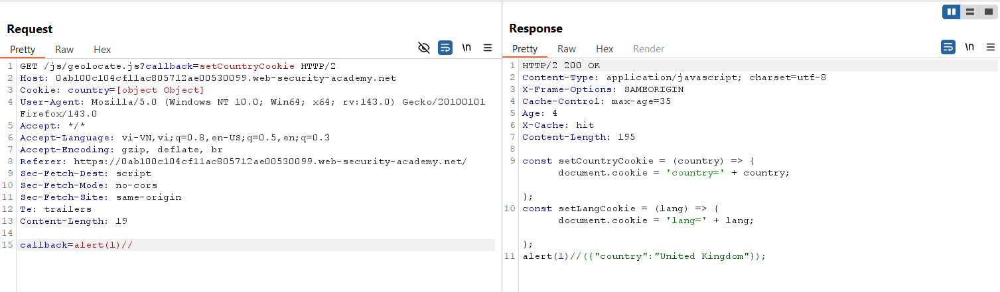
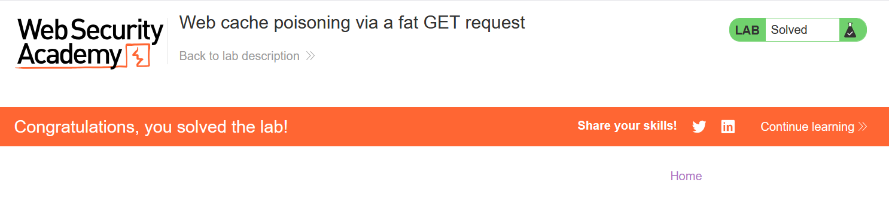

# Write-up: Web cache poisoning via a fat GET request

### Tổng quan
Khai thác lỗ hổng **Web Cache Poisoning** trong ứng dụng web, nơi server chấp nhận **fat GET request** (GET request có body) nhưng không include body trong cache key. Tham số `callback` trong body của request `GET /js/geolocate.js` được sử dụng làm JavaScript callback mà không được xử lý an toàn, dẫn đến **DOM-based XSS**. Bằng cách poison cache với payload `alert(1)` trong body, kẻ tấn công khiến response cacheable thực thi mã độc trong trình duyệt nạn nhân.

### Mục tiêu
- Xác định lỗ hổng **Web Cache Poisoning** trong **fat GET request**, khai thác tham số `callback` trong body để poison cache với payload `alert(1)`, khiến trang chủ thực thi `alert(1)` trong trình duyệt nạn nhân và hoàn thành lab.

### Công cụ sử dụng
- Burp Suite Pro
- Firefox Browser

### Quy trình khai thác

#### 1. Xác định unkeyed query string
- Gửi request đến Repeater:  
  ```
  GET /js/geolocate.js?callback=setCountryCookie HTTP/2
  ....
  callback=abllit
  ```  
- Quan sát response: Giá trị `abllit` được reflect trong JavaScript, xác nhận tham số `callback` trong body là unkeyed và có thể dùng để chèn payload XSS.  
  

#### 2. Khai thác web cache thực hiện XSS
- Khai thác bằng payload:  
  ```
  GET /js/geolocate.js?callback=setCountryCookie HTTP/2
  ....
  callback=alert(1)
  ```  
- **Giải thích**: Payload `alert(1)` trong body của GET request được chèn vào response JavaScript, vì body không được include trong cache key (lỗ hổng **fat GET request**). Response độc hại được cache, khiến trình duyệt nạn nhân thực thi XSS.  
  

- Kết quả: XSS thực thi thành công, `alert(1)` được chạy trong trình duyệt nạn nhân, lab hoàn thành.  
  

### Bài học rút ra
- Hiểu cách khai thác **Web Cache Poisoning** trong **fat GET request**, tận dụng body không được include trong cache key để chèn payload XSS vào response JavaScript.  
- Nhận thức tầm quan trọng của việc vô hiệu hóa body trong GET request, xác thực và mã hóa tham số trong response cacheable, và xử lý an toàn callback JavaScript để ngăn chặn XSS.

### Kết luận
Lab này cung cấp kinh nghiệm thực tiễn trong việc khai thác **Web Cache Poisoning** thông qua **fat GET request**, nhấn mạnh tầm quan trọng của việc cấu hình cache an toàn và xử lý body của GET request để ngăn chặn thực thi mã độc trong trình duyệt nạn nhân. Xem portfolio đầy đủ tại https://github.com/Furu2805/Lab_PortSwigger.

*Viết bởi Toàn Lương, Tháng 10/2025.*