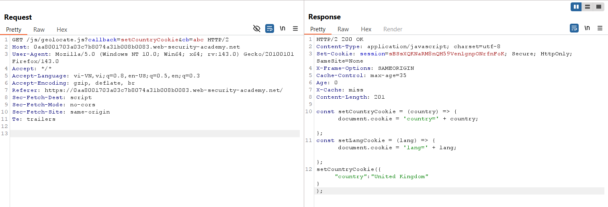
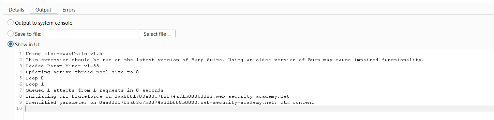
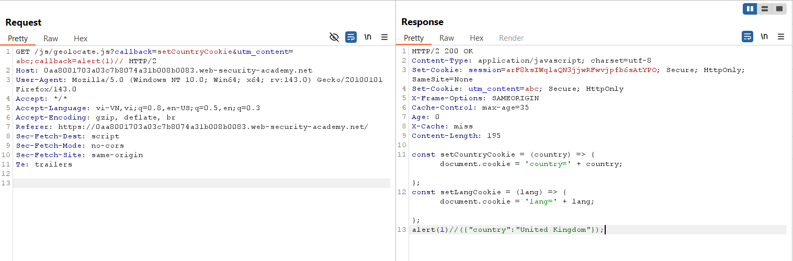
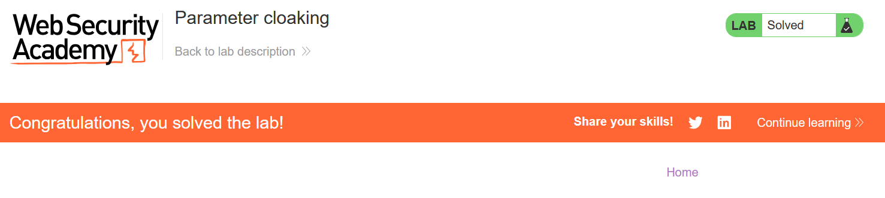

# Write-up: Parameter cloaking

### Tổng quan
Khai thác lỗ hổng **Web Cache Poisoning** kết hợp **DOM-based XSS** thông qua **parameter cloaking** trong ứng dụng web, nơi tham số `utm_content` là unkeyed query string và backend (có thể dùng Rails) parse query string sai, ưu tiên giá trị cuối cùng của tham số `callback`. Bằng cách sử dụng `utm_content` để che giấu payload `callback=alert(1)` trong URL, kẻ tấn công poison cache, khiến response JavaScript chứa mã độc được cache và thực thi `alert(1)` trong trình duyệt nạn nhân.

### Mục tiêu
- Xác định unkeyed query string `utm_content`, khai thác **parameter cloaking** để poison cache với payload `alert(1)` trong tham số `callback`, khiến trang chủ thực thi XSS trong trình duyệt nạn nhân và hoàn thành lab.

### Công cụ sử dụng
- Burp Suite Pro (với extension Param Miner)
- Firefox Browser

### Quy trình khai thác

#### 1. Xác định unkeyed query string
- Gửi request đến Repeater:  
  ```
  GET /js/geolocate.js?callback=setCountryCookie&cb=abc HTTP/2
  Host: 0ar9025z26ab7890v0wx345600yz00wv.web-security-academy.net
  ```  
- Quan sát response khi `X-Cache: miss`: Giá trị `abc` được reflect trong JavaScript, xác nhận tham số `cb` có thể ảnh hưởng response.  
  

- Sử dụng Param Miner để đoán tham số, phát hiện `utm_content` là unkeyed query string được server hỗ trợ.  
  

- Kiểm tra hành vi với ba tham số đồng thời (`callback`, `utm_content`, `callback`), nhận thấy backend parse sai query string.

#### 2. Khai thác web cache thực hiện XSS
- Khai thác bằng payload:  
  ```
  GET /js/geolocate.js?callback=setCountryCookie&utm_content=abc;callback=alert(1)// HTTP/2
  Host: 0ar9025z26ab7890v0wx345600yz00wv.web-security-academy.net
  ```  
- **Giải thích**:  
  - Cache server chỉ thấy cache key là `/js/geolocate.js?callback=setCountryCookie$$`, bỏ qua `utm_content` (unkeyed parameter).  
  - Backend (có thể dùng Rails) parse query string, nhận diện ba tham số: `callback=setCountryCookie`, `utm_content=abc`, và `callback=alert(1)`. Backend ưu tiên giá trị cuối của `callback` (`alert(1)`), dẫn đến response JavaScript chứa payload XSS.  
  - Ký tự `//` ở cuối để comment bỏ phần còn lại của query string, đảm bảo payload hợp lệ.  
  

- Kết quả: XSS thực thi thành công, `alert(1)` được chạy trong trình duyệt nạn nhân, lab hoàn thành.  
  

### Bài học rút ra
- Hiểu cách khai thác **Web Cache Poisoning** thông qua **parameter cloaking**, tận dụng unkeyed query string (`utm_content`) và hành vi parse sai của backend để chèn payload XSS.  
- Nhận thức tầm quan trọng của việc đồng bộ hóa parse query string giữa cache và backend, xác thực tham số unkeyed, và vô hiệu hóa cache cho các endpoint động để ngăn chặn XSS.

### Kết luận
Lab này cung cấp kinh nghiệm thực tiễn trong việc khai thác **Web Cache Poisoning** thông qua **parameter cloaking**, nhấn mạnh tầm quan trọng của việc cấu hình cache an toàn và xử lý query string để ngăn chặn thực thi mã độc trong trình duyệt nạn nhân. Xem portfolio đầy đủ tại https://github.com/Furu2805/Lab_PortSwigger.

*Viết bởi Toàn Lương, Tháng 10/2025.*