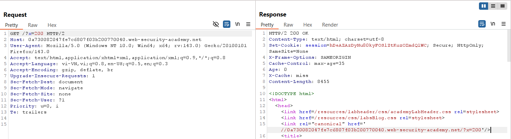
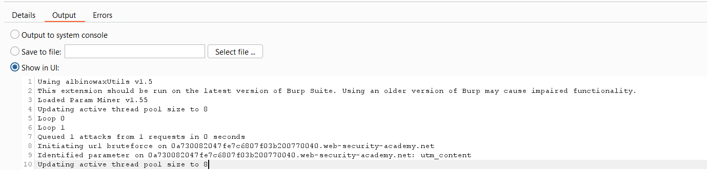
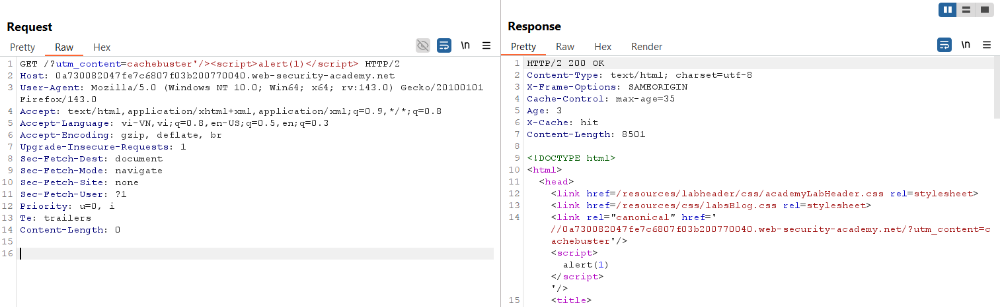
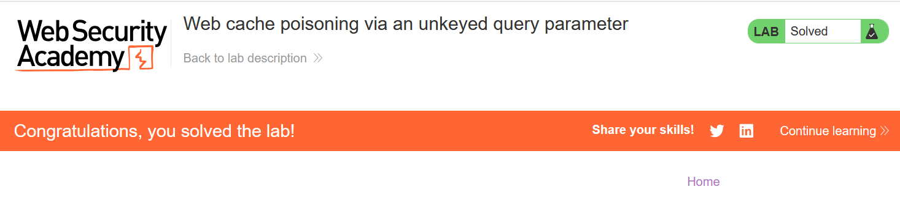

# Write-up: Web cache poisoning via an unkeyed query parameter

### Tổng quan
Khai thác lỗ hổng **Web Cache Poisoning** kết hợp **DOM-based XSS** trong ứng dụng web, nơi tham số `utm_content` là unkeyed query parameter và được reflect vào response mà không được xử lý an toàn. Bằng cách poison cache với payload XSS trong `utm_content`, kẻ tấn công khiến response cacheable chứa mã độc `<script>alert(1)</script>`, được thực thi trong trình duyệt nạn nhân khi truy cập trang chủ.

### Mục tiêu
- Xác định unkeyed query parameter `utm_content`, poison cache với payload XSS `alert(1)` thông qua tham số này, khiến trang chủ thực thi mã độc trong trình duyệt nạn nhân và hoàn thành lab.

### Công cụ sử dụng
- Burp Suite Pro (với extension Param Miner)
- Firefox Browser

### Quy trình khai thác

#### 1. Xác định unkeyed query string
- Gửi request đến Repeater:  
  ```
  GET /?x=20 HTTP/2
  ```  
- Quan sát response (khi `X-Cache: hit` hoặc `miss`): Response chứa dòng:  
  ```
  href='//0a730082047fe7c6807f03b200770040.web-security-academy.net/?x=20'
  ```  
- Kết luận: Tham số `x` được reflect trong response, có thể khai thác thông qua response cacheable.  
  

- Sử dụng Param Miner để đoán tham số, phát hiện `utm_content` là unkeyed query parameter được server hỗ trợ.  
  

#### 2. Khai thác web cache thực hiện XSS
- Khai thác bằng payload:  
  ```
  GET /?utm_content='/><script>alert(1)</script> HTTP/2
  ```  
- **Giải thích**: Tham số `utm_content` là unkeyed, không được include trong cache key, nên payload `'/><script>alert(1)</script>` được reflect vào response mà không bị lọc, khiến response cacheable chứa mã XSS.  
  

- Gửi request lặp lại cho đến khi trình duyệt nạn nhân set cookie chứa `utm_content`, xác nhận response độc hại đã được cache.  
- Kết quả: XSS thực thi thành công, `alert(1)` được chạy trong trình duyệt nạn nhân, lab hoàn thành.  
  

### Bài học rút ra
- Hiểu cách khai thác **Web Cache Poisoning** thông qua unkeyed query parameter (`utm_content`), chèn payload XSS vào response cacheable để thực thi mã độc trong trình duyệt nạn nhân.  
- Nhận thức tầm quan trọng của việc xác thực và lọc các tham số unkeyed, vô hiệu hóa cache cho các endpoint động, và xử lý an toàn dữ liệu reflect vào response để ngăn chặn XSS.

### Kết luận
Lab này cung cấp kinh nghiệm thực tiễn trong việc khai thác **Web Cache Poisoning** thông qua unkeyed query parameter, nhấn mạnh tầm quan trọng của việc cấu hình cache an toàn và xử lý tham số query để ngăn chặn thực thi mã độc trong trình duyệt nạn nhân. Xem portfolio đầy đủ tại https://github.com/Furu2805/Lab_PortSwigger.

*Viết bởi Toàn Lương, Tháng 10/2025.*