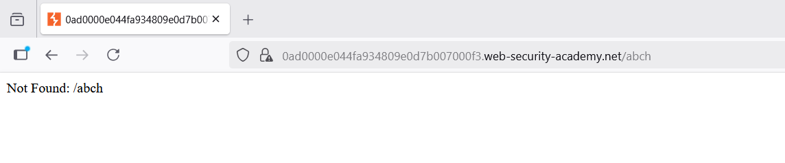
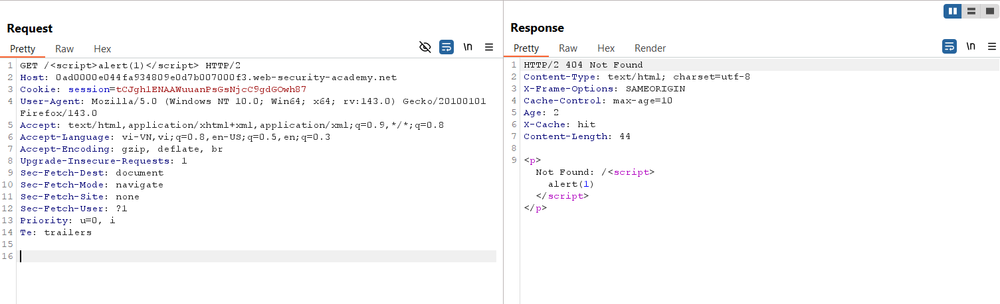
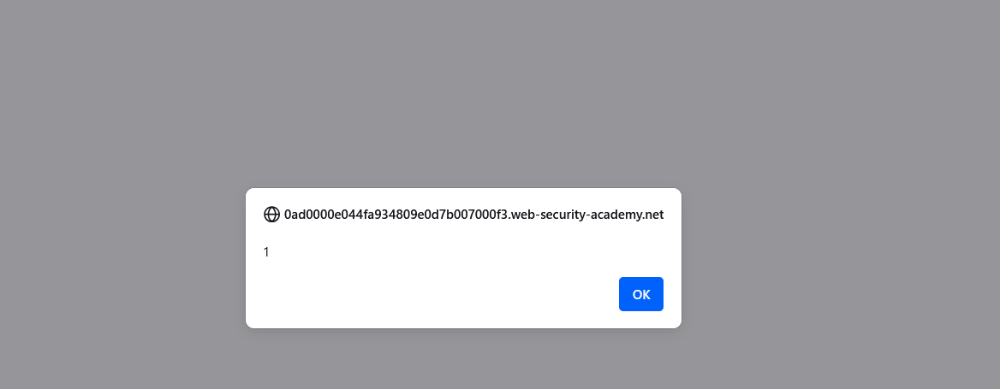
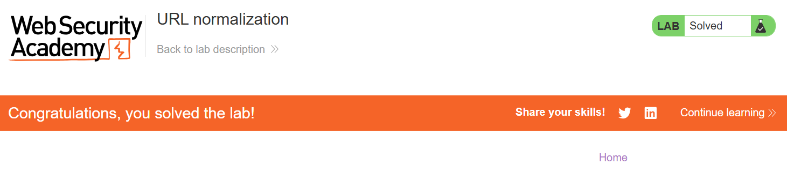

# Write-up: URL normalization

### Tổng quan
Khai thác lỗ hổng **DOM-based XSS** kết hợp với **Web Cache Poisoning** trong ứng dụng web, nơi tham số `callback` trong request `GET /js/geolocate.js` là unkeyed query string và được sử dụng làm JavaScript callback mà không được xử lý an toàn. Do trình duyệt mã hóa URL, XSS không thể khai thác trực tiếp, nhưng quá trình **URL normalization** của cache bỏ qua mã hóa, cho phép chèn payload XSS (`alert(1)`) vào response được cache. Kẻ tấn công gửi URL độc hại đến nạn nhân, khiến trình duyệt nạn nhân thực thi `alert(1)`.

### Mục tiêu
- Xác định lỗ hổng **DOM-based XSS** trong tham số `callback`, khai thác quá trình **URL normalization** của cache để poison response với payload `alert(1)`, và gửi URL độc hại đến nạn nhân để thực thi XSS, hoàn thành lab.

### Công cụ sử dụng
- Burp Suite Pro
- Firefox Browser

### Quy trình khai thác

#### 1. Xác định unkeyed query string
- Thử truy cập đến đường dẫn không tồn tại trên server
  - Kết quả: có khả năng xss
      

- Đề bài cho ta gửi link đến victim, tuy nhiên nếu chỉ đơn thuần gửi gửi link là `https://id.web-security-academy.net/abcd` thì sẽ chỉ nhận lại chuỗi đã bị url encode bởi trình duyệt:
    
- Vì vậy ta cần lợi dụng cơ chế normalize cache key của cache server. Poison cache với burp repeater
    

#### 2. Khai thác web cache thực hiện XSS
- XSS bằng browser
    

- Hoàn thành lab.
    

### Bài học rút ra
- Hiểu cách khai thác **DOM-based XSS** kết hợp **Web Cache Poisoning**, tận dụng quá trình **URL normalization** của cache để chèn payload XSS vào response JavaScript.  
- Nhận thức tầm quan trọng của việc xác thực và mã hóa tham số query trong response cacheable, vô hiệu hóa cache cho các endpoint động, và xử lý an toàn callback JavaScript để ngăn chặn XSS.

### Kết luận
Lab này cung cấp kinh nghiệm thực tiễn trong việc khai thác **Web Cache Poisoning** thông qua **URL normalization** để kích hoạt **DOM-based XSS**, nhấn mạnh tầm quan trọng của việc cấu hình cache an toàn và xử lý tham số để ngăn chặn thực thi mã độc trong trình duyệt nạn nhân. Xem portfolio đầy đủ tại https://github.com/Furu2805/Lab_PortSwigger.

*Viết bởi Toàn Lương, Tháng 10/2025.*