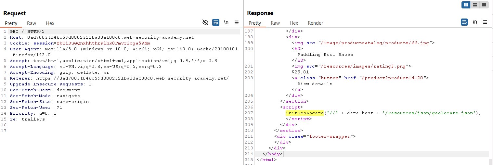
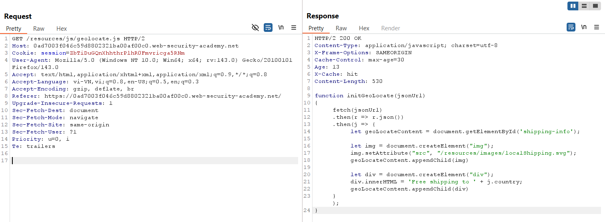
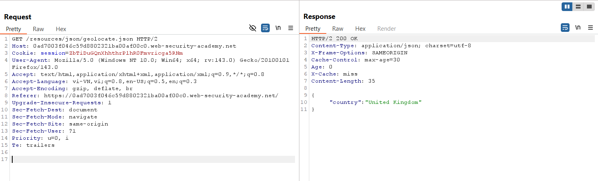
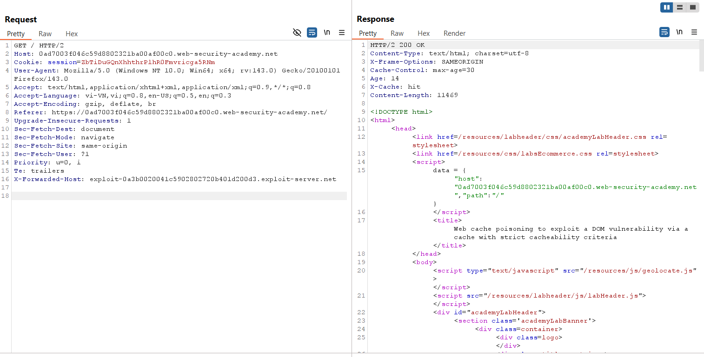
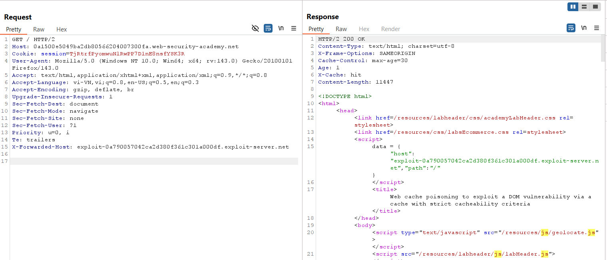

# Write-up: Web cache poisoning to exploit a DOM vulnerability via a cache with strict cacheability criteria

### Tổng quan
Khai thác lỗ hổng **Web Cache Poisoning** kết hợp với **DOM-based XSS** trong ứng dụng web, nơi hàm `initGeoLocate` sử dụng `data.host` từ header để xây dựng URL và chèn nội dung JSON vào `innerHTML` mà không xử lý an toàn. Bằng cách poison cache với header `X-Forwarded-Host` trỏ đến Exploit Server chứa payload XSS, kẻ tấn công khiến người dùng truy cập trang độc hại, kích hoạt `alert(document.cookie)` và hoàn thành lab.

### Mục tiêu
- Khai thác lỗ hổng **Web Cache Poisoning** để poison cache với phản hồi chứa payload DOM-based XSS, khiến người dùng truy cập trang độc hại, kích hoạt `alert(document.cookie)` và hoàn thành lab.

### Công cụ sử dụng
- Burp Suite Pro
- Firefox Browser

### Quy trình khai thác

1. Xác định vị trí poison
- Trong trang home ta quan sát thấy hàm initGeoLocate với tham số thứ nhất được concat bởi data.host
    

- nội dung của hàm như sau: fetch một file Json từ url, sau đó đưa vào innerHTML của thẻ div để render -> sink DOM based XSS tại đây
    
    

- Poison giá trị của host trong data thành exploit server
    

2. Khai thác web cache thực hiện xss
- Setup exploit server
    

- Gửi với header x-forwarded-host: exploit-server
    - Kết quả: hoàn thành lab
    

### Bài học rút ra
- Hiểu cách khai thác **Web Cache Poisoning** kết hợp **DOM-based XSS**, sử dụng header `X-Forwarded-Host` để poison cache và chèn payload XSS vào `innerHTML` của phản hồi cacheable.  
- Nhận thức tầm quan trọng của việc kiểm tra và lọc header người dùng (như `X-Forwarded-Host`), vô hiệu hóa cache cho các phản hồi động, và xử lý an toàn dữ liệu trước khi chèn vào DOM để ngăn chặn các cuộc tấn công cache poisoning.

### Kết luận
Lab này cung cấp kinh nghiệm thực tiễn trong việc khai thác **Web Cache Poisoning** để kích hoạt **DOM-based XSS**, nhấn mạnh tầm quan trọng của việc bảo vệ cache và xử lý dữ liệu an toàn để ngăn chặn các cuộc tấn công kết hợp. Xem portfolio đầy đủ tại https://github.com/Furu2805/Lab_PortSwigger.

*Viết bởi Toàn Lương, Tháng 10/2025.*