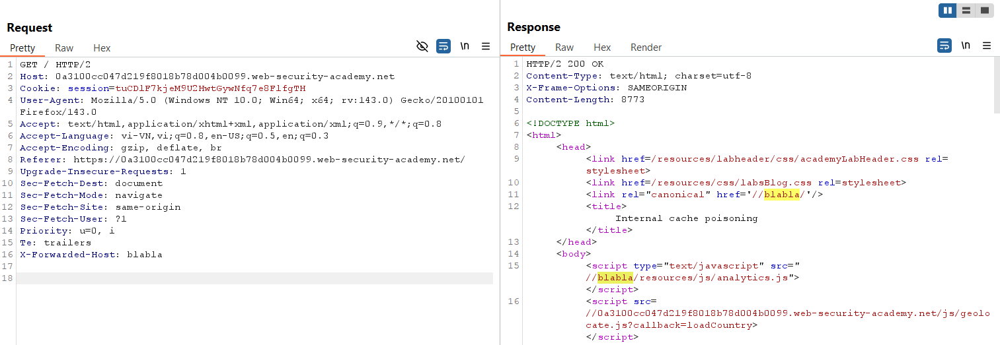
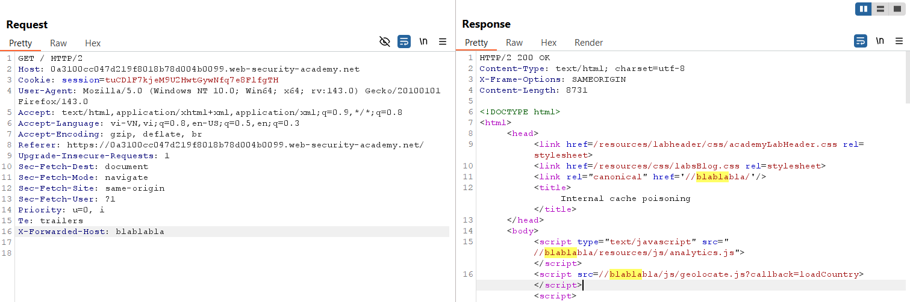
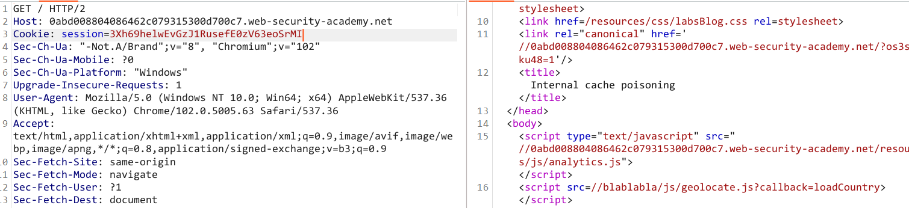
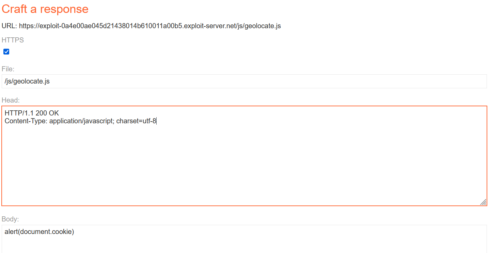
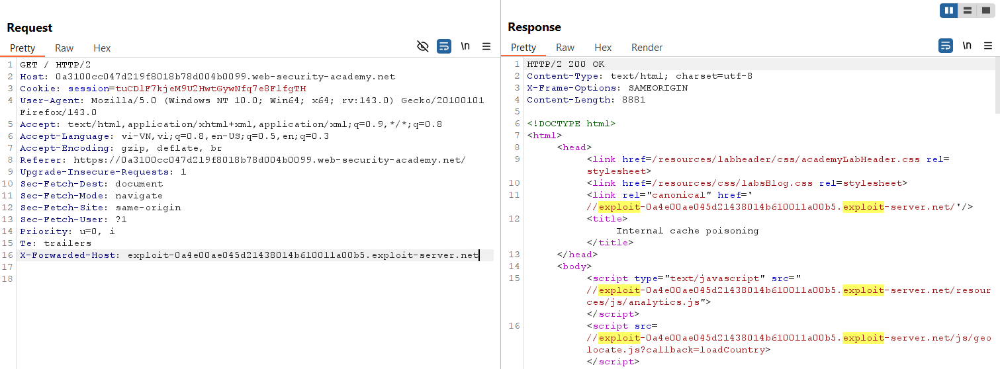
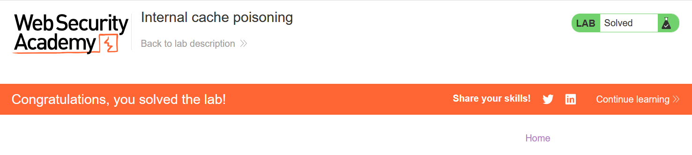

# Write-up: Internal cache poisoning

### Tổng quan
Khai thác lỗ hổng **Web Cache Poisoning** trong ứng dụng web sử dụng nhiều lớp cache (internal và external), nơi header `X-Forwarded-Host` được xử lý khác nhau giữa các lớp cache. Bằng cách poison internal cache với header `X-Forwarded-Host` trỏ đến Exploit Server chứa payload XSS, kẻ tấn công khiến trang chủ thực thi `alert(document.cookie)` trong trình duyệt của nạn nhân, hoàn thành lab.

### Mục tiêu
- Khai thác lỗ hổng **Web Cache Poisoning** để poison internal cache, thay đổi hostname của `geolocate.js` thành Exploit Server, khiến trang chủ thực thi `alert(document.cookie)` trong trình duyệt nạn nhân và hoàn thành lab.

### Công cụ sử dụng
- Burp Suite Pro (với extension Param Miner)
- Firefox Browser

### Quy trình khai thác

**1. Xác định vị trí poison**
- Sử dụng Param Miner ta tìm được `x-forwarded-host` là đặc biệt

- Trong request `GET /`, ta thêm header `x-forwarded-host`: blabla rồi gửi đi
    - **Kết quả**: blabla được reflect trong response khi fetch `analytis.js`, tuy nhiên đối với geolocate.js thì vẫn giữ nguyên -> chúng được cache bởi 2 fragment khác nhau.
        

- Gửi lại requet GET / với header x-forwarded-host: blablabla
    - Kết quả: Thay đổi thành công hostname ứng với geolocate.js
        

- Thử bỏ header và send lại request 
    - Kết quả: hostname của geolocate.js và analytis.js đều là host đường dẫn
        
- vậy x-forwarded-host là một keyed input đối với external cache nhưng lại là một unkeyed input đôi với internal cache

**2. Khai thác web cache thực hiện xss**
- Setup body exploit server:
    

- Gửi request GET / với header x-forwarded-host: exploit-server
    

- Kết quả: hoàn thành lab.
    

### Bài học rút ra
- Hiểu cách khai thác **Web Cache Poisoning** trong hệ thống sử dụng nhiều lớp cache, lợi dụng sự khác biệt trong xử lý header `X-Forwarded-Host` giữa internal và external cache để chèn payload XSS.  
- Nhận thức tầm quan trọng của việc đồng bộ hóa xử lý header giữa các lớp cache, lọc và xác thực header người dùng, và vô hiệu hóa cache cho các phản hồi động để ngăn chặn các cuộc tấn công cache poisoning.

### Kết luận
Lab này cung cấp kinh nghiệm thực tiễn trong việc khai thác **Web Cache Poisoning** với nhiều lớp cache, nhấn mạnh tầm quan trọng của việc cấu hình cache an toàn và xác thực đầu vào để ngăn chặn thực thi mã độc trong trình duyệt nạn nhân. Xem portfolio đầy đủ tại https://github.com/Furu2805/Lab_PortSwigger.

*Viết bởi Toàn Lương, Tháng 10/2025.*