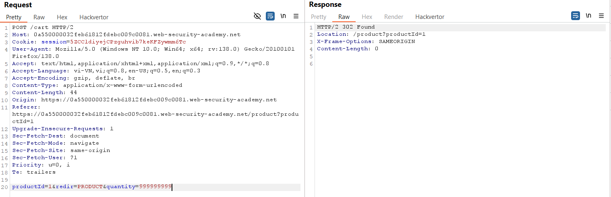
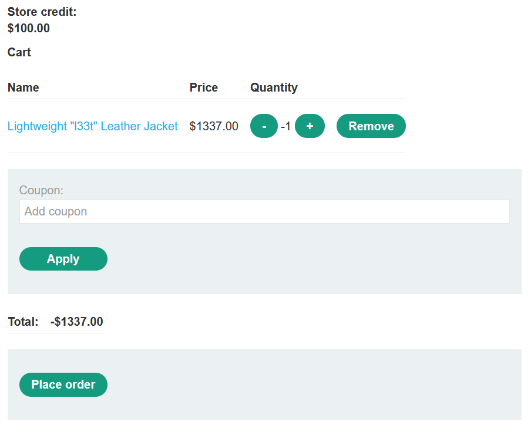
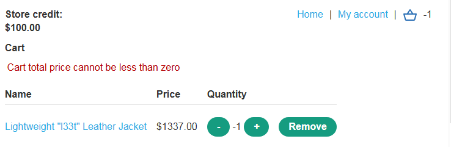
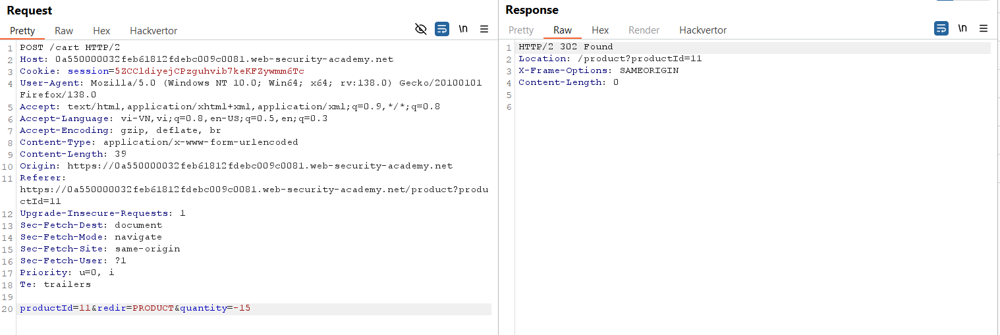
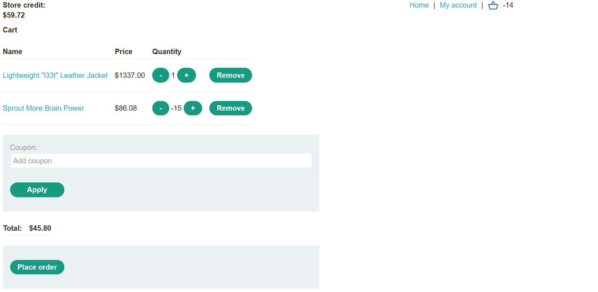
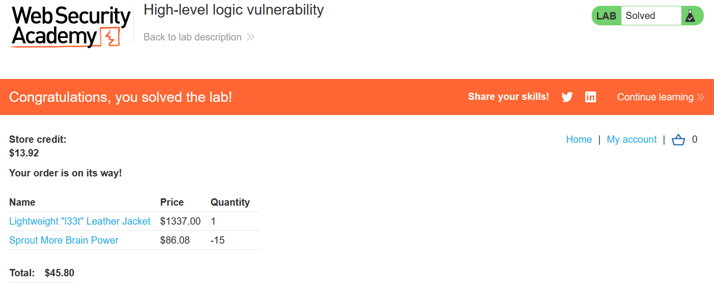

# Write-up: High-level logic vulnerability

### Tổng quan
Khai thác lỗ hổng logic trong quy trình mua hàng, lợi dụng việc thiếu kiểm tra tham số quantity để sửa số lượng sản phẩm thành số âm, cân bằng tổng giá và mua Lightweight l33t Leather Jacket với giá thấp.

### Mục tiêu
- Mua sản phẩm Lightweight l33t Leather Jacket bằng cách khai thác lỗi logic.

### Công cụ sử dụng
- Burp Suite Community
- Firefox Browser

### Quy trình khai thác
1. **Thu thập thông tin (Reconnaissance)**
- Đăng nhập vào tài khoản `wiener`:`peter`.
- Thêm sản phẩm Lightweight l33t Leather Jacket vào giỏ hàng.
- Kiểm tra Burp Proxy HTTP History, xác định yêu cầu POST tới `/cart`:
    - Gửi yêu cầu này tới Repeater để thử nghiệm.

- Thử sửa tham số quantity trong Repeater thành số bất kỳ (ví dụ: quantity=5):
    - **Kết quả**: Web chấp nhận số lượng bất kỳ, không kiểm tra giá trị.
        

- Thử quantity=-1 cho Lightweight l33t Leather Jacket:
    - **Kết quả**: Tổng giá giỏ hàng thành âm.
        
    - Thử thanh toán thì web báo lỗi: "Cart total price cannot be less than zero"
        

- Để bypass, thêm sản phẩm khác (productId=11) với quantity âm để cân bằng tổng giá

2. **Khai thác (Exploitation)**
- Gửi POST request cho Lightweight l33t Leather Jacket (productId=1, quantity=1):

- Gửi POST request cho sản phẩm khác (productId=11, quantity=-15)
    
    - Kết quả: Tổng giá giỏ hàng dương, cho phép thanh toán:
    

- Chọn **Place order** để hoàn thành lab:
    

### Bài học rút ra
- Hiểu cách khai thác lỗ hổng logic trong quy trình mua hàng khi thiếu kiểm tra tham số số lượng.
- Nhận thức tầm quan trọng của việc kiểm tra dữ liệu đầu vào phía server để ngăn chặn sửa đổi giá trị.

### Tài liệu tham khảo
- PortSwigger: Business logic vulnerabilities

### Kết luận
Lab này cung cấp kinh nghiệm thực tiễn trong việc khai thác lỗ hổng logic, sử dụng Burp Suite để sửa số lượng sản phẩm và mua hàng thành công. Xem portfolio đầy đủ tại https://github.com/Furu2805/Lab_PortSwigger.

*Viết bởi Toàn Lương, Tháng 5/2025.*