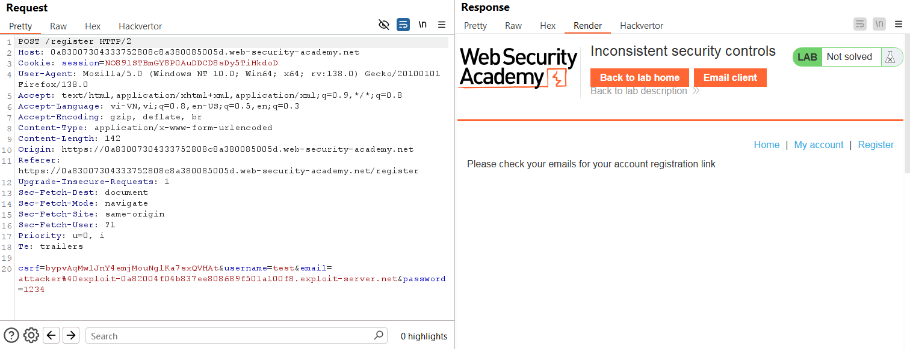
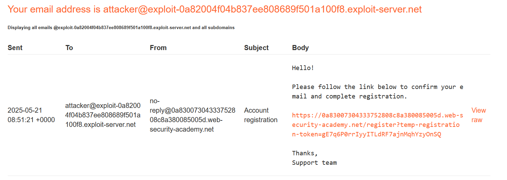
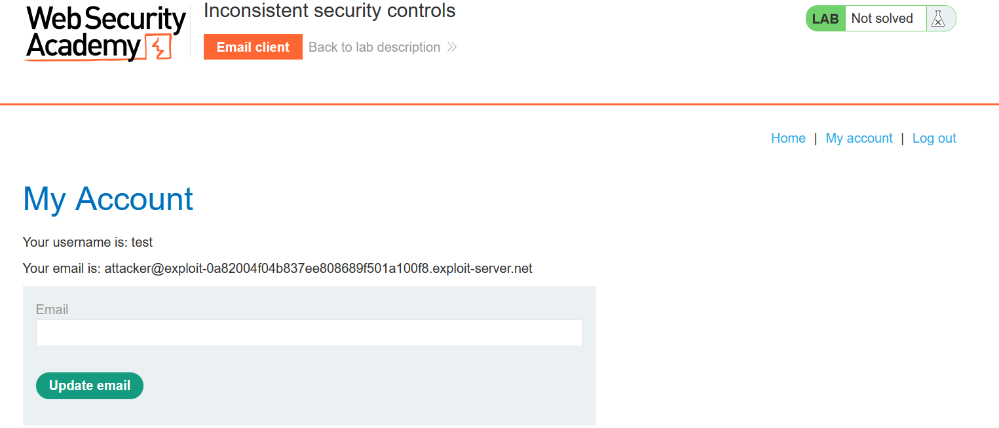
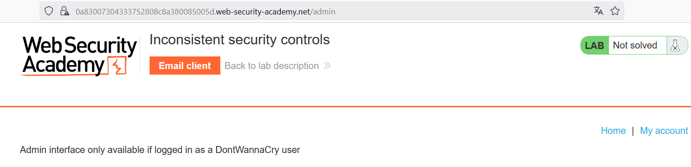
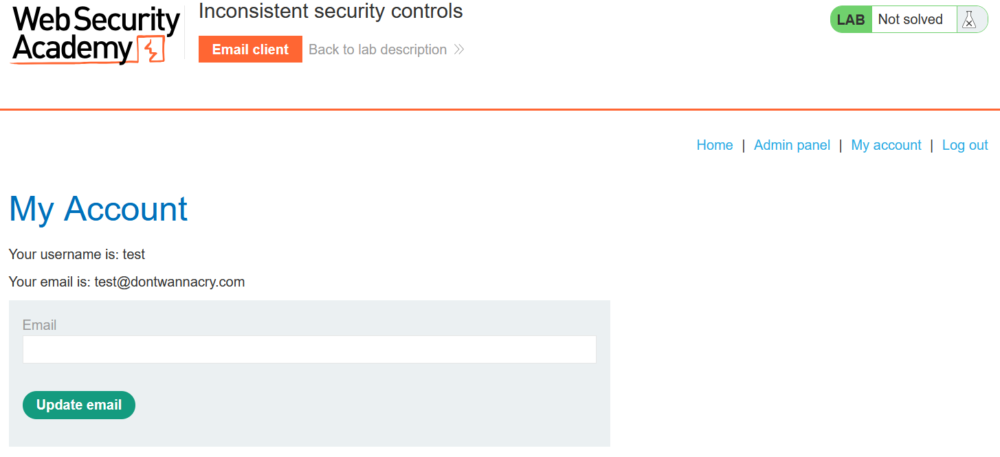
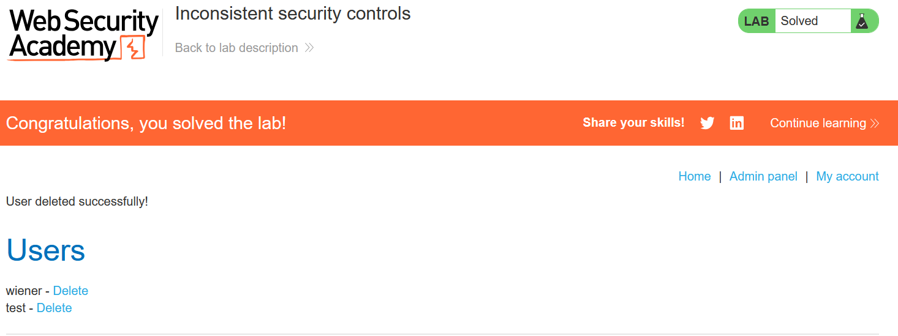

# Write-up: Inconsistent security controls

### Tổng quan
Khai thác lỗ hổng kiểm soát bảo mật không nhất quán, cho phép người dùng thông thường truy cập chức năng quản trị bằng cách sửa email thành đuôi @dontwannacry.com và xóa tài khoản carlos.

### Mục tiêu
- Truy cập `admin panel` và xóa tài khoản `carlos`.

### Công cụ sử dụng
- Burp Suite Community
- Firefox Browser

### Quy trình khai thác
1. **Thu thập thông tin (Reconnaissance)**
- Tạo tài khoản qua trang đăng ký (/register) với email attacker@exploit-0a82004f04b837ee808689f501a100f8.exploit-server.net 
    
- Vào email trong exploit server được cung cấp, click liên kết xác nhận để kích hoạt tài khoản:
    
- Đăng nhập vào tài khoản vừa tạo `test`:`1234`.
    
- Thử truy cập `/admin`, nhận lỗi: `"Admin interface only available if logged in as a DontWannaCry user"`:
    

2. **Khai thác (Exploitation)**
- Vào phần cập nhật email (`/my-account`), update email thành `test@dontwannacry.com` và thấy xuất hiện `admin panel`
    

- Chọn tùy chọn xóa tài khoản carlos:
    - Kết quả: Tài khoản carlos bị xóa, hoàn thành lab:

    

### Bài học rút ra
- Hiểu cách khai thác lỗ hổng kiểm soát bảo mật không nhất quán khi ứng dụng không xác thực đầy đủ quyền truy cập.
- Nhận thức tầm quan trọng của việc kiểm tra và giới hạn quyền người dùng phía server.

### Tài liệu tham khảo
- PortSwigger: Business logic vulnerabilities

### Kết luận
Lab này cung cấp kinh nghiệm thực tiễn trong việc khai thác lỗ hổng logic, lợi dụng việc cập nhật email để truy cập admin panel và xóa tài khoản. Xem portfolio đầy đủ tại https://github.com/Furu2805/Lab_PortSwigger.

*Viết bởi Toàn Lương, Tháng 5/2025.*