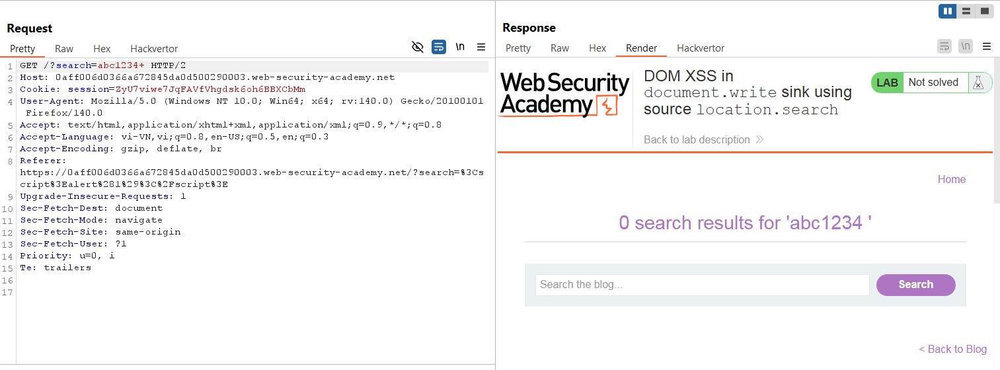

# Write-up: DOM XSS in `document.write` sink using source `location.search`

### Tổng quan
Khai thác lỗ hổng DOM-based Cross-Site Scripting (XSS) trong chức năng tìm kiếm, nơi tham số từ `location.search` được chèn trực tiếp vào `document.write` mà không được làm sạch, cho phép thực thi mã JavaScript thông qua payload `"><body onload=alert(1)>` để hoàn thành lab.

### Mục tiêu
- Khai thác lỗ hổng DOM XSS trong chức năng tìm kiếm bằng cách sử dụng tham số từ `location.search` để chèn mã JavaScript vào `document.write` và thực thi `alert(1)` để hoàn thành lab.

### Công cụ sử dụng
- Burp Suite Community
- Firefox Browser

### Quy trình khai thác
1. **Thu thập thông tin (Reconnaissance)**
- Truy cập chức năng tìm kiếm của ứng dụng
- Nhập một xâu ký tự bất kỳ vào ô tìm kiếm:
    - **Phản hồi**: Trang hiển thị xâu ký tự vừa tìm trong nội dung HTML

- Sử dụng Dev Tools (F12) để kiểm tra, thấy tham số từ `location.search` được chèn vào thuộc tính `src` của thẻ ``:
    
    - **Phân tích**: Input từ `location.search` không được làm sạch trước khi đưa vào `document.write`, cho phép chèn mã HTML hoặc JavaScript, gợi ý khả năng khai thác DOM XSS.

2. **Khai thác (Exploitation)**
- Chèn payload XSS vào tham số:
    `"><body onload=alert(1)>`
    - `Phản hồi`: `document.write` tạo ra HTML:
        - Thẻ `<body onload=alert(1)>` được thực thi, hiển thị hộp thoại `alert(1)`:
        
    
### Bài học rút ra
- Hiểu cách khai thác lỗ hổng DOM XSS bằng cách chèn mã HTML/JavaScript vào tham số `location.search` được sử dụng trong `document.write` sink.
- Nhận thức tầm quan trọng của việc làm sạch (sanitizing) input người dùng trước khi sử dụng trong `document.write` để ngăn chặn các cuộc tấn công DOM XSS.

### Tài liệu tham khảo
- PortSwigger: Cross-Site Scripting (XSS)

### Kết luận
Lab này cung cấp kinh nghiệm thực tiễn trong việc phát hiện và khai thác lỗ hổng DOM XSS thông qua `document.write` sink với nguồn `location.search`, nhấn mạnh tầm quan trọng của việc làm sạch input người dùng trong xử lý DOM. Xem portfolio đầy đủ tại https://github.com/Furu2805/Lab_PortSwigger.

*Viết bởi Toàn Lương, Tháng 7/2025*.