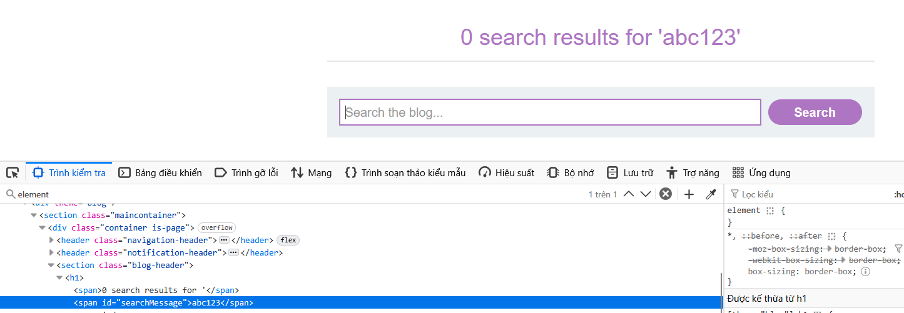

# Write-up: OM XSS in `innerHTML` sink using source `location.search`

### Tổng quan
Khai thác lỗ hổng DOM-based Cross-Site Scripting (XSS) trong chức năng tìm kiếm, nơi tham số từ `location.search` được chèn trực tiếp vào thuộc tính `innerHTML` mà không được làm sạch, cho phép thực thi mã JavaScript thông qua payload `` để hoàn thành lab.

### Mục tiêu
- Khai thác lỗ hổng DOM XSS trong chức năng tìm kiếm bằng cách sử dụng tham số từ `location.search` để chèn mã JavaScript vào `innerHTML` và thực thi `alert(1)` để hoàn thành lab

### Công cụ sử dụng
- Burp Suite Community
- Firefox Browser

### Quy trình khai thác
1. **Thu thập thông tin (Reconnaissance)**
- Truy cập chức năng tìm kiếm của ứng dụng 
- Nhập một chuỗi ký tự bất kỳ vào ô tìm kiếm:
    - `Phản hồi`: Trang hiển thị chuỗi vừa nhập trong nội dung `HTML`.
        
    
2. **Khai thác (Exploitation)**
- Chèn payload XSS vào tham số query:
    ``
    - Thẻ `` với `src=1` (URL không hợp lệ) kích hoạt sự kiện `onerror`, thực thi `alert(1)`, hiển thị hộp thoại và hoàn thành lab
        
    - **Giải thích**: Payload `` được chèn trực tiếp vào innerHTML, tạo thẻ  với sự kiện onerror để thực thi JavaScript, dẫn đến DOM XSS, hoàn thành yêu cầu của lab:
    
### Bài học rút ra
- Hiểu cách khai thác lỗ hổng DOM XSS bằng cách chèn mã HTML/JavaScript vào tham số `location.search` được sử dụng trong `innerHTML` sink.
- Nhận thức tầm quan trọng của việc làm sạch (sanitizing) input người dùng trước khi sử dụng trong `innerHTML` để ngăn chặn các cuộc tấn công DOM XSS.

### Tài liệu tham khảo
- PortSwigger: Cross-Site Scripting (XSS)

### Kết luận
Lab này cung cấp kinh nghiệm thực tiễn trong việc phát hiện và khai thác lỗ hổng DOM XSS thông qua `innerHTML` sink với nguồn `location.search`, nhấn mạnh tầm quan trọng của việc làm sạch input người dùng trong xử lý DOM. Xem portfolio đầy đủ tại https://github.com/Furu2805/Lab_PortSwigger.

*Viết bởi Toàn Lương, Tháng 7/2025.*