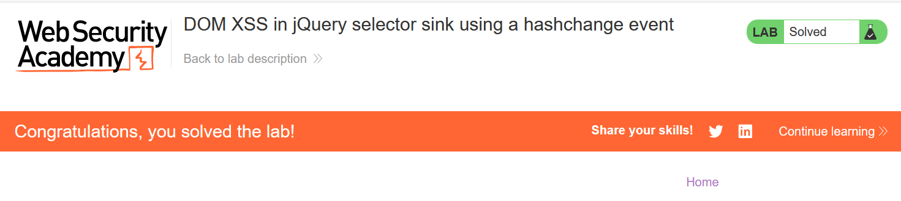

# Write-up: DOM XSS in jQuery selector sink using a hashchange event

### Tổng quan
Khai thác lỗ hổng DOM-based Cross-Site Scripting (XSS) trong ứng dụng sử dụng jQuery selector sink, nơi giá trị hash từ URL (`location.hash`) được xử lý bởi sự kiện `hashchange` mà không được làm sạch, cho phép thực thi mã JavaScript (`print()`) thông qua payload trong thẻ `<iframe>` để hoàn thành lab.

### Mục tiêu
- Khai thác lỗ hổng DOM XSS thông qua sự kiện `hashchange` và jQuery selector sink để thực thi hàm `print()` và hoàn thành lab bằng cách gửi payload tới nạn nhân.

### Công cụ sử dụng
- Burp Suite Community
- Firefox Browser
- Exploit Server (PortSwigger)

### Quy trình khai thác
1. **Thu thập thông tin (Reconnaissance)**
- Truy cập ứng dụng và kiểm tra hành vi của URL với giá trị hash.
- Quan sát trong Dev Tools (F12), phát hiện ứng dụng sử dụng jQuery để xử lý giá trị `location.hash` thông qua sự kiện `hashchange`.

2. **Khai thác (Exploitation)**
- Mở Exploit Server, nhập payload vào phần body:
    ```java
    <iframe src="https://lab-id.web-security-academy.net/#" onload="this.src+=''"></iframe>
    ```
    
- Nhấn "Store" để lưu payload, sau đó chọn "View exploit" để kiểm tra:
    - Payload tạo một thẻ `<iframe>` tải trang `https://lab-id.web-security-academy.net/#`.
    - Sự kiện `onload` thay đổi `src` của `<iframe>` thành `https://lab-id.web-security-academy.net/#`.
    - Giá trị hash `#` được jQuery selector xử lý, dẫn đến thực thi hàm `print()` khi thẻ `` gặp lỗi `onerror`:
        

- Gửi payload tới nạn nhân qua chức năng "Deliver exploit to victim" trên Exploit Server -> hoàn thành lab:
    

- **Giải thích**: Giá trị hash `#` được jQuery selector sink sử dụng mà không được làm sạch, cho phép chèn thẻ `` với sự kiện `onerror`, dẫn đến thực thi mã JavaScript, gây ra DOM XSS.
    
### Bài học rút ra
- Hiểu cách khai thác lỗ hổng DOM XSS bằng cách chèn mã HTML/JavaScript vào giá trị hash được xử lý bởi jQuery selector sink qua sự kiện `hashchange`.
- Nhận thức tầm quan trọng của việc làm sạch (sanitizing) giá trị `location.hash` trước khi sử dụng trong jQuery selector để ngăn chặn các cuộc tấn công DOM XSS.

### Tài liệu tham khảo
- PortSwigger: Cross-Site Scripting (XSS)

### Kết luận
Lab này cung cấp kinh nghiệm thực tiễn trong việc phát hiện và khai thác lỗ hổng DOM XSS thông qua jQuery selector sink và sự kiện `hashchange`, nhấn mạnh tầm quan trọng của việc làm sạch input người dùng trong xử lý DOM. Xem portfolio đầy đủ tại https://github.com/Furu2805/Lab_PortSwigger.

*Viết bởi Toàn Lương, Tháng 7/2025.*