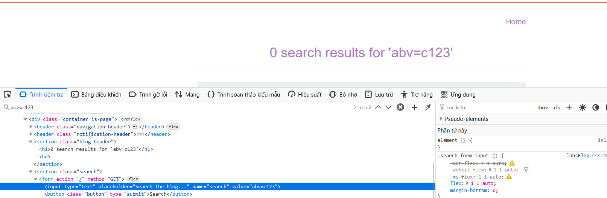
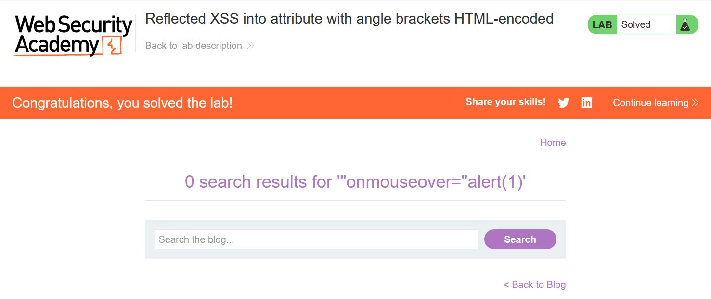

# Write-up: Reflected XSS into attribute with angle brackets HTML-encoded

### Tổng quan
Khai thác lỗ hổng Reflected Cross-Site Scripting (XSS) trong chức năng tìm kiếm của ứng dụng, nơi tham số `search` từ URL được chèn trực tiếp vào thuộc tính `value` của thẻ `<input>` mà không được làm sạch đúng cách, cho phép thực thi mã JavaScript thông qua payload `"onmouseover="alert(1)` khi người dùng di chuột qua ô tìm kiếm, dù angle brackets (`<, >`) bị HTML-encoded.

### Mục tiêu
- Khai thác lỗ hổng Reflected XSS trong chức năng tìm kiếm bằng cách chèn mã JavaScript vào thuộc tính `value` của thẻ `<input>` để thực thi `alert(1)` và hoàn thành lab.

### Công cụ sử dụng
- Burp Suite Community
- Firefox Browser

### Quy trình khai thác
1. **Thu thập thông tin (Reconnaissance)**
- Truy cập chức năng tìm kiếm của ứng dụng và nhập chuỗi `abv=c123` vào search box, sau đó chọn tìm kiếm:
- Sử dụng Dev Tools (F12) để kiểm tra mã nguồn, thấy thẻ `<input>`:
    ```
    <input type="text" placeholder="Search the blog..." name="search" value="abv=c123">
    ```
    

- `Quan sát`: Tham số search từ URL được chèn trực tiếp vào thuộc tính `value` của thẻ `<input>`. Angle brackets (<, >) bị HTML-encoded, nhưng các ký tự như double quotes (") và sự kiện JavaScript không bị chặn, gợi ý khả năng khai thác Reflected XSS bằng cách chèn sự kiện như `onmouseover`.

2. **Khai thác (Exploitation)**
- Chèn payload XSS vào tham số search:
    `"onmouseover="alert(1)`
    - **Phản hồi**: Thẻ `<input>` trở thành:
    ```
    <input type="text" placeholder="Search the blog..." name="search" value="" onmouseover="alert(1)">
    ```
- Khi người dùng di chuột qua ô tìm kiếm, sự kiện `onmouseover` kích hoạt, thực thi `alert(1)`, hiển thị hộp thoại:
    

- Giải thích: Payload `"onmouseover="alert(1)` thoát khỏi thuộc tính value và chèn sự kiện `onmouseover` vào thẻ `<input>`. Vì angle brackets bị HTML-encoded, payload tận dụng double quotes và sự kiện JavaScript để thực thi mã, dẫn đến Reflected XSS, hoàn thành yêu cầu của lab.

### Bài học rút ra
- Hiểu cách khai thác lỗ hổng Reflected XSS bằng cách chèn sự kiện JavaScript như `onmouseover` vào thuộc tính HTML (`value`) thông qua tham số URL, ngay cả khi angle brackets bị HTML-encoded.
- Nhận thức tầm quan trọng của việc làm sạch (sanitizing) và mã hóa đúng cách input người dùng trước khi chèn vào thuộc tính HTML để ngăn chặn các cuộc tấn công XSS.

### Tài liệu tham khảo
- PortSwigger: Cross-Site Scripting (XSS)

### Kết luận
Lab này cung cấp kinh nghiệm thực tiễn trong việc phát hiện và khai thác lỗ hổng Reflected XSS trong thuộc tính `value` của thẻ `<input>`, nhấn mạnh tầm quan trọng của việc làm sạch và mã hóa input người dùng để bảo vệ ứng dụng web khỏi các cuộc tấn công XSS. Xem portfolio đầy đủ tại https://github.com/Furu2805/Lab_PortSwigger.

*Viết bởi Toàn Lương, Tháng 7/2025.*