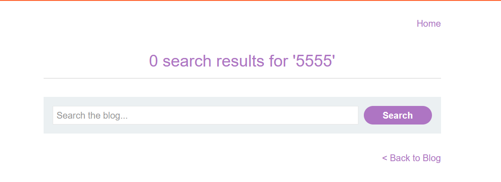
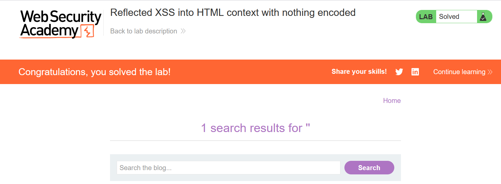

# Write-up: Reflected XSS into HTML context with nothing encoded 

### Tổng quan
Khai thác lỗ hổng Reflected Cross-Site Scripting (XSS) trong chức năng tìm kiếm của ứng dụng, nơi input người dùng được chèn trực tiếp vào HTML mà không được mã hóa, cho phép thực thi mã JavaScript (``) để hoàn thành lab.

### Mục tiêu
- Khai thác lỗ hổng Reflected XSS trong chức năng tìm kiếm để thực thi mã JavaScript và hoàn thành lab.

### Công cụ sử dụng
- Burp Suite Community
- Firefox Browser

### Quy trình khai thác
1. **Thu thập thông tin (Reconnaissance)**
- Đăng nhập tài khoản `wiener`:`peter` , truy cập chức năng tìm kiếm của ứng dụng.
- Thử nhập `5555` vào ô tìm kiếm và nhấn tìm kiếm:
    - **Phản hồi**: Trang hiển thị thông báo chứa `5555` trong HTML.

    - **Quan sát**: Input 5555 được chèn trực tiếp vào HTML mà không được mã hóa, gợi ý khả năng khai thác Reflected XSS:
        

2. **Khai thác (Exploitation)**\
- Chèn payload XSS vào ô tìm kiếm và gửi: ``
    - **Phản hồi**: Trình duyệt thực thi mã JavaScript, hiển thị hộp thoại alert(1) và hoàn thành lab:
        
    
    - **Giải thích**: Input `` được chèn trực tiếp vào HTML context mà không được mã hóa, cho phép thực thi mã JavaScript, hoàn thành yêu cầu của lab:

### Bài học rút ra
- Hiểu cách khai thác lỗ hổng Reflected XSS trong HTML context bằng cách chèn mã JavaScript vào input không được mã hóa.
- Nhận thức tầm quan trọng của việc mã hóa (encoding) và làm sạch (sanitizing) input người dùng để ngăn chặn các cuộc tấn công XSS

### Tài liệu tham khảo
- PortSwigger: Cross-Site Scripting (XSS)

### Kết luận
Lab này cung cấp kinh nghiệm thực tiễn trong việc phát hiện và khai thác lỗ hổng Reflected XSS trong HTML context, nhấn mạnh tầm quan trọng của việc mã hóa input người dùng để bảo vệ ứng dụng web. Xem portfolio đầy đủ tại https://github.com/Furu2805/Lab_PortSwigger.

*Viết bởi Toàn Lương, Tháng 7/2025.*