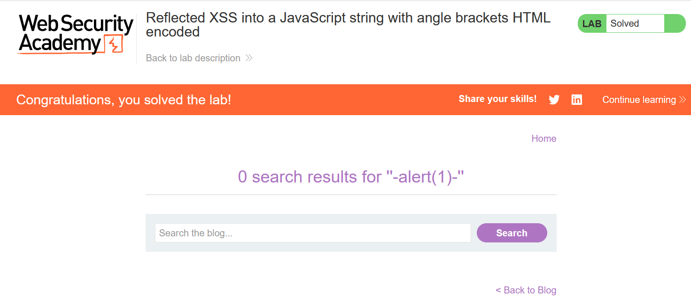

# Write-up: Reflected XSS into a JavaScript string with angle brackets HTML encoded

### Tổng quan
Khai thác lỗ hổng Reflected Cross-Site Scripting (XSS) trong chức năng tìm kiếm của ứng dụng, nơi tham số `search` được chèn trực tiếp vào chuỗi JavaScript trong biến `searchTerms` mà không được làm sạch đúng cách. Angle brackets (`<`, `>`) bị HTML-encoded, nhưng payload `'-alert(1)-'` được sử dụng để thoát chuỗi và thực thi mã JavaScript, hoàn thành lab.

### Mục tiêu
- Khai thác lỗ hổng Reflected XSS bằng cách chèn mã JavaScript vào chuỗi JavaScript trong tham số `search`, thoát khỏi chuỗi với `'-alert(1)-`' để thực thi `alert(1)` và hoàn thành lab.

### Công cụ sử dụng
- Burp Suite Community
- Firefox Browser

### Quy trình khai thác
1. **Thu thập thông tin (Reconnaissance)**
- Truy cập chức năng tìm kiếm của ứng dụng và nhập chuỗi thử nghiệm vào search box:
    `</script>`

- Sử dụng Dev Tools (Ctrl+U) để xem source code, thấy đoạn script:
    ```
    <script>
        var searchTerms = '&lt;/script&gt;&lt;img src=1 onerror=alert(1)&gt;';
        document.write('');
    </script>
    ```

- **Quan sát**:
    - Tham số `search` được chèn trực tiếp vào chuỗi JavaScript trong biến `searchTerms`.
    - Angle brackets (`<`, `>`) bị HTML-encoded thành `&lt;`, `&gt;`, ngăn chặn chèn thẻ HTML trực tiếp.
    - Chuỗi được bao quanh bởi single quotes (`'`), gợi ý khả năng thoát chuỗi bằng single quote để chèn mã JavaScript.

2. **Khai thác (Exploitation)**
- Chèn payload XSS vào tham số `search`: `'-alert(1)-'`
    - **Phản hồi**: Đoạn script trở thành:
        ```java
        <script>
            var searchTerms = ''-alert(1)-'';
            document.write('');
        </script>
        ```
    - Hiển thị hộp thoại:
        .png)

- **Giải thích**: Payload tận dụng việc tham số `search` được chèn vào chuỗi JavaScript mà không được làm sạch, cho phép thoát chuỗi với single quote và thực thi `alert(1)`, dẫn đến Reflected XSS, hoàn thành yêu cầu của lab:
    

### Bài học rút ra
- Hiểu cách khai thác lỗ hổng Reflected XSS bằng cách thoát chuỗi JavaScript với single quote để chèn mã thực thi, ngay cả khi angle brackets bị HTML-encoded.
- Nhận thức tầm quan trọng của việc làm sạch (sanitizing) và mã hóa đúng cách input người dùng trước khi chèn vào chuỗi JavaScript để ngăn chặn các cuộc tấn công XSS.

### Tài liệu tham khảo
- PortSwigger: Cross-Site Scripting (XSS)

### Kết luận
Lab này cung cấp kinh nghiệm thực tiễn trong việc phát hiện và khai thác lỗ hổng Reflected XSS trong chuỗi JavaScript, nhấn mạnh tầm quan trọng của việc làm sạch input người dùng trong mã JavaScript để ngăn chặn các cuộc tấn công XSS. Xem portfolio đầy đủ tại https://github.com/Furu2805/Lab_PortSwigger.

*Viết bởi Toàn Lương, Tháng 7/2025.*