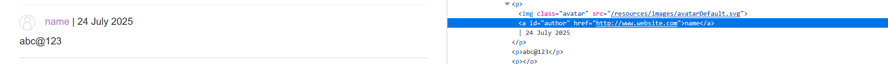
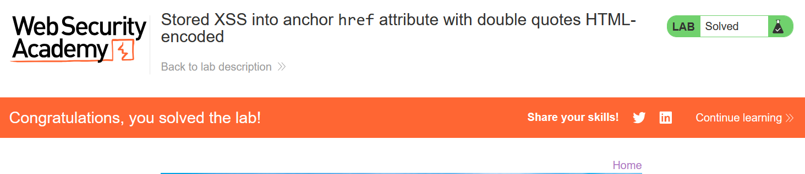

# Write-up: Stored XSS into anchor href attribute with double quotes HTML-encoded

### Tổng quan
Khai thác lỗ hổng Stored Cross-Site Scripting (XSS) trong chức năng comment của bài blog, nơi trường website được chèn trực tiếp vào thuộc tính `href` của thẻ `<a>` mà không được làm sạch, cho phép thực thi mã JavaScript thông qua payload `javascript:alert(1)` để hoàn thành lab, mặc dù double quotes (") bị HTML-encoded.

### Mục tiêu
- Khai thác lỗ hổng Stored XSS trong chức năng comment bằng cách chèn mã JavaScript vào trường website để thực thi `alert(1)` và hoàn thành lab.

### Công cụ sử dụng
- Burp Suite Community
- Firefox Browser

### Quy trình khai thác
1. **Thu thập thông tin (Reconnaissance)**
- Truy cập một bài post bất kỳ và gửi comment với chuỗi bất kỳ, ví dụ:
    - Name: Test User
    - Email: test@example.com
    - Website: http://www.website.com
    - Comment: Test comment

- Sử dụng Burp Proxy để kiểm tra yêu cầu `GET /post/comment/confirmation?postId=1`:
    - `Phản hồi`: Trang xác nhận hiển thị:
    ```
    <p>
        <a id="author" href="http://www.website.com">Test User</a> | 24 July 2025
    </p>
    <p>test@example.com</p>
    ```
    - `Quan sát`: Trường website được chèn trực tiếp vào thuộc tính href của thẻ `<a id="author">` mà không được làm sạch, mặc dù double quotes (`"`) bị HTML-encoded (thành `&quot;`). Điều này gợi ý khả năng khai thác Stored XSS bằng cách sử dụng giao thức `javascript:` trong `href`:
        

2. **Khai thác (Exploitation)**
- Gửi comment mới với trường website chứa payload XSS:
    - Name: Test User
    - Email: test@example.com
    - Website: javascript:alert(1)
    - Comment: Test comment

- Kiểm tra lại trang `/post/comment/confirmation?postId=1`:
    - **Phản hồi**: Thẻ `<a>` trở thành:
        `<a id="author" href="javascript:alert(1)">Test User</a>`

- Khi nhấp vào liên kết Test User, mã JavaScript alert(1) được thực thi, hiển thị hộp thoại và hoàn thành lab.
    

- `Giải thích`: Payload `javascript:alert(1)` được lưu trữ trong trường website và chèn vào thuộc tính `href` mà không bị chặn, vượt qua HTML-encoding của double quotes, dẫn đến Stored XSS khi người dùng nhấp vào liên kết, hoàn thành yêu cầu của lab.

### Bài học rút ra
- Hiểu cách khai thác lỗ hổng Stored XSS bằng cách chèn mã JavaScript vào thuộc tính href của thẻ `<a>` thông qua trường website trong chức năng comment.
- Nhận thức tầm quan trọng của việc làm sạch (sanitizing) và kiểm tra input người dùng, đặc biệt là các trường như website, trước khi chèn vào thuộc tính HTML để ngăn chặn các cuộc tấn công XSS.

### Tài liệu tham khảo
- PortSwigger: Cross-Site Scripting (XSS)

### Kết luận
Lab này cung cấp kinh nghiệm thực tiễn trong việc phát hiện và khai thác lỗ hổng Stored XSS trong thuộc tính href của thẻ `<a>`, nhấn mạnh tầm quan trọng của việc làm sạch input người dùng để bảo vệ ứng dụng web. Xem portfolio đầy đủ tại https://github.com/Furu2805/Lab_PortSwigger.

*Viết bởi Toàn Lương, Tháng 7/2025.*