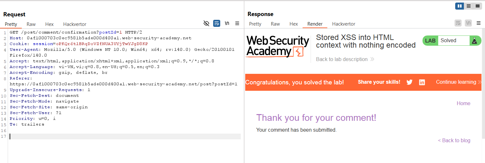

# Write-up: Stored XSS into HTML context with nothing encoded

### Tổng quan
Khai thác lỗ hổng Stored Cross-Site Scripting (XSS) trong chức năng comment của một bài blog, nơi input người dùng được chèn trực tiếp vào HTML mà không được mã hóa, cho phép thực thi mã JavaScript `()` để hoàn thành lab.

### Mục tiêu
- Khai thác lỗ hổng Stored XSS trong chức năng comment của bài blog để thực thi mã JavaScript và hoàn thành lab.

### Công cụ sử dụng
- Burp Suite Community
- Firefox Browser

### Quy trình khai thác
1. **Thu thập thông tin (Reconnaissance)**
- Truy cập một bài blog bất kỳ trên ứng dụng
- Quan sát chức năng comment, thử nhập dữ liệu bình thường và gửi:
    - **Phản hồi**: Comment xuất hiện trên trang blog,

2. **Khai thác (Exploitation)**
- Chèn payload XSS vào ô comment của bài blog: ``:
    - **Phản hồi**: Comment được lưu trữ, và mã JavaScript thực thi, hiển thị hộp thoại `alert(1)` khi truy cập bài blog và hoàn thành lab.
        
    - **Giải thích**: Input `` được lưu trữ và chèn trực tiếp vào HTML context mà không được mã hóa, dẫn đến Stored XSS, hoàn thành yêu cầu của lab.
    
### Bài học rút ra
- Hiểu cách khai thác lỗ hổng Stored XSS trong HTML context bằng cách chèn mã JavaScript vào input không được mã hóa.
- Nhận thức tầm quan trọng của việc mã hóa (encoding) và làm sạch (sanitizing) input người dùng trong các chức năng lưu trữ dữ liệu để ngăn chặn các cuộc tấn công XSS.

### Tài liệu tham khảo
- PortSwigger: Cross-Site Scripting (XSS)

### Kết luận
Lab này cung cấp kinh nghiệm thực tiễn trong việc phát hiện và khai thác lỗ hổng Stored XSS trong HTML context, nhấn mạnh tầm quan trọng của việc mã hóa và làm sạch input người dùng để bảo vệ ứng dụng web. Xem portfolio đầy đủ tại https://github.com/Furu2805/Lab_PortSwigger.

*Viết bởi Toàn Lương, Tháng 7/2025.*