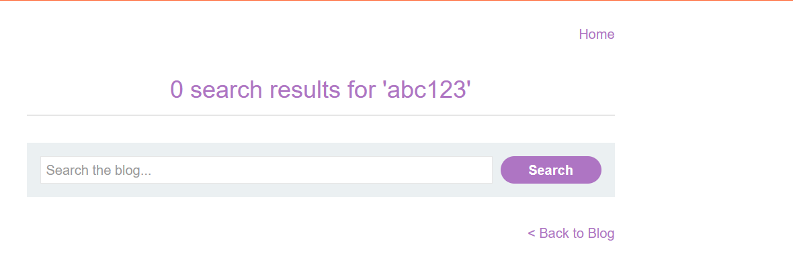
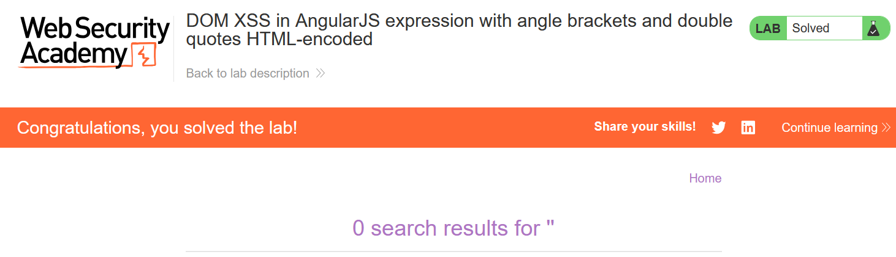

# Write-up: DOM XSS in AngularJS expression with angle brackets and double quotes HTML-encoded

### Tổng quan
Khai thác lỗ hổng DOM-based Cross-Site Scripting (XSS) trong chức năng tìm kiếm của ứng dụng sử dụng AngularJS, nơi input từ `location.search` được xử lý trong AngularJS expression mà không được làm sạch đúng cách, cho phép thực thi mã JavaScript thông qua payload `{{$on.constructor('alert(1)')()}}` để hoàn thành lab, mặc dù angle brackets (`<, >`) và double quotes (") bị HTML-encoded.

### Mục tiêu
- Khai thác lỗ hổng DOM XSS trong chức năng tìm kiếm bằng cách sử dụng AngularJS expression để thực thi mã JavaScript (`alert(1)`) và hoàn thành lab.

### Công cụ sử dụng
- Burp Suite Community
- Firefox Browser

### Quy trình khai thác
1. **Thu thập thông tin (Reconnaissance)**
- Truy cập chức năng tìm kiếm của ứng dụng 
- Nhập một chuỗi ký tự bất kỳ (ví dụ: test) vào ô tìm kiếm:
    - **Phản hồi**: Trang hiển thị chuỗi test trong nội dung HTML
        

    - `Quan sát`: Input được chèn trực tiếp vào AngularJS expression mà không được làm sạch đúng cách, nhưng angle brackets (<, >) và double quotes (") bị HTML-encoded (thành &lt;, &gt;, &quot;), gợi ý cần sử dụng payload AngularJS-specific để khai thác DOM XSS:

2. **Khai thác (Exploitation)**
- Chèn payload AngularJS XSS vào tham số:
    `{{$on.constructor('alert(1)')()}}`
    - **Phản hồi**: Payload được xử lý trong AngularJS expression
    - AngularJS thực thi expression `$on.constructor('alert(1)')()`, gọi hàm `alert(1)`, hiển thị hộp thoại và hoàn thành lab:
        
    
### Bài học rút ra
- Hiểu cách khai thác lỗ hổng DOM XSS trong AngularJS bằng cách sử dụng expression như `$on.constructor` để thực thi mã JavaScript khi angle brackets và double quotes bị HTML-encoded.
- Nhận thức tầm quan trọng của việc làm sạch (sanitizing) và kiểm tra input người dùng trong AngularJS expressions để ngăn chặn các cuộc tấn công DOM XSS.

### Tài liệu tham khảo
- PortSwigger: Cross-Site Scripting (XSS)

### Kết luận
Lab này cung cấp kinh nghiệm thực tiễn trong việc phát hiện và khai thác lỗ hổng DOM XSS trong AngularJS expressions, nhấn mạnh tầm quan trọng của việc làm sạch input người dùng trong các framework JavaScript như AngularJS. Xem portfolio đầy đủ tại https://github.com/Furu2805/Lab_PortSwigger.

*Viết bởi Toàn Lương, Tháng 7/2025.*