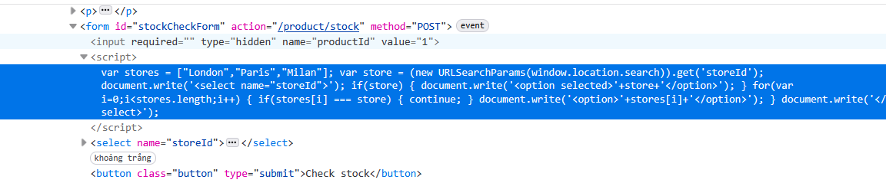

# Write-up: DOM XSS in `document.write` sink using source `location.search` inside a select element

### Tổng quan
Khai thác lỗ hổng DOM-based Cross-Site Scripting (XSS) trong chức năng check stock của ứng dụng, nơi tham số storeId từ `location.search` được chèn trực tiếp vào `document.write` trong một thẻ `<select>` mà không được làm sạch, cho phép thực thi mã JavaScript thông qua payload `"></select><body onload=alert(1)>` để hoàn thành lab.

### Mục tiêu
- Khai thác lỗ hổng DOM XSS trong chức năng check stock bằng cách sử dụng tham số storeId từ `location.search` để chèn mã JavaScript vào `document.write` và thực thi `alert(1)` để hoàn thành lab.

### Công cụ sử dụng
- Burp Suite Community
- Firefox Browser

### Quy trình khai thác
1. **Thu thập thông tin (Reconnaissance)**
- Truy cập chức năng check stock của một sản phẩm bất kỳ
- Sử dụng Dev Tools (F12) để kiểm tra mã nguồn, thấy đoạn mã JavaScript sử dụng `document.write` để tạo thẻ `<select>`:
    `document.write('<select name="storeId">' + location.search.substring(9) + '</select>');`

- Nhập tham số `storeId`:
    - `Phản hồi`: Trang hiển thị thẻ `<select>` với nội dung:
        `<select name="storeId">test</select>`
    - `Quan sát`: Tham số storeId từ `location.search` được chèn trực tiếp vào `document.write` mà không được làm sạch, gợi ý khả năng khai thác DOM XSS bằng cách phá vỡ cấu trúc thẻ `<select>`:
        

2. **Khai thác (Exploitation)**
- Chèn payload XSS vào tham số `storeId`: `"></select><body onload=alert(1)>`
    - `Phản hồi`: `document.write` tạo ra HTML:
    - Thẻ `<body onload=alert(1)>` được thực thi, hiển thị hộp thoại `alert(1)`:
        

    - `Giải thích`: Payload `"></select><body onload=alert(1)>` thoát khỏi thẻ `<select>` và chèn thẻ `<body>` với sự kiện onload, dẫn đến thực thi JavaScript, gây ra DOM XSS, hoàn thành yêu cầu của lab
    
### Bài học rút ra
- Hiểu cách khai thác lỗ hổng DOM XSS bằng cách chèn mã HTML/JavaScript vào tham số `location.search` được sử dụng trong `document.write` sink trong thẻ `<select>`.
- Nhận thức tầm quan trọng của việc làm sạch (sanitizing) input người dùng trước khi sử dụng trong `document.write` để ngăn chặn các cuộc tấn công DOM XSS.

### Tài liệu tham khảo
- PortSwigger: Cross-Site Scripting (XSS)

### Kết luận
Lab này cung cấp kinh nghiệm thực tiễn trong việc phát hiện và khai thác lỗ hổng DOM XSS thông qua document.write sink với nguồn location.search trong thẻ `<select>`, nhấn mạnh tầm quan trọng của việc làm sạch input người dùng trong xử lý DOM. Xem portfolio đầy đủ tại https://github.com/Furu2805/Lab_PortSwigger.

Viết bởi Toàn Lương, Tháng 7/2025.