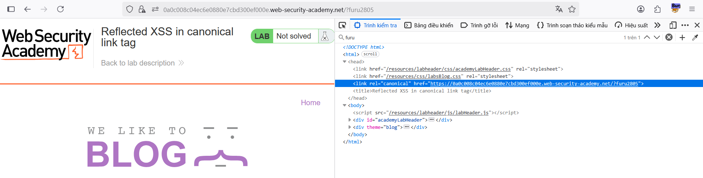
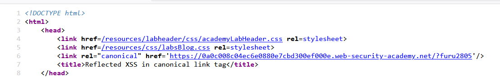
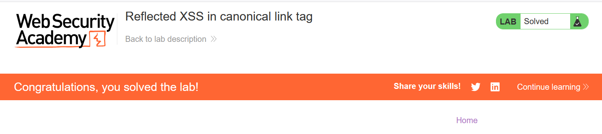

# Write-up: Reflected XSS in canonical link tag

### Tổng quan
Khai thác lỗ hổng Reflected Cross-Site Scripting (XSS) trong thẻ `<link rel="canonical">`, nơi tham số từ URL được chèn trực tiếp vào thuộc tính `href` mà không được làm sạch, cho phép thực thi mã JavaScript thông qua thuộc tính `accesskey` và sự kiện `onclick` khi người dùng nhấn tổ hợp phím như `ALT+SHIFT+X, CTRL+ALT+X, hoặc Alt+X.`

### Mục tiêu
- Khai thác lỗ hổng Reflected XSS trong thẻ `<link rel="canonical">` bằng cách chèn payload vào tham số URL để thực thi `alert(1)` khi nạn nhân nhấn tổ hợp phím và hoàn thành lab.

### Công cụ sử dụng
- Burp Suite Community
- Firefox Browser

### Quy trình khai thác
1. **Thu thập thông tin (Reconnaissance)**
- Truy cập trang web của lab
- Thêm tham số tùy ý vào URL, GET /?furu2805
    - `Phản hồi`: Sử dụng Dev Tools (F12) để kiểm tra mã nguồn, thấy thẻ <link>:
        
    - Sử dụng tổ hợp phím ctrl+U để thấy source của trang:
    ```    
    <link rel="canonical" href='https://id-lab.web-security-academy.net/?furu2805'/>
    ```
     
    - `Quan sát`: Tham số từ URL (như `furu2805`) được chèn trực tiếp vào thuộc tính href của thẻ `<link rel="canonical">` mà không được làm sạch, gợi ý khả năng khai thác Reflected XSS nếu có thể chèn các thuộc tính HTML như accesskey và onclick.

2. **Khai thác (Exploitation)**
- Chèn payload XSS vào tham số URL: `'accesskey='x'onclick='alert(1)`
    - `Phản hồi`: Thẻ `<link>` trở thành:
    
    ```
    <link rel="canonical" href="https://id-lab.web-security-academy.net/?search=" accesskey="x" onclick="alert(1)">
    ```

- Khi nạn nhân nhấn tổ hợp phím như `ALT+SHIFT+X`, `CTRL+ALT+X, hoặc Alt+X`, sự kiện `onclick` được kích hoạt, thực thi `alert(1)`, hiển thị hộp thoại và hoàn thành lab
    

- `Giải thích`: Payload `'accesskey='x'onclick='alert(1)` thoát khỏi thuộc tính `href` và chèn các thuộc tính `accesskey` và `onclick` vào thẻ `<link>`. Thuộc tính `accesskey` cho phép gán phím tắt (x), và sự kiện onclick thực thi JavaScript khi phím tắt được nhấn, dẫn đến Reflected XSS.

### Bài học rút ra
- Hiểu cách khai thác lỗ hổng Reflected XSS bằng cách chèn các thuộc tính HTML như `accesskey` và `onclick` vào thẻ `<link rel="canonical">` thông qua tham số URL.
- Nhận thức tầm quan trọng của việc làm sạch (sanitizing) input người dùng trước khi sử dụng trong các thuộc tính HTML như href để ngăn chặn các cuộc tấn công XSS.

### Tài liệu tham khảo
- PortSwigger: Cross-Site Scripting (XSS)

### Kết luận
Lab này cung cấp kinh nghiệm thực tiễn trong việc phát hiện và khai thác lỗ hổng Reflected XSS trong thẻ `<link rel="canonical">`, nhấn mạnh tầm quan trọng của việc làm sạch input người dùng để bảo vệ ứng dụng web khỏi các cuộc tấn công XSS. Xem portfolio đầy đủ tại https://github.com/Furu2805/Lab_PortSwigger.

*Viết bởi Toàn Lương, Tháng 7/2025.*