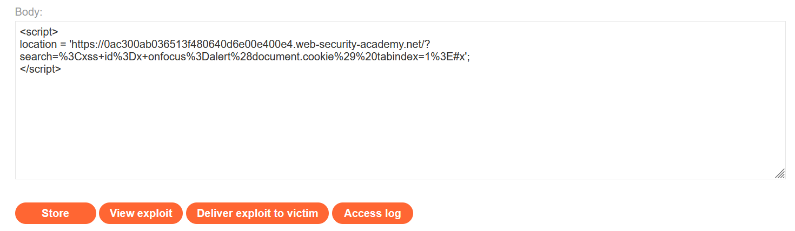
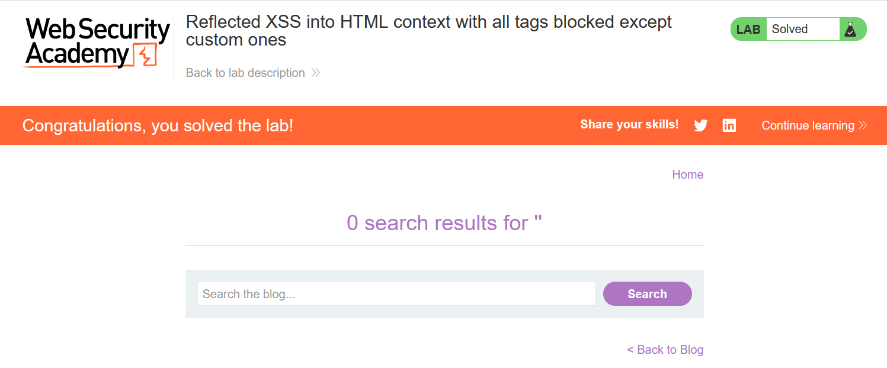

# Write-up: Reflected XSS into HTML context with all tags blocked except custom ones

### Tổng quan
Khai thác lỗ hổng Reflected Cross-Site Scripting (XSS) trong chức năng tìm kiếm của ứng dụng, nơi tất cả các thẻ HTML bị chặn trừ các thẻ tùy chỉnh (custom tags). Payload sử dụng thẻ custom `<xss>` với sự kiện `onfocus` và thuộc tính `tabindex` để tự động thực thi `alert(document.cookie)` khi trang được load với fragment `#x`, tận dụng Exploit Server để gửi payload đến nạn nhân và hoàn thành lab.

### Mục tiêu
- Khai thác lỗ hổng Reflected XSS bằng cách sử dụng thẻ custom `<xss>` với sự kiện `onfocus` trong tham số search, kích hoạt tự động qua URL fragment `#x` và gửi exploit qua Exploit Server để thực thi `alert(document.cookie)` và hoàn thành lab.

### Công cụ sử dụng
- Burp Suite Community
- Firefox Browser

### Quy trình khai thác
1. **Khai thác (Exploitation)**
- Truy cập chức năng tìm kiếm của ứng dụng và nhập chuỗi thử nghiệm vào search box (ví dụ: `<div>test</div>`)
    - **Phản hồi**: Thấy thông báo lỗi hoặc nội dung bị lọc, cho thấy tất cả các thẻ HTML tiêu chuẩn bị chặn.
    
- Thử nhập thẻ custom `<xss>test</xss>`    
    - **Phản hồi**: Thẻ `<xss>` được phản hồi trong HTML mà không bị lọc:

2. **Khai thác (Exploitation)**
- Tạo payload XSS sử dụng thẻ custom `<xss>`
    `<xss id=x onfocus=alert(document.cookie) tabindex=1>`
        
- Mã hóa URL payload và thêm fragment `#x`:
    `%3Cxss+id%3Dx+onfocus%3Dalert(document.cookie)+tabindex%3D1%3E#x`

- Tạo script để chuyển hướng trình duyệt nạn nhân tới URL chứa payload, tải trong body
    ```
    <script>
    location = 'https://id-lab.web-security-academy.net/?search=%3Cxss+id%3Dx+onfocus%3Dalert(document.cookie)+tabindex%3D1%3E#x';
    </script>
    ```
    
    - Cơ chế:
        - Thuộc tính `tabindex=1` làm thẻ `<xss`> trở thành phần tử có thể focus.
        - Fragment `#x` khiến trình duyệt tự động focus vào phần tử có `id=x`.
        - Sự kiện `onfocus` kích hoạt, thực thi `alert(document.cookie)`, hiển thị hộp thoại.
- Sử dụng chức năng `"Deliver exploit to victim"` trong Exploit Server để gửi script tới nạn nhân, kích hoạt XSS tự động, hoàn thành yêu cầu của lab
    
    
### Bài học rút ra
- Hiểu cách khai thác lỗ hổng Reflected XSS bằng cách sử dụng thẻ custom như `<xss>` với sự kiện `onfocus` và thuộc tính `tabindex`, kết hợp fragment URL để kích hoạt tự động, khi các thẻ HTML tiêu chuẩn bị chặn.
- Nhận thức tầm quan trọng của việc lọc và làm sạch (sanitizing) tất cả các thẻ, bao gồm cả thẻ custom, và kiểm tra các thuộc tính sự kiện trong input người dùng để ngăn chặn các cuộc tấn công XSS.

### Tài liệu tham khảo
- PortSwigger: Cross-Site Scripting (XSS)

### Kết luận
Lab này cung cấp kinh nghiệm thực tiễn trong việc phát hiện và khai thác lỗ hổng Reflected XSS bằng thẻ custom và sự kiện `onfocus`, nhấn mạnh tầm quan trọng của việc lọc toàn diện các thẻ và thuộc tính trong input người dùng. Xem portfolio đầy đủ tại https://github.com/Furu2805/Lab_PortSwigger.

*Viết bởi Toàn Lương, Tháng 7/2025.*