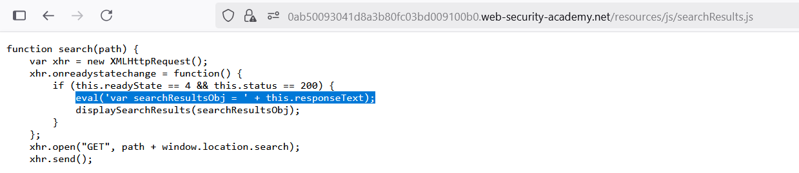

# Write-up: Reflected DOM XSS

### Tổng quan
Khai thác lỗ hổng Reflected DOM-based Cross-Site Scripting (XSS) trong chức năng tìm kiếm của ứng dụng, nơi hàm `eval()` được sử dụng để xử lý response JSON mà không làm sạch input, cho phép chèn mã JavaScript thông qua payload `\"-alert(1)}//` để thực thi `alert(1)` và hoàn thành lab.

### Mục tiêu
- Khai thác lỗ hổng Reflected DOM XSS trong chức năng tìm kiếm để thực thi mã JavaScript (`alert(1)`) và hoàn thành lab.

### Công cụ sử dụng
- Burp Suite Community
- Firefox Browser

### Quy trình khai thác
1. **Thu thập thông tin (Reconnaissance)**
- Truy cập chức năng tìm kiếm của ứng dụng 
- Sử dụng Dev Tools (F12) để kiểm tra các file tĩnh, phát hiện file `/searchResults.js`
    - Quan sát mã nguồn `searchResults.js`, thấy hàm `eval()` được sử dụng:
        
    - **Quan sát**: Hàm `eval()` xử lý responseText dạng JSON,
    - `Phân tích`: Nếu searchTerm chứa mã JavaScript, hàm `eval()` có thể thực thi nó, gợi ý khả năng khai thác Reflected DOM XSS:

2. **Khai thác (Exploitation)**
- Chèn payload XSS vào ô tìm kiếm: `\"-alert(1)}//`
    - **Phản hồi**: hoàn thành lab
        

    - Payload `\"-alert(1)}//` phá vỡ cấu trúc JSON, chèn mã `alert(1)` vào `eval()`, dẫn đến thực thi JavaScript và hiển thị hộp thoại `alert(1)`
    
### Bài học rút ra
- Hiểu cách khai thác lỗ hổng Reflected DOM XSS bằng cách chèn mã JavaScript vào input được xử lý bởi hàm eval() trong DOM.
- Nhận thức tầm quan trọng của việc tránh sử dụng hàm eval() và làm sạch input người dùng trong xử lý JSON để ngăn chặn các cuộc tấn công DOM XSS.

### Tài liệu tham khảo
- PortSwigger: Cross-Site Scripting (XSS)

### Kết luận
Lab này cung cấp kinh nghiệm thực tiễn trong việc phát hiện và khai thác lỗ hổng Reflected DOM XSS thông qua hàm eval(), nhấn mạnh tầm quan trọng của việc làm sạch input và tránh các hàm nguy hiểm trong xử lý DOM. Xem portfolio đầy đủ tại https://github.com/Furu2805/Lab_PortSwigger.

*Viết bởi Toàn Lương, Tháng 7/2025.*